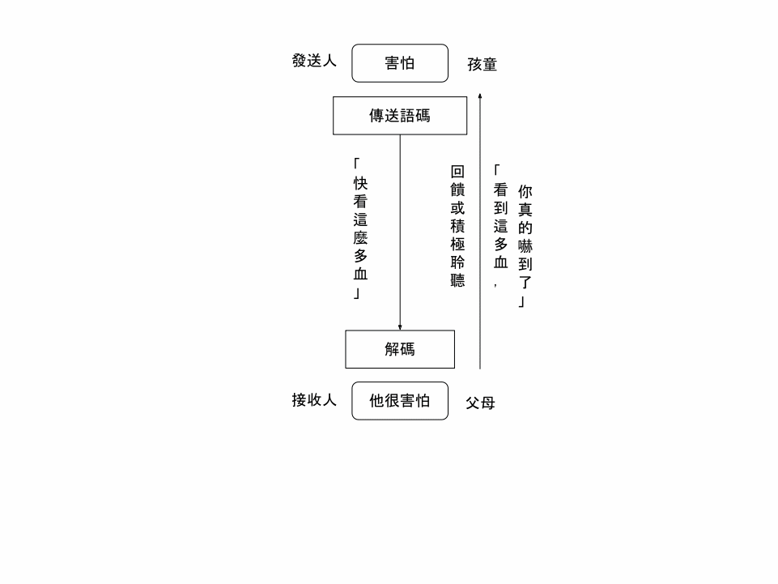
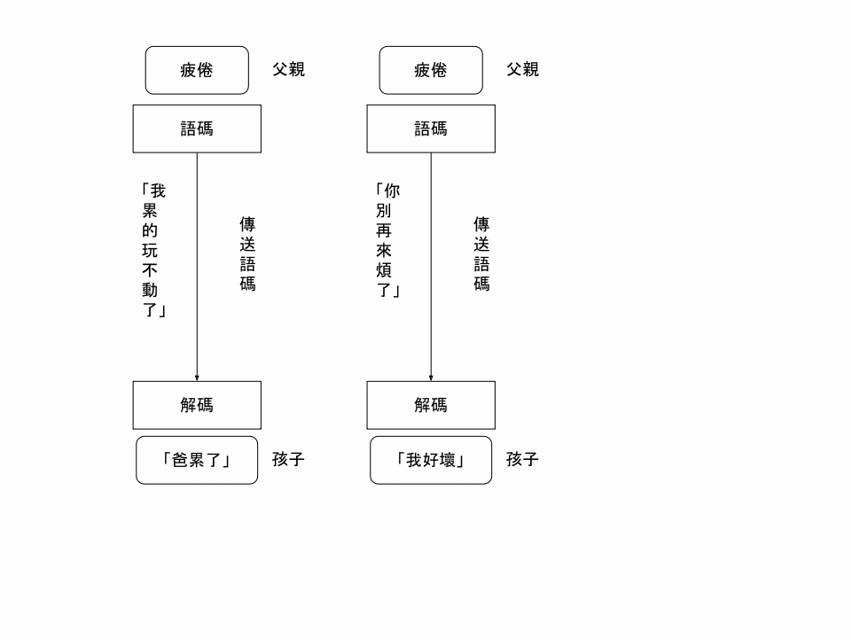

## 第二章 親子關係的藍圖

父母效能訓練源自人際關係基本原理，不僅適用親子關係，也能應用在夫婦、上司與下屬、老師與學生、朋友、廠商與客戶之間，一切的人際關係類型上，所以這本書的作者還寫了「領導者效能訓練」和「教師效能訓練」。

### 矛盾原理

小孩相同的行為會因為父母當下的狀態、不同的子女、不同的場所，而前後矛盾。同樣是小孩在大聲說話，媽媽忙著做菜時不介意，但是午睡時就會介意；在家裡可以，在捷運上或圖書館就不行。

矛盾原理可以延伸成小孩同樣的行為對於不同的大人會有不同的接受度，這是很正常的，不需要站在同一陣線。小孩吃飯時說話，可能爸爸不能接受，媽媽可以

### 問題主權原理

如果小孩和父母說「我掉了一個硬幣到水溝裡，怎麼辦？」這是小孩的問題，不是父母的，大人不應該替小孩解決問題，而是鼓勵小孩自行解決問題。

分辨這是誰的問題。小孩的問題？或是父母的問題？

* 小孩的問題，父母傳達：「你好像有心事，要不要我幫忙？」（輔助技巧：第三、四、五章）
* 父母的問題，向小孩傳達：「我有個問題需要你幫忙」（面質技巧：第六、七、八章）

## 第三章 幫助子女解決問題

小孩說出自己的困擾時，父母典型的反應不是聽而是說，他們覺得自己得說些什麼，通常會是 12 種絆腳石，阻止進一步溝通，並傷害孩子的自尊心

意識到自己的回答是絆腳石：聽到小孩說出自己的困擾時，一字不差地寫下你回答孩子的話，通常都是絆腳石

四種基本的聆聽技巧：
1. 消極聆聽（緘默）
2. 表達注意力的反應：用語言或非語言暗示真的在傾聽
    - 點頭、身體前傾、微笑、皺著眉頭
    - 感同身受的回應聲：哦、嗯、啊
3. 鼓勵、誘使孩子說話的問話
    - 想談談心事嗎？
    - 你對這件事感覺如何？
    - 你對這件事有什麼感想？
    - 你猜想最可能發生了什麼事？
4. 積極聆聽：參考圖

## 第四章 成為懂得聆聽的父母

第三章四種基本的聆聽技巧可以一起用，例如先用第 3 點（鼓勵、誘使孩子說話的問話），閒聊中再用第 4 點積極聆聽。孩子情緒激動時，父母積極聆聽沒有用。父母沒心情時，也不要積極聆聽

- 簡短的積極聆聽回答，比較不會激起反抗：
    - 你很怕打雷
    - 你的膝蓋很痛
    - 你很氣你妹妹
    - 你不喜歡太鹹的湯
- 從孩子的感受出發，使積極聆聽的回答更簡短、直接，如上所示
- 避免每一個問題都積極聆聽，只在嚴重時使用
    - 小事不用積極聆聽
    - 察言觀色
    - 用緘默或鼓勵、誘導問話試試看是否夠嚴重

**重點：打從心底想了解孩子，問題主權在孩子身上，積極聆聽才有用**

## 第六章 我訊息

參考圖

練習辨識真正的感覺，並鼓起勇氣表達出來

1. 列個單子，寫下有多少種感覺
2. 列出行為、感覺並完成句子

| 動作 | 舉例 |
| --- | ---- |
| 行為 | 巴比一陣風似的穿過客廳 |
| 感覺 | 我擔心 |
| 完成句子 | 他會撞翻燈打破它 |

完整的我訊息：

| 不可接受的行為 | 父母的感覺 | 實質影響 |
| ------------ | -------- | ------- |
| 你瞪著法蘭克時， | 我感到難過不安， | 因為他的哭喊聲干擾到我手頭上的事 |
