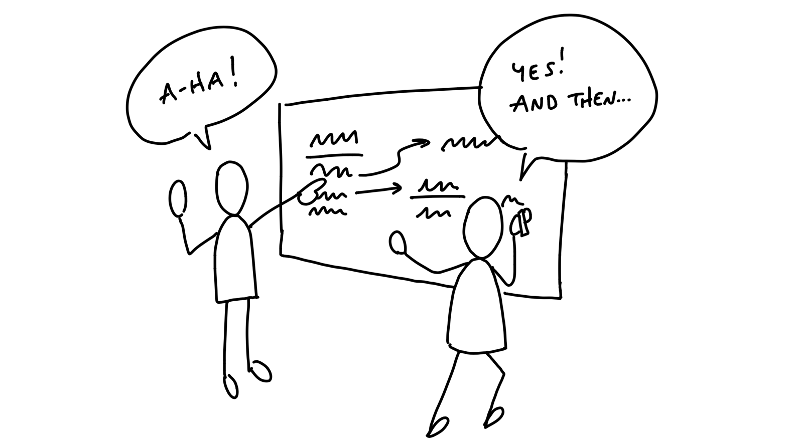

# 第四章 Find the Elements 找出元素

Now that we have the constraints of an appetite and the problem we’re solving, it’s time to get from an idea in words to the elements of a software solution. There could be dozens of different ways to approach the solution for a problem. So it’s important that we can move fast and cover a lot of different ideas without getting dragged down.

現在我們已經有了限定的胃口和限定的待解決問題，是時候將文字中的想法轉化為軟體解決方案的元素了。解決一個問題可能有數十種不同的方法。因此，重要的是我們能夠快速行動，並且能夠涵蓋許多不同的想法，而不會陷入細節中。

## Move at the right speed 以適當的速度前進

Two things enable us to move at the right speed at this stage.

有兩件事讓我們能夠在這個階段以適當的速度前進。

First, we need to have the right people—or nobody—in the room. Either we’re working alone or with a trusted partner who can keep pace with us. Someone we can speak with in shorthand, who has the same background knowledge, and who we can be frank with as we jump between ideas.

首先，我們需要確保在場的是合適的人，或者乾脆沒有人。我們要嘛獨自工作，要嘛與一位能夠跟上我們步調的信任夥伴合作。這個夥伴應該能夠與我們用簡短的方式溝通，擁有相同的背景知識，並且在我們快速切換想法時，能夠坦誠交流。

Second, we need to avoid the wrong level of detail in the drawings and sketches. If we start with wireframes or specific visual layouts, we’ll get stuck on unnecessary details and we won’t be able to explore as broadly as we need to.

其次，我們需要避免在圖紙和草圖中陷入錯誤的細節層級。如果一開始就使用線框圖或特定的視覺布局，我們會被不必要的細節困住，無法進行足夠廣泛的探索。

The challenge here is to be concrete enough to make progress on a specific solution without getting dragged down into fine details. The questions we’re trying to answer are:

這裡的挑戰在於，要具體到足以推進特定解決方案，但又不會被過多的細節拖累。我們試圖回答的問題是：

- Where in the current system does the new thing fit?
- 新元素在現有系統中的哪個位置適合？
- How do you get to it?
- 如何抵達它？
- What are the key components or interactions?
- 關鍵組件或互動是什麼？
- Where does it take you?
- 它會引導使用者到哪裡？

To stay on the right level of detail and capture our thoughts as they come, we work by hand using a couple of prototyping techniques: breadboarding and fat marker sketches. These allow us to quickly draw different versions of entire flows so we can debate the pros and cons of each approach and stay aligned with what we’re talking about as we go.

為了保持在適當的細節層級並即時捕捉我們的想法，我們採用手繪方式，使用幾種原型設計技術：**電路板式繪圖（Breadboarding）**和**粗筆標記草圖（Fat Marker Sketches）**。這些方法讓我們能夠快速繪製整體流程的不同版本，以便討論各種方法的優缺點，並在過程中保持對話的一致性。

## Breadboarding 電路板式繪圖

We borrow a concept from electrical engineering to help us design at the right level of abstraction. A breadboard is an electrical engineering prototype that has all the components and wiring of a real device but no industrial design.

我們借用電機工程中的一個概念，來幫助我們在適當的抽象層級進行設計。**麵包板（Breadboard）**是電機工程中的一種原型，它包含真實裝置的所有元件與佈線，但沒有工業設計的外觀。

Deciding to include an indicator light and a rotary knob is very different from debating the chassis material, whether the knob should go to the left of the light or the right, how sharp the corners should be, and so on.

決定是否加入指示燈和旋鈕，與討論機殼材質、旋鈕應該放在指示燈的左邊還是右邊、邊角應該多銳利等細節，是完全不同的層次。

Similarly, we can sketch and discuss the key components and connections of an interface idea without specifying a particular visual design. To do that, we can use a simple shorthand. There are three basic things we’ll draw:

類似地，我們可以在不指定具體視覺設計的情況下，畫出並討論介面想法的關鍵組件和連接方式。為了做到這一點，我們可以使用簡單的速記方式。我們會畫出三個基本元素：

- Places: These are things you can navigate to, like screens, dialogs, or menus that pop up. 
- 地點：這些是你可以導航到的地方，例如螢幕、對話框或彈出來的選單。
- Affordances: These are things the user can act on, like buttons and fields. We consider interface copy to be an affordance, too. Reading it is an act that gives the user information for subsequent actions.
- 可操作性：這些是使用者可以互動的元素，例如按鈕和欄位。我們也認為介面上的文字是可操作性之一，因為閱讀它是使用者的一個行為，提供了後續操作所需的資訊。
- Connection lines: These show how the affordances take the user from place to place.
- 連接線：這些線條顯示可操作性如何引導使用者從一個地點移動到另一個地點。

We’ll use words for everything instead of pictures. The important things are the components we’re identifying and their connections. They allow us to play out an idea and judge if the sequence of actions serves the use case we’re trying to solve.

我們會用文字來表示一切，而不是圖片。重要的是我們所識別的組件及其連接方式。這些可以幫助我們推演一個想法，並評估這些行為的順序是否能解決我們試圖解決的使用情境。

## Example 例子

Suppose our product is an invoicing tool. We’re considering adding a new “Autopay” feature to enable our customers’ customers to pay future invoices automatically.

假設我們的產品是一個開票工具。我們正在考慮新增一個「自動付款」功能，讓我們的客戶的客戶可以自動支付未來的發票。

How do you turn Autopay on? What’s involved? We can pick a starting point and say that the customer landed on an invoice. That’s our first place. We draw it by writing the name of the place and underlining it.

如何啟用自動付款？需要哪些步驟？我們可以選擇一個起點，假設客戶來到了發票頁面。那就是我們的第一個地點。我們將它畫出來，寫下地點名稱並加上底線。

On the invoice, we’re thinking we could add a new button to “Turn on Autopay.” That’s an affordance. Affordances go below the line to indicate they can be found at that place.

在發票頁面上，我們可以考慮新增一個「開啟自動付款」的按鈕。這就是一個可操作性。可操作性會放在底線下方，表示它可以在該地點找到。

Where does that button go? Some place for setting up the Autopay. We don’t have to specify whether it’s a separate screen or a pop up modal or what. From a what’s-connected-to-what standpoint (the topology) it’s all the same. Let’s draw a connection line from the button to the Setup Autopay screen.

那個按鈕會去哪裡？某個用來設置自動付款的地方。我們不需要具體說明它是單獨的畫面還是彈出式視窗，因為從「什麼連接到什麼」的角度來看（拓樸結構），其實都一樣。我們可以畫一條連接線，從按鈕連到設置自動付款的畫面。

Now we can talk about what belongs on that screen. Do we ask for a credit card here? Is there a card on file already? What about ACH or other payment methods?

現在我們可以討論在這個畫面上應該包含哪些內容。我們是不是在這裡要求輸入信用卡資訊？是否已有儲存的卡片資訊？那麼ACH（自動清算中心）或其他付款方式呢？

Just figuring out what to write under the bar starts to provoke debates and discussions about what to build.

僅僅是決定在底線下寫些什麼，就開始引發關於該建造什麼的討論與辯論。

As we think it through, we decide we should ask for credit card details here and show the logo of the financial institution (an aspect of the domain in this specific product).

在我們仔細思考後，我們決定在這裡要求輸入信用卡資訊，並顯示金融機構的標誌（這是這個特定產品領域的一部分）。

Straightforward enough. But wait — did we actually pay the original invoice or not? Hm. Now we have both functional and interface questions. What does enabling Autopay actually do? Does it apply only for the future or does paying with Autopay the first time also pay the current invoice? And where do we explain this behavior? We’re starting to have deeper questions and discussions prompted by just a few words and arrows in the breadboard.

夠簡單明瞭吧。但等等——我們到底有沒有支付原始的發票？嗯，現在我們有了功能性和介面上的問題。啟用自動付款到底會做什麼？它只適用於未來的發票，還是第一次使用自動付款時也會支付當前的發票？我們要在哪裡解釋這個行為？僅僅幾個字和箭頭在麵包板上，我們就開始有了更深入的問題和討論。

Since we’re using such a lightweight notation, and we aren’t bogged down with wireframes, we can quickly jump around and entertain different possibilities.

由於我們使用的是如此簡單的符號，而且沒有被線框圖所束縛，我們可以快速跳轉並探索不同的可能性。

We could add an option to the Setup screen…

我們可以在設置畫面中加入一個選項……

But now we’re complicating the responsibilities of the confirmation screen. We’re going to need to show a receipt if you pay your balance now. Should the confirmation have a condition to sometimes show a receipt of the amount just paid?

但現在我們讓確認畫面的責任變得更複雜了。如果現在就支付餘額，我們需要顯示收據。那麼，確認畫面是否需要有條件地顯示剛支付的金額收據呢？

How about an entirely different approach. Instead of starting on an Invoice, we make Autopay an option when making a payment. This way there’s no ambiguity about whether the current amount is being paid. We could add an extra “Autopay was enabled” callout to the existing payment confirmation page.

如何採取完全不同的方式呢？我們可以不從發票頁面開始，而是在進行付款時提供自動付款選項。這樣就不會對是否支付當前金額產生任何歧義。我們可以在現有的付款確認頁面上新增一個「自動付款已啟用」的提示。

Sketching this out reminded us that the current payment form supports ACH in addition to credit card. We discuss and confirm that we can use ACH too.

畫出這個草圖讓我們想起，目前的付款表單除了支持信用卡外，還支持ACH。我們討論並確認也可以使用ACH。

What about after Autopay is enabled? How does the customer turn it off? Up to this point, many customers in the system didn’t have usernames or passwords. They followed tokenized links to pay the invoices one by one. One might naturally assume that now that the customer has something like Autopay, they need a username and password and some landing place to go manage it.

那麼，自動付款啟用後，客戶該如何關閉它呢？到目前為止，系統中的許多客戶並沒有使用者名稱或密碼，他們是通過令牌化的連結逐一支付發票。現在，當客戶擁有像自動付款這樣的功能時，人們可能會自然地假設，他們需要擁有一個使用者名稱和密碼，並且需要一個專門的頁面來管理這個功能。

The team in this case decided that adding the username/password flows was too much scope for their appetite at the time. Reflecting strategically on what they knew about their customers, they thought it would be quite alright if the invoicer’s customers had to reach out to the invoicer and ask them to turn off the Autopay. In that case we could add a single option to disable Autopay in the customer detail page that we already offered to invoicers. We drew out the flow like this:

在這個情況下，團隊決定增加使用者名稱/密碼流程對他們當時的需求範圍來說太過繁瑣。從戰略角度回顧他們對客戶的了解，他們認為如果開票者的客戶必須聯繫開票者，請求他們關閉自動付款，這樣也完全可以接受。這樣一來，我們可以在開票者已經提供的客戶詳細資料頁面中，加入一個單一選項來禁用自動付款。我們就這樣畫出了流程：

This example illustrates the level of thinking and the speed of movement to aim for during the breadboarding phase. Writing out the flows confronts us with questions we didn’t originally think of and stimulates design ideas without distracting us with unimportant visual choices.

這個範例說明了在麵包板階段，應該達到的思考深度和移動速度。將流程寫出來讓我們面對了原本沒有想到的問題，並激發了設計想法，同時不會被不重要的視覺選擇分散注意力。

Once we get to a place where we play through the use case and the flow seems like a fit, we’ve got the elements we need to move on to start defining the project more clearly. We’re getting more concrete while still leaving out a huge amount of detail.

一旦我們進入了可以完整演練使用情境的階段，並且流程看起來合適，我們就擁有了開始更清晰定義專案所需的元素。我們在變得更具體的同時，仍然保留了大量的細節。

## Fat marker sketches 粗筆標記草圖

Sometimes the idea we have in mind is a visual one. Breadboarding would just miss the point because the 2D arrangement of elements is the fundamental problem. In that case, we still don’t want to waste time on wireframes or unnecessary fidelity. Instead we use fat marker sketches.

有時候我們心中構思的想法是視覺性的。麵包板方法可能會錯過要點，因為元素的二維排列本身就是根本問題。在這種情況下，我們仍然不希望浪費時間在線框圖或不必要的精細度上。相反，我們會使用粗筆標記草圖來進行設計。

A fat marker sketch is a sketch made with such broad strokes that adding detail is difficult or impossible. We originally did this with larger tipped Sharpie markers on paper. Today we also do it on iPads with the pen size set to a large diameter.

粗筆標記草圖是一種使用寬大筆觸進行的草圖，這樣一來，添加細節變得困難甚至不可能。我們最初是使用大頭的 Sharpie 馬克筆在紙上繪製這些草圖。如今，我們也會在iPad上使用筆尖設置為較大直徑的情況下進行繪製。

Here’s an example. We found ourselves often creating fake to-dos in our Basecamp to-do lists that acted as dividers. We’d create an item like “––– Needs testing –––“ and put items below it. We had the idea to make some kind of official divider feature in our to-do tool to turn the workaround into a first class function of to-do lists.

這是一個範例。我們發現自己經常在Basecamp的待辦清單中創建假待辦事項，作為區分項目之用。我們會創建像是「––– 需要測試 –––」這樣的項目，然後把其他項目放在下面。我們的想法是，在我們的待辦工具中創建一個正式的分隔線功能，將這個變通方法轉變為待辦清單的主要功能。

We had to work out what the implications of adding a divider were. We came up with a rough idea that adding a divider separates the list into “loose” to-dos above the divider and “grouped” to-dos below. Adding subsequent dividers adds more groups below the “loose” items at the top.

我們需要弄清楚添加分隔線的影響。我們提出了一個大致的想法：添加分隔線會將待辦清單分成兩部分，分隔線上方是「鬆散」的待辦事項，下方是「分組」的待辦事項。隨著後續分隔線的加入，會在頂部的「鬆散」項目下方增加更多的分組。

We could add items via some affordance within each group, including the “loose” group on top.

我們可以透過每個分組中的某個可操作性來新增項目，包括頂部的「鬆散」分組。

We were a little concerned the add buttons might break up the gestalt of the list, and the groups might all separate too much from the lists on the page. We talked about possibilities to place the “add” affordance inside of a menu that we already had to the left of each to-do item.

我們有點擔心「新增」按鈕可能會打破清單的整體感，且各個分組可能會讓清單在頁面上看起來過於分散。我們討論了將「新增」可操作性放置在每個待辦項目左側已經存在的選單中的可能性。

This notation is much less constraining than breadboards, which has downsides. We might sketch a sidebar and get attached to a layout element like that even though it’s not a core element. But as long as we keep an eye on that we’re still far better off than if we get sucked into the weeds by creating wireframes too early.

這種符號方式比麵包板更加不受限制，這也有其缺點。我們可能會草繪一個側邊欄，並且對這樣的佈局元素產生依賴，即使它並不是核心元素。但只要我們保持警覺，這仍然比過早進入線框圖並陷入細節中要來得好得多。

It may seem a little silly to call fat marker sketches a technique or a tool. The reason for calling them out is we too easily skip ahead to the wrong level of fidelity. Giving this rough early stage a name and using a specific tool for it helps us to segment our own creative process and make sure we aren’t jumping ahead to detail a specific idea when we haven’t surveyed the field enough.

把粗筆標記草圖稱為一種技術或工具，可能看起來有點滑稽。之所以特別提到它，是因為我們太容易跳過到錯誤的精細層級。給這個粗略的早期階段命名並使用特定的工具，幫助我們將創意過程區分開來，並確保在尚未充分探索整體情況時，我們不會急著去詳細描述某個具體的想法。

## Elements are the output 元素是輸出

In the case of the Autopay example, we ended up with some clear elements:

以自動付款的範例來說，我們最終得到了幾個明確的元素：

- A new “use this to Autopay?” checkbox on the existing “Pay an invoice” screen
- 在現有的「支付發票」畫面上新增一個「使用此進行自動付款？」的核取方塊
- A “disable Autopay” option on the invoicer’s side
- 在開票者端新增一個「停用自動付款」的選項

For the To-Do Groups project, the elements were:

對於待辦事項分組專案，元素包括：

- Loose to-dos above the first group belong directly to the parent
- Grouped to-dos appear below the loose to-dos
- We’d like to try an _add_ affordance within each section, but if that doesn’t work visually, we’re ok with relying on the action menu for inserting to-dos into position.
- 第一個分組上方的鬆散待辦事項直接隸屬於父項目。
- 分組待辦事項顯示在鬆散待辦事項下方。
- 我們希望在每個區塊內嘗試添加一個「新增」可操作性，但如果這在視覺上無法達成，我們也可以依賴動作選單來將待辦事項插入到適當的位置。

Similarly, when we sketched the simplified solution for rendering events on a calendar grid, we used the fat marker approach.

類似地，當我們草繪在日曆格子中呈現事件的簡化解決方案時，我們也使用了粗筆標記草圖的方法。

This enabled us to work out the main elements of the solution:

這讓我們能夠弄清楚解決方案的主要元素：

- A 2-up monthly calendar grid
- Dots for events, no spanned pills
- Agenda-style list of events below that scrolls an event into view when you tap a dot
- 一個雙欄的月曆格子
- 用圓點表示事件，沒有跨欄的長條標籤（pills）
- 在下方顯示議程風格的事件列表，當你點擊圓點時，該事件會滾動顯示於畫面中。

This list of elements is extremely narrow and specific compared to “monthly calendar.” Exactly the kind of narrowing we hope to accomplish through the shaping process.

這個元素清單相較於「月曆」來說，極為狹窄且具體，正是我們希望透過塑造過程達成的那種聚焦。

## Room for designers 設計師的空間

Later, when it’s time to involve a designer, you don’t want to have to say “I know I drew it like this but ignore that…”. Regardless of what you say, any specific mockups are going to bias what other people do after you—especially if you’re in a higher position than them. They’ll take every detail in the initial mockups as direction even though you didn’t intend it.

稍後，當需要涉及設計師時，你不希望必須說「我知道我畫成這樣，但請忽略那部分...」。不管你怎麼說，任何具體的模擬圖都會影響後續的人做出決策，尤其是當你在他們之上時。他們會把初步模擬圖中的每個細節當作指示，儘管你當時並不打算這樣。

Working at the right “level of abstraction” not only ensures we move at the right speed, it also leaves this important room for creativity in the later stages.

在正確的「抽象層次」上工作，不僅確保我們以合適的速度推進，也為後期階段的創意留下了重要的空間。

By leaving details out, the breadboard and fat marker methods give room to designers in subsequent phases of the project.

通過省略細節，麵包板和粗筆標記方法為專案後續階段的設計師提供了空間。

This is a theme of the shaping process. We’re making the project more specific and concrete, but still leaving lots of space for decisions and choices to be made later. This isn’t a spec. It’s more like the boundaries and rules of a game. It could go in countless different ways once it’s time to play.

這是塑造過程中的一個主題。我們正在讓專案變得更具體和明確，但仍然為後續的決策和選擇留下大量空間。這不是一份規格說明書，而更像是一場遊戲的邊界和規則。一旦開始執行，過程可以朝著無數種不同的方向發展。

## Not deliverable yet 還不是交付階段

This step of shaping is still very much in your private sphere. It’s normal for the artifacts at this point — on the wall or in your notebook — to be more or less indecipherable to anybody who wasn’t there with you.

這一步的塑造仍然非常屬於你的私人領域。在這個階段，牆上的或筆記本中的成果，對於那些沒有參與的人來說，通常會是模糊不清的，這是很正常的。

We’ve gone from a cloudy idea, like “autopay” or “to-do groups,” to a specific approach and a handful of concrete elements. But the form we have is still very rough and mostly in outline.

我們從模糊的想法，例如「自動付款」或「待辦事項分組」，轉向了具體的方案和一些具體的元素。但我們現在所擁有的形式仍然非常粗略，主要是輪廓性的。

What we’ve done is landed on an approach for how to solve the problem. But there may be some significant unknowns or things we need to address before we’d consider this safe to hand off to a team to build successfully.

我們所做的是確定了解決問題的方式。但在我們認為這樣可以安全地交給團隊進行建設之前，可能還有一些重大的未知數或需要解決的問題。

The next step is to do some stress-testing and de-risking. We want to check for holes and challenges that could hinder the project from shipping within the fixed time appetite that we have in mind for it.

下一步是進行壓力測試和風險降低。我們希望檢查可能妨礙專案在預定時間內順利推出的漏洞和挑戰。

After that we’ll see how to wrap up the shaped concept into a write-up for pitching.

之後，我們將看看如何將已塑造的概念整理成一份提案書，以便進行提案。

## No conveyor belt 沒有傳送帶

Also keep in mind that, at this stage, we could walk away from the project. We haven’t bet on it. We haven’t made any commitments or promises about it. What we’ve done is added value to the `raw idea` by making it more actionable. We’ve gotten closer to a good option that we can later lobby for when it’s time to allocate resources.

同時也要記住，在這個階段，我們隨時可以放棄這個專案。我們並沒有賭上它，也沒有對它做出任何承諾或保證。我們所做的是通過讓這個「原始想法」變得更具可操作性，為其增添價值。我們已經更接近一個不錯的選擇，當資源分配的時候，我們可以為此爭取支持。

