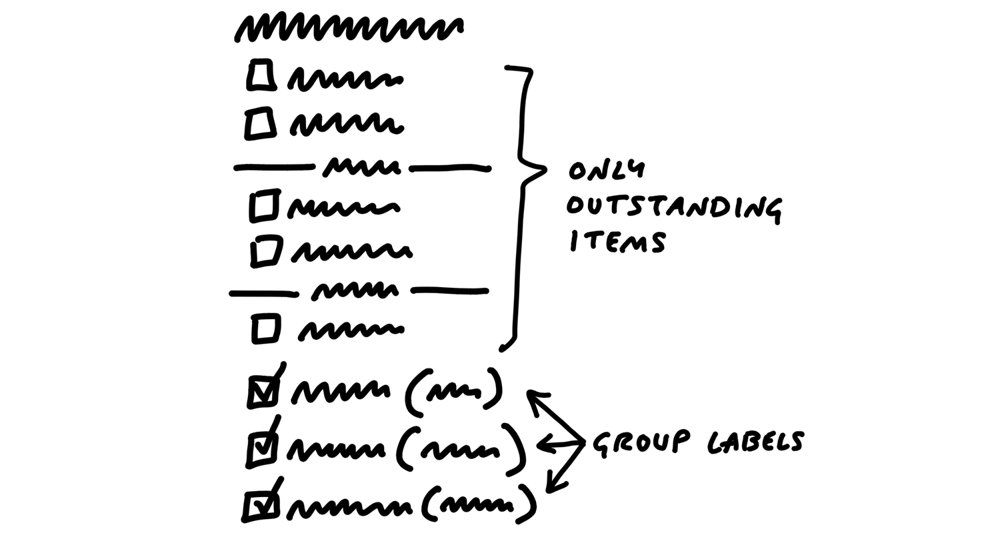

# 第五章 Risks and Rabbit Holes 風險與陷阱

Remember that we’re shaping work for a fixed time window. We may trust from our experience that the elements we fleshed out in the previous chapter are buildable within the appetite (six weeks). But we need to look closer, because all it takes is one hole in the concept to derail that. Suppose we bet on the project and a team takes it on. If they run into an unanticipated problem that takes two weeks to solve, they just burned a third of the budget!

記住，我們是在為一個固定的時間窗口塑造工作。我們可能會根據過去的經驗相信，在前一章中擬定的元素可以在預定的時間範圍內（六週）完成。但我們需要更仔細地檢視，因為只要有一個概念上的漏洞，就可能會讓這一切偏離軌道。假設我們下注這個專案並由團隊接手。如果他們遇到了一個未預見的問題，解決需要兩週的時間，那麼他們就浪費了三分之一的預算！

Even worse, sometimes you run into problems that don’t just delay the project—they have no apparent solution. We once bet on a project to redesign the way we present projects with clients on Basecamp’s home screen. We assumed the designer would figure it out; we didn’t do the work in the shaping phase to validate that a viable approach existed. Once the project started, it turned out to be a much harder problem than we expected. None of us were able to find a suitable design solution within the six weeks we budgeted. We ended up abandoning the project and rethinking it later.

更糟糕的是，有時候你會遇到不僅會延遲專案的問題，還可能是沒有明顯解決方案的問題。我們曾經下注一個專案，重新設計我們如何在Basecamp的首頁展示與客戶的專案。我們假設設計師會解決這個問題；我們在塑造階段並沒有驗證是否存在可行的方案。一旦專案開始，我們才發現這比預期的要難得多。在六週的預算內，我們沒有人能找到適合的設計方案。最終，我們放棄了這個專案，並在後來重新思考它。

Of course there will always be unknowns. That’s why we apply the many practices in Part Three so that teams tackle the right problems in the right order, leaving room for the unexpected. But that doesn’t mean we shouldn’t look for the pitfalls we _can_ find up front and eliminate them before betting on the project. Before we consider it safe to bet on, a shaped project should be as free of holes as possible.

當然，總是會有未知數。這就是為什麼我們會應用第三部分中的各種方法，讓團隊以正確的順序解決正確的問題，並為意外情況留出空間。但這並不意味著我們不應該在一開始就尋找那些我們能夠發現的陷阱，並在下注專案之前將它們消除。在我們認為專案安全可以下注之前，已經塑造過的專案應該盡可能不留漏洞。

## Different categories of risk 不同類別的風險

In terms of risk, well-shaped work looks like a thin-tailed probability distribution. There’s a slight chance it could take an extra week but, beyond that, the elements of the solution are defined enough and familiar enough that there’s no reason it should drag on longer than that.

從風險角度來看，良好塑造的工作就像是薄尾概率分佈。雖然有微小的機會可能會多花一週時間，但超過這個範圍的可能性很小，因為解決方案的元素已經足夠明確且熟悉，沒理由讓專案拖延超過這個時間。

However, if there are any rabbit holes in the shaping—technical unknowns, unsolved design problems, or misunderstood interdependencies—the project could take _multiple times_ the original appetite to complete. The right tail stretches out.

然而，如果在塑造過程中存在任何陷阱——技術未知、未解決的設計問題，或是誤解的相互依賴——那麼專案可能需要比原定時間預算長上好幾倍才能完成。此時，概率分佈的右尾會拉長。

We want to remove the unknowns and tricky problems from the project so that our probability is as thin-tailed as possible. That means a project with independent, well-understood parts that assemble together in known ways.

我們希望將專案中的未知數和棘手問題移除，使得專案的概率分佈盡可能接近薄尾分佈。這意味著專案應該由獨立且已知的部分組成，這些部分以已知的方式組合在一起。

## Look for rabbit holes 尋找陷阱

Fleshing out the elements of the solution was a fast-moving, exploratory process. It was more breadth than depth. In this step, we slow down and look critically at what we came up with. Did we miss anything? Are we making technical assumptions that aren’t fair?

塑造解決方案的元素是一個快速而探索性的過程，重點是廣度而非深度。在這一步，我們需要放慢腳步，批判性地檢視我們所構思的內容。我們有沒有遺漏什麼？我們是否做出了不合理的技術假設？

One way to analyze the solution is to walk through a use case in slow motion. Given the solution we sketched, how exactly would a user get from the starting point to the end? Slowing down and playing it out can reveal gaps or missing pieces that we need to design.

分析解決方案的一種方式是以慢動作的方式走過一個使用案例。根據我們所描繪的解決方案，用戶將如何從起點到達終點？放慢步伐並逐步推演可以揭示出我們可能需要設計的空白或遺漏的部分。

Then we should also question the viability of each part we think we solved. We ask ourselves questions like:

接著，我們還需要質疑每一個我們認為已解決的部分的可行性。我們會問自己以下問題：

- Does this require new technical work we’ve never done before?
- Are we making assumptions about how the parts fit together?
- Are we assuming a design solution exists that we couldn’t come up with ourselves?
- Is there a hard decision we should settle in advance so it doesn’t trip up the team?
- 這需要我們做以前從未做過的新技術工作嗎？
- 我們是否在假設各部分是如何融合的？
- 我們是否假設存在一個設計解決方案，但我們自己無法想出來？
- 是否有一個我們應該提前解決的重大決策，以免它拖慢團隊進度？

## Case study: Patching a hole 案例研究：填補漏洞

For example, when we defined the To-Do Groups project, we introduced the idea of dividers in the to-do list:

例如，當我們定義「待辦清單分組」專案時，我們提出了在待辦清單中加入分隔線的想法：

We liked the idea of the dividers, and the logic of loose versus grouped to-dos made sense to us. But when we looked closer we realized that we didn’t address how to display completed items. In the pre-existing design, the latest few completed items displayed below the list. Should we now render completed items at the bottom of each group instead of the list? Or should we continue to show completed items at the bottom, and repeat the same set of dividers within the completed items section? Should we reconsider how we handle completed items entirely?

我們喜歡分隔線的想法，並且「松散」和「分組」待辦事項的邏輯對我們來說是合理的。但當我們再仔細檢視時，我們發現我們並沒有處理如何顯示已完成的項目。在先前的設計中，最新完成的幾個項目會顯示在清單的底部。那麼，我們現在應該將已完成的項目顯示在每個分組的底部，而不是清單底部嗎？還是應該繼續將已完成的項目顯示在底部，並在已完成項目的區域內重複相同的分隔線？我們是否應該重新考慮如何處理已完成的項目？

This was a hole in the concept. If we didn’t address it, we’d be pushing a deep design problem down to the team and unreasonably asking them to find a solution under deadline. It’s not responsible to give the team a tangled knot of interdependencies and then ask them to untangle it within a short fixed time window.

這是概念中的一個漏洞。如果我們不解決這個問題，我們將把一個深層的設計問題推給團隊，並不合理地要求他們在截止時間內找到解決方案。將錯綜複雜的相互依賴關係交給團隊，然後要求他們在短時間內解開它，是不負責任的。

We knew from experience that changing the way completed to-dos render has lots of complicated implications in user experience, navigation, and performance. To remove uncertainty in the project, we decided to dictate a solution in the shaped concept. We would leave the completed items exactly as they worked previously. Instead of grouping or segmenting them, we would just append the name of the group to each completed item. It would be a little messy, but we justified the trade-off: it drastically simplified the problem, and we could still show completed items from a group on the group’s detail page.

我們從經驗中知道，改變已完成待辦事項的顯示方式會對使用體驗、導航和性能產生很多複雜的影響。為了消除專案中的不確定性，我們決定在塑造概念中規定解決方案。我們將保持已完成項目的顯示方式與先前相同，而不是將它們分組或分段。我們只會將分組名稱附加到每個已完成項目上。這會有點凌亂，但我們認為這是值得的折衷方案：它大大簡化了問題，並且我們仍然可以在分組的詳細頁面顯示來自該分組的已完成項目。

This is the kind of trade-off that’s difficult to make when you’re working inside the cycle under pressure. There are lots of reasons why a different design or a deeper reconsideration of completed to-dos would be objectively better. Why not try rendering them inside each group? A designer could reasonably think, “Maybe if I experiment with the styling a little more I can make them blend in better.” They could easily waste a few days of the very few weeks they have going down a dead end.

這種折衷是當你在壓力下處於開發週期中時很難做出的決定。雖然從客觀角度來看，不同的設計或對已完成待辦事項的深入再考慮可能會更好。為什麼不嘗試將它們渲染在每個分組內呢？一個設計師可能會合理地想，“或許如果我再嘗試調整一下樣式，它們可以更好地融入。” 他們可能會輕易浪費幾天時間，在一個死胡同裡走冤枉路。

As shapers, we’re thinking less about the ultimate design and more about basic quality and risk. With the compromised concept we get to keep all the elements that made the project worth doing—the groups of incomplete items—and we get to cut off a big tail of risk.

作為塑造者，我們更關注基本的質量和風險，而不是最終的設計。通過這個妥協的概念，我們保留了讓這個專案值得做的所有元素——未完成項目的分組——並且我們消除了風險的尾端。

Next, when we write the pitch for this project, we’ll point out this specific “patch” as part of the concept. That way nobody down the line will get tripped up on it.

接下來，當我們為這個專案撰寫提案時，我們會指出這個具體的「修補」作為概念的一部分。這樣，在未來的過程中，沒有人會因此而受困。

## Declare out of bounds 宣告超出範圍

Since everyone on the team wants to do their best work, they will of course look for all the use cases to cover and consider them necessary. As the team gets more comfortable with `scope hammering` (see [Decide When to Stop](https://basecamp.com/shapeup/3.5-chapter-14)), this improves. But it’s still a good idea to call out any cases you specifically _aren’t_ supporting to keep the project well within the appetite.

既然團隊中的每個人都希望做到最好，他們當然會尋找所有需要涵蓋的使用案例並視為必要。隨著團隊對「範圍掌控」(見「決定何時停止」) 的熟悉，這會有所改善。但仍然是一個好主意，明確指出任何你**不**支持的情況，這樣可以確保專案能夠保持在預定的範圍內。

For example, we worked on an idea for notifying groups of people in Basecamp. Rather than checking off five programmers one by one, you could just click “Programmers” and they’d be selected for notification. As we looked at the product, we saw tons of places where this kind of behavior might make sense. If we let you choose a group when posting a message, why not when assigning a to-do, or mentioning people in the chat room?

例如，我們曾經討論過在 Basecamp 中通知一群人的想法。與其一個接一個地勾選五個程式設計師，不如直接點選「程式設計師」群組，然後他們就會被選中接收通知。在我們檢視產品時，我們發現這種行為在很多地方都有其存在的可能性。如果我們在發送訊息時可以選擇群組，為何不在指派待辦事項或在聊天室提到某人時也這麼做呢？

We decided for the purpose of the project that the core value was narrowing down who to notify about a message. We explicitly marked off the other cases as “out of bounds” for the project and focused on the win we wanted: a faster flow for posting messages.

但我們為了這個專案的目的，決定將核心價值集中於縮小誰會收到訊息通知的範圍。我們明確標記了其他情境為「超出範圍」，並專注於我們希望實現的目標：更快速的發送訊息流程。

## Cut back 刪減功能

There may be parts of the solution we got excited about during the sketching phase that aren’t really necessary. When we designed the To-Do Groups feature, we thought it would be great to color-code groups. No doubt the page would look more interesting with color-coded group labels, and the feature might be more useful too. But we decided to flag this as unnecessary and cut it from the core of the project. We could mention it to the team as a nice-to-have, but everyone should start from the assumption that the feature is valuable without it.

有些在草圖階段我們感到興奮的解決方案，其實可能並不那麼必要。例如，在設計待辦事項分組功能時，我們曾經認為為每個分組加上顏色標註會很棒。毫無疑問，這樣的頁面看起來會更有趣，這個功能也許會變得更加實用。但我們最終決定將這一點標記為不必要，並將其從專案的核心中刪除。我們可以告訴團隊這個功能是附加選項，但每個人都應該從假設這個功能在沒有顏色標註的情況下依然有價值的角度出發。

## Present to technical experts 向技術專家呈現

Up to this point shaping has been a closed-door activity. Before you’re ready to write up the idea to share more widely, you might need input on some parts of the concept you aren’t completely sure about. There may be a technical assumption that you need to verify with someone who understands the code better. Or perhaps you want to make sure that usage data doesn’t contradict an assumption you’re making about current customer behavior.

這一階段的塑造工作還是處於內部閉門階段。在準備將概念正式寫出來與更大範圍的團隊分享之前，你可能需要向一些技術專家徵求意見，尤其是對於你不完全確定的部分。這可能是某些技術假設，需要和了解代碼的專家核對一下；或者，你可能想確認一下現有的使用數據，看看它是否與你對當前客戶行為的假設相矛盾。

This is a good time to grab some technical experts and walk them through the idea. Communicate that this is just an idea. It’s something you’re shaping as a potential bet, not something that’s coming down the pipe yet. The mood is friendly-conspiratorial: “Here’s something I’m thinking about… but I’m not ready to show anybody yet… what do you think?”

這是個很好的時機，抓住一些技術專家，並帶領他們了解這個想法。告訴他們這只是個想法，是你正在塑造的潛在計畫，而不是已經確定的事情。氛圍是友好且帶有些微共謀的感覺：“這是我在考慮的東西…但我還沒準備好展示給任何人…你覺得怎麼樣？”

Beware the simple question: “Is this possible?” In software, everything is possible but nothing is free. We want to find out if it’s possible within the appetite we’re shaping for. Instead of asking “is it possible to do X?” ask “is X possible in 6-weeks?” That’s a very different question.

小心問這個簡單的問題：“這有可能嗎？”在軟體領域，一切皆有可能，但沒有什麼是免費的。我們想知道它是否在我們所設想的範圍內是可行的。與其問“做X有可能嗎？”不如問“在6週內，X能做嗎？”這是一個截然不同的問題。

Talk through the constraints of how this is a good solution given the appetite, so they’re partners in keeping the project at the size you intend. And emphasize that you’re looking for risks that could blow up the project. It’s not just a “what do you think” conversation—we’re really hunting for time bombs that might blow up the project once it’s committed to a team.

討論這是一個符合需求的好解決方案時，要說明其中的限制條件，讓他們成為合作夥伴，幫助你保持專案的規模。並強調你正在尋找可能會讓專案爆炸的風險。這不僅是一次“你覺得怎麼樣”的對話，我們其實是在尋找可能在專案確定後，會讓它崩潰的定時炸彈。

Try to keep the clay wet. Rather than writing up a document or creating a slideshow, invite them to a whiteboard and redraw the elements as you worked them out earlier, building up the concept from the beginning. Stick completely to the concept you already worked out to get feedback on the work you’ve already done. Then once you’ve covered the work you already did, open it up and invite them to suggest revisions. Having seen this concept, do they have any insights about how to drastically simplify or approach the problem differently?

盡量保持構思的彈性。與其寫文件或製作簡報，不如邀請他們來白板，重新畫出你之前討論過的元素，從頭開始建立這個概念。完全依照你已經形成的概念進行，讓他們對你已經完成的工作提供反饋。當你展示了已經完成的部分後，再開放讓他們提出修改建議。在看到這個概念之後，他們是否有任何見解，能幫助你大幅簡化或改變處理問題的方式？

Depending on how the conversation goes, you may either have validated your approach or discovered some problems that send you back for another round of shaping.

根據對話的進展，你可能會驗證你的做法，或是發現一些問題，這些問題可能讓你需要重新調整思路。
## De-risked and ready to write up 風險已經降低，準備好撰寫

At the end of this stage, we have the elements of the solution, patches for potential rabbit holes, and fences around areas we’ve declared out of bounds. We’ve gone from a roughly formed solution with potential risk in it to a solid idea that we now hope to bet on in the future.

在這個階段結束時，我們已經擁有了解決方案的各個元素、對潛在風險的修正，並且設置了我們認為不該觸及的範圍。從一個尚未完善、具有潛在風險的解決方案，我們已經發展成為一個堅實的想法，現在我們希望未來能夠投注其中。

That means we’re ready to make the transition from privately shaping and getting feedback from an inner-circle to presenting the idea at the `betting table`. To do that, we write it up in a form that communicates the boundaries and spells out the solution so that people with less context will be able to understand and evaluate it. This “pitch” will be the document that we use to lobby for resources, collect wider feedback if necessary, or simply capture the idea for when the time is more ripe in the future.

這表示我們準備好從內部圈子中私下塑造並獲取反饋，轉向在“賭注桌”上展示這個想法。為了做到這一點，我們需要以一種能夠清楚傳達邊界並闡明解決方案的形式來書面表達，這樣即便是對背景了解較少的人也能理解並評估這個想法。這份“提案”將是我們用來爭取資源、在必要時收集更廣泛的反饋，或簡單地記錄下這個想法，為未來更有利的時機做準備的文件。

