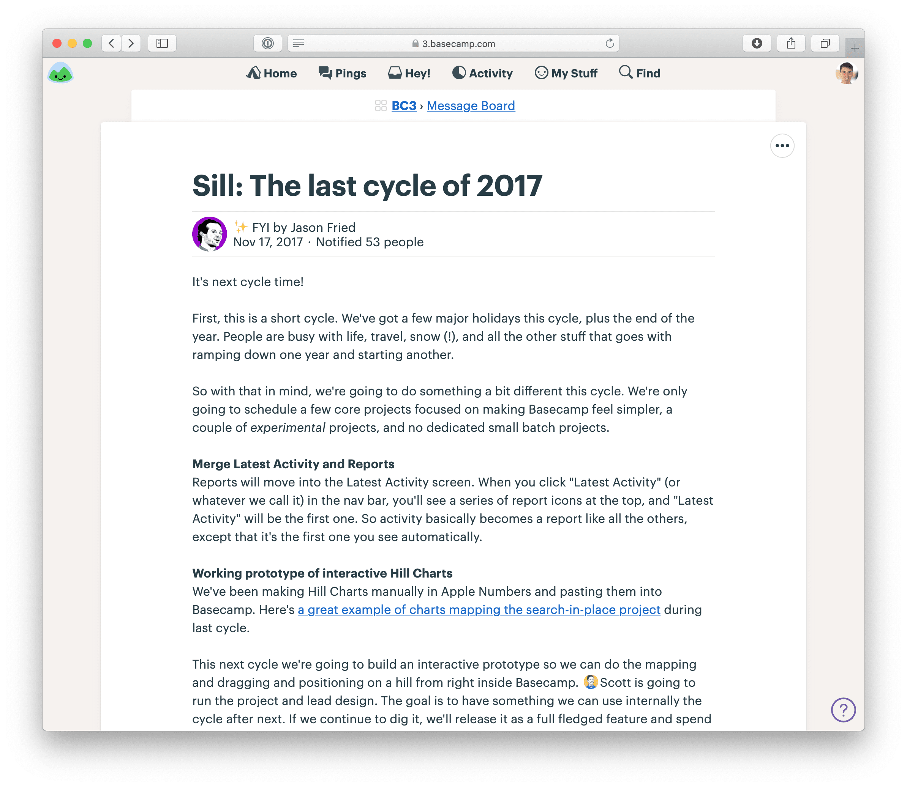

# 第九章 Place Your Bets 下定決心

## Look where you are 看看我們所處的位置

Depending on whether we’re improving an existing product or building a new product, we’re going to set different expectations about what happens during the six-week cycle.

根據我們是正在改善現有產品還是開發新產品，我們會設定不同的預期，關於在六週週期內會發生什麼。

This invites us to reflect on where we are in the arc of our product’s development and bet accordingly.

這讓我們反思自己在產品開發的進程中處於哪個階段，並根據這個階段來做出相應的投注。

## Existing products 現有產品

When we add features to an existing product, we follow the standard Shape Up process: shape the work, bet on it, and give it to a team to build. We expect the team to finish and ship some version of the shaped work by the end of the cycle.

當我們為現有產品添加新功能時，我們遵循標準的 Shape Up 流程：規劃工作、下注並交給團隊來實現。我們預期團隊能夠在週期結束前完成並交付某個版本的已規劃工作。

On an existing product, all of the existing code and design that _isn’t_ going to change defines a kind of empty space that the new feature will fit into. Shaping and building is like crafting a piece of furniture for a house that is already built.

在現有產品中，所有**不會**改動的現有代碼和設計，定義了一個空間，新功能將在這個空間中融入。規劃和建設就像是為一個已經建好的房子製作一件家具。

## New products 新產品

New products are different. Whereas adding to an existing product is like buying a couch for a room with fixed dimensions, new product development is like figuring out where the walls and the foundation should go so the building will stand.

新產品則不同。與為現有產品添加功能類似於為一個固定尺寸的房間買一張沙發相比，新產品開發就像是決定牆壁和基礎應該放在哪裡，這樣建築才能穩固地立起來。

We’ve noticed three phases of work when we build a new product from scratch. In each phase, the way that we shape and our expectations for how the team will work together during the cycle are different. These phases unfold over the course of multiple cycles, but we still only bet one cycle at a time.

我們發現，當我們從零開始構建一個新產品時，有三個階段。在每個階段中，我們規劃的方式和我們對團隊在週期中如何協同工作的期望是不同的。這些階段會在多個週期中展開，但我們依然每次只投注一個週期。

## R&D mode 研發模式

At the very earliest stages of a new product, our idea is just a theory or a glimmer. We don’t know if the bundle of features we imagine will hold together in reality, and the technical decisions about how to model them in code are even less clear.

在新產品的最初階段，我們的想法只是一個理論或一線希望。我們不知道我們設想的功能組合在現實中是否能夠融為一體，而如何在代碼中模擬它們的技術決策則更不清楚。

This means there is a lot of scrapwork. We might decide half-way to standing up a feature that it’s not what we want and try another approach instead.

這意味著會有很多無用的工作。我們可能會在實現某個功能的過程中發現它不是我們想要的，然後改變方法，嘗試另一種方式。

In other words, we can’t reliably shape what we want in advance and say: “This is what we want. We expect to ship it after six weeks.” We have to learn what we want by building it.

換句話說，我們無法可靠地提前規劃出我們想要的東西，然後說：「這就是我們想要的，我們預期六週後會交付它。」我們必須通過構建它來學習我們真正需要的東西。

We call this stage `R&D mode` and adjust for it in three ways.

我們稱這個階段為「研發模式」，並且會通過三種方式進行調整。

* Instead of betting on a well-shaped pitch, we mainly bet the _time_ on spiking some key pieces of the new product idea. The shaping is much fuzzier because we expect to learn by building.
* 我們並不是投注在一個已經規劃好的提案上，而是主要投注**時間**來測試新產品構想中的一些關鍵部分。規劃會變得模糊一些，因為我們預期通過建設來學習。
* Rather than delegating to a separate build team, our senior people make up the team. David (CTO) takes the programming role and works with Jason (CEO and designer) or a senior designer with Jason’s guidance. This is necessary for two reasons. First, you can’t delegate to other people when you don’t know what you want yourself. Second, the architectural decisions will determine what’s possible in the product’s future — they define the “holes” that future features fit into. At this phase the team needs to hold the vision of the product and be able to judge the long-term effects of design decisions.
* 我們不會將工作委派給另一個專門的開發團隊，而是由我們的高級成員組成團隊。David（CTO）擔任程式設計角色，與 Jason（CEO 兼 設計師）或在 Jason 指導下的高級設計師一起工作。這樣做有兩個原因。首先，當你自己還不確定想要什麼時，無法將工作委託給其他人。第二，架構決策將決定產品未來的可能性——它們定義了未來功能嵌入的「空洞」。在這個階段，團隊需要掌握產品的願景，並能夠評估設計決策對未來的長期影響。
* Lastly, we don’t expect to ship anything at the end of an R&D cycle. The aim is to spike, not to ship. In the best case we’ll have some UI and code committed to serve as the foundation for subsequent work. The goal is to learn what works so we can commit to some load-bearing structure: the main code and UI decisions that will define the form of the product going forward.
* 最後，我們不期待在研發週期結束時交付任何產品。目標是進行測試，而不是交付。在最理想的情況下，我們將會有一些 UI 和代碼，這些將成為後續工作的基礎。目標是學習哪些部分有效，以便我們能夠確定一些具有承載能力的結構：主要的代碼和 UI 決策，這些將定義產品未來的形式。

We can’t ship anything to customers with just a single cycle of R&D work. But we still don’t commit to more than one cycle at a time. We may learn from the first cycle that we aren’t ready to tackle the product yet. Or we may discover that our intuition rang true and the product is coming together. Depending on how it goes, we’ll decide cycle-by-cycle whether to continue spending informal time in R&D mode.

我們無法僅依賴單一個研發週期就將任何東西交付給客戶。但我們仍然不會一次承諾超過一個週期。我們可能會從第一個週期中學到，我們還不準備好進行這個產品的開發。或者我們可能會發現我們的直覺是正確的，產品正在順利進展。根據進展情況，我們將會逐個週期地決定是否繼續投入非正式的研發模式。

## Production mode 生產模式

If we continue to get warmer after some R&D cycles, we’ll eventually reach a point where the most important architectural decisions are settled. The product does those few essential things that define it, and the foundation is laid for the dozens of other things we’ll have to do before we can ship to customers.

如果經過幾個研發週期後，我們仍然逐步接近目標，我們最終會達到一個階段，這時最重要的架構決策已經確定。產品完成了幾個關鍵的功能，這些功能定義了它的核心特性，並為我們在能夠交付給客戶之前需要完成的其他數十個功能奠定了基礎。

With this structure in place, the senior team can bring in other people to contribute. This is the flip to `production mode`, where we work in formal cycles with clear-cut shaping, betting, and building phases. Production mode is like working on an existing product: the precedent set by the R&D work enables new contributors to identify where new functionality belongs and how it fits into the whole.

有了這個架構，資深團隊可以引入其他人來貢獻。這就是進入「生產模式」的轉折點，在這裡我們會以正式的週期進行工作，並擁有明確的形狀、下注和建設階段。生產模式就像是在現有產品上工作：研發工作的前例使新加入的人能夠識別新功能應該放在哪裡，以及它如何融入整體結構中。

In production mode:

在生產模式中：

- Shaping is deliberate again. The shaped work describes what we expect to see at the end of the cycle.
- The team that builds the projects is no longer limited to the senior group. It becomes possible to bet multiple teams in parallel (if you have them) and cover more ground.
- Shipping is the goal, not spiking. But because the product isn’t publicly available to customers yet, we define ‘shipping’ differently. Shipping means merging into the main codebase and expecting not to touch it again.
- 形狀設定變得更加有計劃。形狀化的工作描述了我們期望在週期結束時看到的結果。
- 建立專案的團隊不再僅限於資深團隊。若有多個團隊，現在可以進行平行下注，並覆蓋更多範圍。
- 發佈是目標，而非探索性工作。但因為產品尚未公開對客戶提供，我們對「發佈」的定義有所不同。發佈意味著將工作合併進主代碼庫，並期望不再進行修改。

Since we aren’t shipping to customers at the end of each cycle, we maintain the option to remove features from the final cut before launch. This means we can still be experimental. We can bet six weeks on a feature without knowing if we’ll want it in the final product. That’s not a problem as long as we set expectations to the build team: we can’t predict what we’ll want in the final cut, and we’re willing to risk this cycle to take our best swing at the idea.

因為在每個週期結束時我們並未將產品發佈給客戶，所以我們保留了在最終發佈前移除功能的選項。這意味著我們仍然可以保持實驗性。我們可以在某個功能上下注六週，而不需要知道它是否會成為最終產品的一部分。只要我們對建設團隊設定了明確的預期：我們無法預測最終版本中會想要哪些功能，我們願意冒險，在這個週期內全力嘗試這個想法，這並不成問題。

## Cleanup mode 清理模式

In the final phase before launching the new product, we throw all structure out the window. We call this `cleanup mode`. It’s a free-for-all. We’ve built enough new products to learn that there are always things we forget, things we miss, details that aren’t right, and bugs that creep in over the course of the R&D and production mode cycles.

在推出新產品的最後階段，我們將所有的結構拋到一邊。我們稱之為「清理模式」(cleanup mode)。這是一場自由的混戰。我們已經建造了足夠多的新產品，學會了總會有一些我們忘記的東西、有些細節不對勁、還有在研發模式和生產模式的週期中潛藏進來的錯誤。

There’s something about putting your finger near the launch button that makes your hair stand up. Everything suddenly gets “real.” Things we dismissed before pop out at us with new importance.

在接近按下發佈按鈕的時候，總有一種讓人毛髮豎立的感覺。突然間，一切變得「真實」起來。我們之前忽略的事情，此刻突然以全新的重要性浮現出來。

That’s why we reserve some capacity at the end for the unexpected. In cleanup mode:

這就是為什麼我們在最後階段保留一些容量來處理意外情況。在清理模式下：

- There’s no shaping. The cycle is closer in spirit to the “bug smash” mentioned in the previous chapter. Leadership stands at the helm throughout the cycle, calling attention to what’s important and cutting away distractions.
- There aren’t clear team boundaries. Everyone jumps in to help however they can.
- Work is “shipped” (merged to the main codebase) continuously in as small bites as possible.
- 沒有規劃。這個周期更像是上一章提到的「錯誤修復大會」。領導層在整個周期中處於掌舵位置，呼籲注意重要事項並去除干擾。
- 團隊邊界不明確。每個人都會根據需要盡力幫忙。
- 工作是「交付」的（合併到主代碼庫中），並且盡可能以最小的步驟進行。

Discipline is still important. We have to check ourselves to make sure these are must-haves we’re working on, not just our cold feet begging us to delay launch. Cleanup shouldn’t last longer than two cycles.

紀律仍然很重要。我們必須自我檢查，確保我們正在處理的是必須做的工作，而不是僅僅因為冷 feet 讓我們想拖延發佈。清理模式不應該超過兩個周期。

Cleanup is also the phase where leadership makes those “final cut” decisions. A smaller surface area on a V1 means fewer questions to answer, less to support, and less we’re committing to maintain indefinitely. Sometimes we need to see all the features working as a whole to judge what we can live without and what might require deeper consideration before shipping it to customers.

清理階段也是領導層做出「最終決定」的時候。版本 1 的較小範圍意味著更少的問題需要回答、更少的支援，以及我們不必無限期維護的東西。有時我們需要看到所有功能作為整體運作，才能判斷哪些是可以省略的，哪些可能需要更深入的考慮，再決定是否可以發佈給客戶。

## Examples 範例

### The Dot Grid Calendar Dot Grid 日曆

We built the Dot Grid Calendar (see Chapter 2) for Basecamp, an existing product. We shaped the project, bet six weeks on it, a team built it, and then we shipped it straight to customers.

我們為 Basecamp 建立了 Dot Grid 日曆（見第 2 章），這是針對現有產品所做的。首先，我們對這個項目進行了形狀設計，接著投入了六週的時間來開發，團隊完成了開發後，我們直接將它發佈給客戶。

### A new product: HEY 新產品：HEY

In 2020, after two years of development, we launched a new email app and service called [HEY](https://hey.com). HEY was in `R&D mode` for the first year of its development. A team of three, Jason (CEO), David (CTO), and Jonas (senior designer) explored a wide variety of ideas before settling on the core. Nearly a year of `production mode` cycles followed, where all of Basecamp’s teams fleshed out HEY’s feature set. We ended with two cycles of `cleanup` and significantly cut back the feature set to launch in July 2020.

在 2020 年，經過兩年的開發，我們推出了名為 [HEY](https://hey.com) 的全新電子郵件應用程式及服務。HEY 在開發的第一年處於「R&D 模式」。由三位成員組成的團隊，Jason（CEO）、David（CTO）和 Jonas（資深設計師），在探索了各種不同的想法後，最終確定了其核心概念。隨後，進入了接近一年的「生產模式」週期，Basecamp 所有團隊一起完善了 HEY 的功能設置。我們最終經過了兩個 「清理」 週期，並大幅縮減了功能集，直到在 2020 年 7 月成功推出。

To be precise, there was some overlap between R&D and production mode after that first year. Basecamp was big enough as a company that the senior team could shape and delegate production-mode projects around parts of the app that were settled while continuing to explore new territory in R&D mode themselves.

確切來說，在第一年之後，R&D 和生產模式之間是有些重疊的。Basecamp 作為一個大公司，資深團隊可以在探索新領域的同時，專注於已經確定的應用部分，進行生產模式的專案設計和委派。

Every bet on HEY was placed one at a time. The betting table didn’t know they would be working on HEY for two years during those first few R&D cycles. Gradually they gained confidence in the idea and grew a big-picture appetite for how many cycles they were willing to spend on HEY. But they made no specific commitments about what would go into those cycles. And flipping attention back to Basecamp, our existing product, was always on the table.

每一項對 HEY 的投注都是一次一次地做出的。在那些早期的 R&D 週期中，投注桌上沒有人知道他們會在接下來的兩年中致力於 HEY。隨著信心的增強，他們逐漸對這個想法有了更大局的預期，並且決定了願意在 HEY 上花多少個週期。但他們並沒有對這些週期的具體內容做出承諾。而且，將注意力轉回 Basecamp，我們的現有產品，始終是可以選擇的。

### An experimental feature: Hill Charts 一個實驗性功能：Hill Charts

A third example shows some grey area. When we built the Hill Charts feature in Basecamp (see Chapter 13), we had no idea if it was going to work out or not. Basecamp was an existing product, and it felt too risky to bet on releasing this experimental feature to customers. So we framed the project more like a production mode bet on a new product. We shaped a first version that was just functional enough to use ourselves. We didn’t expect to ship it to customers without doing an additional cycle on it. This was a risk: we bet one cycle, not two. If it didn’t work out, we’d scrap it. If something more important came up, we might not ever schedule the second cycle. But we ended up feeling confident after the first cycle. We shaped a project to round it out, decided to bet another cycle, and then shipped it to customers.

第三個例子展示了一些灰色地帶。當我們在 Basecamp 中建立 Hill Charts 功能（參見第13章）時，我們並不知道這個功能是否會成功。Basecamp 是一個現有產品，我們覺得將這個實驗性功能直接推出給客戶風險太大。因此，我們把這個專案框架設計得更像是對新產品的生產模式投注。我們設計了一個初版，功能足夠讓我們自己使用。我們並不打算在額外的週期完成之前將它推出給客戶。這是一個風險：我們只投注了一個週期，而不是兩個。如果它沒有效果，我們就放棄它。如果有更重要的事情發生，我們甚至可能不會排定第二個週期。但最終在第一個週期結束後，我們對它充滿信心。於是我們重新塑造了這個專案，決定再投注一個週期，然後將它推向客戶。

## Questions to ask 要問的問題

Here are some common questions you might hear when people at the betting table are debating which bets to place.

以下是一些當人們在投注桌上討論要進行哪些投注時，可能會聽到的常見問題。

### Does the problem matter? 這個問題重要嗎？

Just like in pitch write-ups, we always take care to separate problem and solution. The solution doesn’t matter if the problem isn’t worth solving.

就像在提案撰寫中一樣，我們始終會小心地區分問題和解決方案。如果問題不值得解決，解決方案就沒有意義。

Of course, any problem that affects customers matters. But we have to make choices because there will always be more problems than time to solve them. So we weigh problems against each other. Is _this_ problem more important than _that_ problem right now?

當然，任何影響客戶的問題都是重要的。但我們必須做出選擇，因為總是有比我們時間更多的問題需要解決。因此，我們會將問題互相比較：現在，這個問題是否比那個問題更重要？

How the people at the table judge problems depends on their perspective, role, and knowledge. For example, a problem might impact a small segment of customers but put a disproportionate burden on support. Depending on your exposure to support and which aspect of the business you’re focused on, you may weigh that differently.

桌上的人如何判斷問題，取決於他們的觀點、角色和知識。例如，一個問題可能會影響少數客戶群，但會對支援團隊造成過度負擔。根據你對支援的接觸程度以及你關注的業務領域，你可能會對這個問題給出不同的權重。

Sometimes a solution that is too complicated or too sweeping may invite questions about the problem. Do we really need to make so many changes across the app? Have we understood the problem specifically enough? Maybe there’s a way to narrow it down so that we get 80% of the benefit from 20% of the change.

有時，一個過於複雜或過於全面的解決方案會引發對問題的質疑。我們真的需要在整個應用中做這麼多改動嗎？我們對問題的理解夠具體嗎？也許有辦法縮小範圍，讓我們能夠用20%的改動達到80%的效果。

### Is the appetite right? 是否「胃口」適當？

It’s good when we have a solution shaped to a reasonable time frame, like two or six weeks. But we might still debate whether it’s worth the time. Suppose a stakeholder says they aren’t interested in spending six weeks on a given pitch. The negotiation could go a couple directions from there:

當我們有一個解決方案被塑造為合理的時間框架（例如兩週或六週）時，這是好的。但我們仍然可能會討論它是否值得花這麼多時間。假設一位利益相關者說他們對花六週時間在某個提案上不感興趣，接下來的討論可能會朝著幾個方向進行：

- Maybe the problem wasn’t articulated well enough, and there’s knowledge that the shaper can add to the conversation right now to swing opinion. For example, “Yeah it doesn’t happen often, but when it does people are so vocal about it that it really tarnishes perception of us.” Or “Maybe it sounds trivial, but support has to go through 11 time-consuming steps to get to resolution.”
- 也許問題沒有表達清楚，這時候提案者可以立即補充一些知識來改變看法。例如：「對，這個問題不常發生，但每次發生時，使用者反應強烈，這會嚴重損害我們的品牌形象。」或者「也許聽起來微不足道，但客服需要經過11個繁瑣的步驟才能解決問題。」
- Sometimes saying “no” to the time commitment is really saying no to something else. Maybe there’s something about the solution or the technical implementation they don’t like. Asking “How would you feel if we could do it in two weeks?” can uncover that it’s not so much about the time. The CTO might answer, “I don’t want to introduce another dependency into that area of the app.”
- 有時候說「不」對於時間的承諾，其實是在拒絕其他東西。可能是對解決方案或技術實現有些不滿。問一句「如果我們能在兩週內完成，你會怎麼想？」可以揭示出其實問題不在時間上。比如，CTO 可能會回答說：「我不想在那個區塊再增加一個依賴。」
- The shaper might just let the idea go if interest is too low.
- 如果興趣太低，塑形者可能會選擇放棄這個想法。
- The shaper might go back to the drawing table and either work on a smaller version (for a shorter appetite) or do more research if they believe the problem is compelling but they weren’t armed well enough to present it.
- 塑形者也可能會回到設計階段，嘗試將方案縮小版本（以適應更短的時間範圍），或是進行更多的研究，如果他們認為問題是有吸引力的，但當初提出時沒有足夠的資料來支撐。

### Is the solution attractive? 解決方案有吸引力嗎？

The problem may be important and the appetite fair, but there can be differences about the solution.

問題可能很重要，並且時間預算也合理，但對於解決方案本身可能會有不同的看法。

For example, adding interface elements to the screen carries an invisible cost: giving up the real estate. A button in the corner of the home page might perfectly solve the problem. But that real estate is valuable. If we give it up now, we won’t be able to use it in the future. Are we selling it too cheaply to solve this particular problem?

例如，向螢幕上添加介面元素會帶來一個無形的成本：放棄這些空間。首頁角落的按鈕可能能完美解決這個問題，但這些空間是寶貴的。如果我們現在把它拿來用，未來就無法再利用它。為了解決這個特定問題，我們是不是把這些空間賣得太便宜了？

If someone offers an immediate design solution, like “how about we move that button to an action menu instead,” we might discuss it. But generally we’ll avoid doing design work or discussing technical solutions for longer than a few moments at the betting table. If we catch ourselves spending too much time in the weeds we’ll remind ourselves “okay, we’re not doing design here” and move back up to the high level.

如果有人提出即時的設計解決方案，例如「我們把那個按鈕移到操作菜單裡如何」，我們可能會討論這個想法。但一般來說，我們會避免在下注會議上做設計工作或討論技術解決方案太長時間。如果我們發現自己花太多時間在細節上，我們會提醒自己「好，我們不是在做設計」，然後回到高層次的討論。

### Is this the right time? 這個時機對嗎？

The kind of project we want to do next can depend on which projects we’ve done recently. Maybe it’s been too long since we’ve made a splash of news with a new feature. Or perhaps we’ve been building too many new features and feel overdue to fix some long-standing customer requests. Or if the teams spent the last couple cycles in the same area of the app, their morale may dip if we plan yet another project doing the same kind of work.

我們接下來想做的專案可能會取決於我們最近做過哪些專案。也許我們很久沒有透過推出新功能來引起一波關注了，或者我們已經推出太多新功能，感覺該是解決一些長期以來的客戶需求的時候了。又或者，如果團隊在過去幾個週期中都在處理應用程式的相同區域，當我們計畫再做一次相同類型的工作時，他們的士氣可能會下降。

Those are all reasons that we might pass on a project even though it’s perfectly well shaped and valuable. The project’s great; it’s just not the right time.

這些都是即使專案本身已經非常完善並且有價值，我們還是可能選擇放棄的原因。專案本身很好，只是時機不對。

### Are the right people available? 對的人有沒有空？

As part of the betting process we choose who specifically will play which role on each team. That is, we’ll pair a project with a specific small team of a designer and one or two programmers. We have a “Core Product” team of designers and programmers and we select from that pool when planning teams for each cycle. The team will work with each other for the whole cycle and then the next cycle can be a different combination of people.

在下注過程中，我們會選擇每個專案中具體由誰擔任哪個角色。也就是說，我們會為專案配對一個特定的小團隊，通常是由一位設計師和一到兩位程式員組成。我們有一個“核心產品”團隊，裡面有設計師和程式員，並且在計劃每個週期的團隊時會從這個池子中選擇。團隊會在整個週期內一起工作，而下一個週期則可以是不同的成員組合。

Different projects require different expertise. Maybe we need some more front-end programming on this one. Or this other one is going to invite a lot of scope creep so we need someone who’s good with the `scope hammer`.

不同的專案需要不同的專業知識。也許這個專案需要更多的前端程式設計技能，或者這個專案可能會引發大量範圍蔓延，因此我們需要一位擅長使用「範圍鎚」的專家。

The type of work each person has been doing is another factor. Someone who’s done a long string of `small batch` projects might prefer to take on a `big batch`, or vice versa.

每個人所從事的工作類型也是一個考量因素。做過一連串「小批量」專案的人可能會偏好接下來處理一個「大批量」的專案，反之亦然。

And lastly there’s always a little Calendar Tetris with peoples’ availability. Vacations or sabbaticals affect which projects we can schedule in the coming cycle.

最後，總是會有一點日程排程上的「日曆俄羅斯方塊」，因為員工的可用性會影響我們能在接下來的週期中排定哪些專案。休假或長期休假會影響我們能安排的專案。

We’ve seen some other companies use a different model where instead of assigning the projects to people, they let the team members choose which projects they want to work on. Culturally, we are too meeting-averse for this extra step. But we’ve heard it can work well for some teams because the project teams have a little more buy-in.

我們看到有些公司採用了不同的模式，他們不是將專案分配給人，而是讓團隊成員選擇自己想要參與的專案。從文化上來說，我們對這個額外步驟比較排斥，因為我們討厭開會。但我們聽過這對某些團隊來說很有效，因為這樣專案團隊會有更多的參與感和認同感。

## Post the kick-off message 發布啟動消息

After the bets are made, someone from the betting table will write a message that tells everyone which projects we’re betting on for the next cycle and who will be working on them.

在所有的投注確定後，來自投注桌的人會寫一封消息，告訴大家我們將在下一個週期中投注哪些專案，並且會有誰負責這些專案的工作。

Jason announces the bets for the next cycle with a [Basecamp](https://basecamp.com) message

Jason 通過 [Basecamp](https://basecamp.com) 發佈消息，宣布下一個週期的投注項目。

