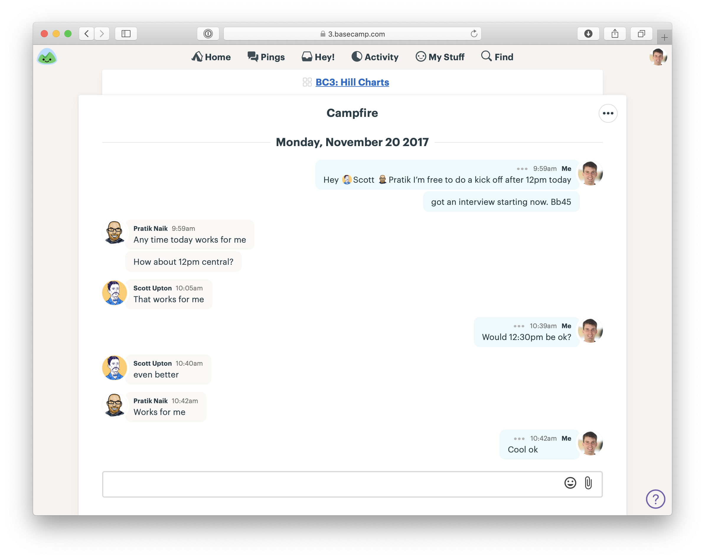

# 第十章 Hand Over Responsibility 移交責任

We’ve made our bets and now it’s time to start the next cycle. How does the team get started?

我們已經下了賭注，現在是時候開始下一個週期了。團隊該如何啟動？

## Assign projects, not tasks 指派專案，而非指派任務

We _don’t_ start by assigning tasks to anyone. Nobody plays the role of the “taskmaster” or the “architect” who splits the project up into pieces for other people to execute.

我們**不會**一開始就將任務分配給個別成員。團隊中不會有「任務管理者」或「架構師」負責將專案拆解成片段，再讓其他人執行。

Splitting the project into tasks up front is like putting the pitch through a paper shredder. Everybody just gets disconnected pieces. We want the project to stay “whole” through the entire process so we never lose sight of the bigger picture.

在一開始就將專案拆解成任務，就像把提案放進碎紙機一樣——每個人只會拿到零散的片段，缺乏整體連結。我們希望專案在整個過程中保持「完整」，以確保大家始終掌握全局，不會迷失在細節中。

Instead, we trust the team to take on the entire project and work within the boundaries of the pitch. The team is going to define their own tasks and their own approach to the work. They will have full autonomy and use their judgement to execute the pitch as best as they can.

相反地，我們相信團隊能夠承擔整個專案，並在提案的範圍內運作。團隊將自行拆解任務，規劃自己的工作方式。他們擁有完全的自主權，並運用專業判斷，盡全力執行提案。

Teams love being given more freedom to implement an idea the way they think is best. Talented people don’t like being treated like “code monkeys” or ticket takers.

團隊喜歡擁有更大的自由度來實現想法，以他們認為最合適的方式執行專案。優秀的人才不喜歡被當作「程式猿」或只是負責處理票據的機器。

Projects also turn out better when the team is given responsibility to look after the whole. Nobody can predict at the beginning of a project what exactly will need to be done for all the pieces to come together properly. What works on paper almost never works exactly as designed in practice. The designers and programmers doing the real work are in the best position to make changes and adjustments or spot missing pieces.

當團隊被賦予整體責任時，專案的成果也會更好。沒有人能在專案開始時準確預測所有細節如何完美結合。理論上的計劃幾乎從未能完全按照設計在實務中運行。真正執行工作的設計師和工程師，才是最適合做出調整、發現缺漏的人。

When teams are assigned individual tasks, each person can execute their little piece without feeling responsible for judging how all the pieces fit together. Planning up front makes you blind to the reality along the way.

如果團隊成員只被分配個別任務，每個人可能會完成自己的部分，卻不會主動去思考整體的協調性。事先規劃得太細，反而讓你在執行過程中對現實狀況視而不見。

Remember: we aren’t giving the teams absolute freedom to invent a solution from scratch. We’ve done the shaping. We’ve set the boundaries. Now we are going to trust the team to fill in the outline from the pitch with real design decisions and implementation.

記住：我們並不是讓團隊從零開始隨意發明解決方案。我們已經完成了塑形，設定了邊界。現在，我們要信任團隊，在這個框架內做出真正的設計決策並負責實際執行。

This is where our efforts to define the project at the right level of abstraction—without too much detail—will pay off. With their talent and knowledge of the particulars, the team is going to arrive at a better finished product than we could have by trying to determine the final form in advance.

這正是我們努力在適當的抽象層次定義專案——避免過度細節化——所帶來的價值。憑藉他們的專業能力和對細節的理解，團隊將打造出比我們事先預設更出色的最終產品。

## Done means deployed 完成的標準就是部署

At the end of the cycle, the team will deploy their work. In the case of a Small Batch team with a few small projects for the cycle, they’ll deploy each one as they see fit as long as it happens before the end of the cycle.

在週期結束時，團隊將部署他們的成果。對於負責小型專案的 **Small Batch** 團隊來說，他們可以依照自己的判斷，在週期內適時部署各個專案，只要確保在週期結束前完成即可。

This constraint keeps us true to our bets and respects the `circuit breaker`. The project needs to be done within the time we budgeted; otherwise, our appetite and budget don’t mean anything.

這項限制讓我們對自己的決策負責，並遵守 「斷路器」機制。專案必須在我們設定的時間內完成，否則，「可投入的精力（appetite）」和「預算」將失去意義。

That also means any testing and QA needs to happen _within_ the cycle. The team will accommodate that by scoping off the most essential aspects of the project, finishing them early, and coordinating with QA. (More on that later.)

這也意味著所有的測試與品質保證（QA）**必須**在週期內完成。團隊會透過**確定專案的核心範圍**、**提前完成最關鍵的部分**，並與 QA 團隊協調來確保這一點。（這部分我們之後會進一步討論。）

For most projects we aren’t strict about the timing of help documentation, marketing updates, or announcements to customers and don’t expect those to happen within the cycle. Those are thin-tailed from a risk perspective (they never take 5x as long as we think they will) and are mostly handled by other teams. We’ll often take care of those updates and publish an announcement about the new feature during cool-down after the cycle.

至於大多數專案，我們對**使用說明、行銷更新或客戶公告**的時機並不嚴格要求，也不期望它們一定要在週期內完成。這些工作從風險角度來看屬於「低風險尾端」，它們的實際所需時間不會比預期長出 5 倍，且通常由其他團隊負責。我們經常會在週期結束後的**冷卻期（cool-down）**處理這些更新，並發布新功能的公告。

## Kick-off 專案啟動

We start the project by creating a new [Basecamp](https://basecamp.com) project and adding the team to it. Then the first thing we’ll do is post the shaped concept to the Message Board. We’ll either post the original pitch or a distilled version of it.

我們會先建立一個新的 [Basecamp](https://basecamp.com) 專案，並將團隊成員加入其中。接著，第一步就是將塑形後的概念發布到留言板。這可能是原始提案，也可能是提案的精要版本。

The first thing on the [Basecamp](https://basecamp.com) project is a message with the shaped concept

在 [Basecamp](https://basecamp.com) 專案中，第一條訊息就是包含塑形後概念的訊息。

Since our teams are remote, we use the chat room in the Basecamp project to arrange a kick-off call.

由於我們的團隊是遠程工作的，我們會在 Basecamp 專案中的聊天室裡安排一次啟動會議

Arranging a call with the team to walk through the shaped work

安排與團隊的會議，走過塑形後的工作內容

The call gives the team a chance to ask any important questions that aren’t clear from the write-up. Then, with a rough understanding of the project, they’re ready to get started.

這個會議讓團隊有機會提出任何在書面說明中不清楚的關鍵問題。接著，團隊對專案有了大致了解後，便可以準備開始執行。

## Getting oriented 進入狀況

Work in the first few days doesn’t look like “work.” No one is checking off tasks. Nothing is getting deployed. There aren’t any deliverables to look at. Often there isn’t even much communication between the team in the first few days. There can be an odd kind of radio silence.

專案的前幾天看起來不像是「工作」的開始。沒有人在勾選任務，也沒有東西被部署，甚至也沒有可交付的成果來檢視。通常，在這段時間內團隊之間的溝通也不多，會有一種奇怪的「無聲狀態」。

Why? Because each person has their head down trying to figure out how the existing system works and which starting point is best. Everyone is busy learning the lay of the land and getting oriented.

為什麼會這樣？因為每個人都專心在理解現有系統如何運作，並找出最合適的起點。每個人都忙著了解整體情況，並開始適應專案的環境。

The team figuring out where to start

團隊確定從何開始

It’s important for managers to respect this phase. Teams can’t just dive into a code base and start building new functionality immediately. They have to acquaint themselves with the relevant code, think through the pitch, and go down some short dead ends to find a starting point. Interfering or asking them for status too early hurts the project. It takes away time that the team needs to find the best approach. The exploration needs to happen anyway. Asking for visible progress will only push it underground. It’s better to empower the team to explictly say “I’m still figuring out how to start” so they don’t have to hide or disguise this legitimate work.

對於管理者來說，尊重這個階段非常重要。團隊不能立即進入代碼庫並開始開發新功能。他們需要熟悉相關代碼，深入思考提案，並走幾條短暫的死胡同，來找到最合適的起點。過早干預或要求他們報告狀態只會對專案造成傷害，浪費了團隊尋找最佳解決方案的時間。探索階段是必須進行的，要求顯著的進展只會讓這些探索過程被隱藏起來。讓團隊能夠明確說出「我還在弄清楚如何開始」會更好，這樣他們就不必隱瞞或掩飾這些合理的工作內容。

Generally speaking, if the silence doesn’t start to break after three days, that’s a reasonable time to step in and see what’s going on.

一般來說，如果三天後沉默依然沒有突破，那麼就可以合理地介入，了解發生了什麼情況。

## Imagined vs discovered tasks 預想的任務 vs 發現的任務

Since the team was given the project and not tasks, they need to come up with the tasks themselves. Here we note an important difference between tasks we _think_ we need to do at the start of a project and the tasks we _discover_ we need to do in the course of doing real work.

由於團隊是接手整個專案而非具體任務，他們需要自行確定任務。這裡有一個重要的區別，就是我們在專案開始時**預想**需要做的任務，與在實際工作過程中**發現**需要執行的任務。

The team naturally starts off with some imagined tasks—the ones they assume they’re going to have to do just by thinking about the problem. Then, as they get their hands dirty, they discover all kinds of other things that we didn’t know in advance. These unexpected details make up the true bulk of the project and sometimes present the hardest challenges.

團隊一開始自然會有一些預想的任務——這些是他們在思考問題時假設必須完成的任務。隨著他們深入執行，會發現許多事先並不知道的細節。這些意外的細節構成了專案的真正核心，並且有時會帶來最具挑戰性的問題。

Teams discover tasks by doing real work. For example, the designer adds a new button on the desktop interface but then notices there’s no obvious place for it on the mobile webview version. They record a new task: figure out how to reveal the button on mobile. Or the first pass of the design has good visual hierarchy, but then the designer realizes there needs to be more explanatory copy in a place that disrupts the layout. Two new tasks: Change the layout to accommodate explanatory copy; write the explanatory copy.

團隊透過實際工作來發現任務。例如，設計師在桌面介面上新增了一個按鈕，但隨後發現移動端網頁版本中並沒有明顯的位置來放置這個按鈕。他們記錄下一個新任務：找出如何在移動端顯示這個按鈕。又或者，設計的第一版本有很好的視覺層級，但設計師意識到在某個地方需要更多的解釋性文字，這樣會破壞原本的佈局。這時出現兩個新任務：調整佈局以容納解釋性文字；編寫解釋性文字。

Often a task will appear in the process of doing something unrelated. Suppose a programmer is working on a database migration. While looking at the model to understand the associations, she might run into a method that needs to be updated for a different part of the project later. She’s going to want to note a task to update that method later.

許多任務往往是在處理無關的工作時出現。例如，假設一位程式設計師正在進行資料庫遷移。在查看模型以理解關聯的過程中，她可能會發現一個需要更新的方法，這個方法在專案的其他部分會用到。她會記下這個任務，稍後更新這個方法。

**The way to really figure out what needs to be done is to start doing real work.** That doesn’t mean the teams start by building just anything. They need to pick something meaningful to build first. Something that is central to the project while still small enough to be done end-to-end—with working UI and working code—in a few days.

**真正找出需要做的任務的方法，就是開始進行實際的工作。** 這並不意味著團隊要隨便開始建設任何東西。他們需要先選擇一個對專案有意義的任務來開始，這個任務應該是專案的核心，同時又足夠小，可以在幾天內完成，包含運作中的用戶介面和程式碼。

In the next chapters we’ll look at how the team chooses that target and works together to get a fully integrated spike working.

在接下來的章節中，我們將探討團隊如何選擇這個目標，並一起協作使得整合完成的首次開發（spike）順利運行。

