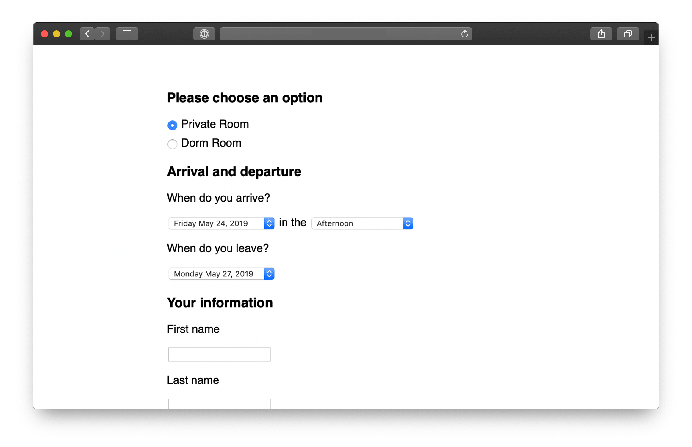

# 第十一章 Get One Piece Done 完成一個小目標

As the team gets oriented, they start to discover and track the tasks they need to do to build the project. It’s important at this early phase that they don’t create a master plan of parts that should come together in the 11th hour. If the team completes a lot of tasks but there’s no “one thing” to click on and try out, it’s hard to feel progress. A team can do a lot of work but feel insecure because they don’t have anything real to show for it yet. Lots of things are done but nothing is _really_ done.

當團隊開始適應專案時，他們會開始發現並追蹤需要完成的任務。這個早期階段很重要，團隊不應該制定一個包含所有零碎部分的宏大計劃，並期望它們在最後一刻才匯聚在一起。如果團隊完成了許多任務，但沒有一個「完成的東西」可以點擊並嘗試，那麼很難感受到進展。一個團隊可能做了很多工作，但如果還沒有實際的成果展示出來，他們會感到不安。很多事情做了，但什麼都還沒**真正**完成。

Instead they should aim to make something tangible and demoable early—in the first week or so. That requires integrating vertically on one small piece of the project instead of chipping away at the horizontal layers.

相反地，他們應該在專案的第一週左右，目標是製作出一個具體且可以展示的成果。這需要在專案中的一小部分進行垂直整合，而不是只專注於水平層級的拆解。

## Integrate one slice 整合一個切片

We can think of projects in two layers: front-end and back-end, design and code. While technically speaking there are more layers than this, these two are the primary integration challenge in most projects.

我們可以將專案分為兩個層級：前端和後端，設計和程式碼。雖然從技術角度來看，專案中可能有更多層級，但這兩個層級通常是大多數專案中的主要整合挑戰。

Suppose the project starts with a lot of design. The team could design a variety of screens and even implement them as templates or views. But until they’re wired to a backend, nothing does anything. The work remains hypothetical and speculative.

假設專案一開始有大量的設計工作。團隊可能會設計多個畫面，甚至將它們實現為模板或視圖。然而，直到這些設計與後端進行串接，這些功能都不會真正運作。此時的工作仍然處於假設性和推測性的階段。

Same with the backend. A lot of tasks could be checked off, but without any UI—what can you do with it? How do you judge if the work on a specific piece of business logic is really right without interacting with it?

後端也是如此。許多任務可能已經完成，但如果沒有任何用戶介面（UI）——你能做什麼呢？如果不與它互動，怎麼評估某個業務邏輯的工作是否真的正確？

What we want instead is to pick off one slice of the project to integrate. Then when that’s done, the team has something tangible that they’ve proven to work (or not work and reconsider). Anyone can click through the interaction and see if the feature does what it should and if what it does is what they want.

我們真正希望的是選擇專案中的一個切片進行整合。當這個切片完成後，團隊就擁有了一個具體的成果，可以證明它是否有效（或者如果無效，再重新考慮）。這樣，任何人都可以點擊操作，檢視這個功能是否按預期運作，並確定它的表現是否符合需求。

## Case study: Clients in projects 案例研究：專案中的客戶

We built a feature in Basecamp 3 that allowed service firms to invite clients to their projects and share chosen documents, messages, or to-do lists with them. The concept, defined in the pitch, had a variety of moving parts:

我們在 Basecamp 3 中開發了一個功能，讓服務公司能夠邀請客戶參與他們的專案，並與客戶共享選定的文件、訊息或待辦事項清單。這個概念，在提案中已有明確定義，涉及了多個互動部分：

- Client Access: Before this feature, Basecamp’s access model was all or nothing. We needed a way to invite some people to see just some parts of a project. This had major back-end and caching implications.
- Client Management: We needed a way to add clients to projects and the ability to manage clients separately from team members.
- Visibility Toggle: Each piece of content in a project should have a toggle to expose it to clients or not.
- 客戶存取：在這個功能之前，Basecamp 的存取模式是完全開放或完全封鎖。我們需要一種方式，讓部分人只能查看專案的某些部分。這對後端和快取系統帶來了重大影響。
- 客戶管理：我們需要一種方法來將客戶添加到專案中，並且能夠將客戶與團隊成員分開管理。
- 可見性切換：專案中的每個內容都應該有一個切換選項，讓用戶決定是否將其顯示給客戶。

The team had one designer and one programmer. After they got oriented and familiar with how the existing code worked, the designer chose the visibility toggle as the best place to integrate first. This was the most central piece of UI in the project. It’s the one that would appear in demo videos and the interaction customers would use most.

團隊有一位設計師和一位程式設計師。在他們了解並熟悉現有代碼後，設計師選擇了可見性切換作為最先整合的地方。這是專案中最核心的 UI 元件，也是最常出現在示範影片和客戶互動中的部分。

The designer didn’t make a pixel-perfect mockup. Instead, he experimented with different affordances and placements in the app’s HTML templates. Should the toggle be two radio buttons, a checkbox, or a custom button that changes state?

設計師並沒有製作像素完美的樣式圖。相反，他在應用程式的 HTML 模板中進行了不同的操作方式和佈局實驗。該切換選項應該是兩個單選按鈕、一個複選框，還是用來改變狀態的自定義按鈕？

Meanwhile, the programmer wasn’t waiting around. He had enough guidance from the pitch to start spiking the access model.

同時，程式設計師並沒有閒著。他從提案中獲得了足夠的指引，開始進行存取模型的初步開發（spiking）。

As soon as the designer felt confident in the basic direction of the UI, he pinged the programmer and showed him the stubbed toggle. Stepping away from the access problem for a bit, the programmer wired the toggle enough so that it would appear on all the supported content types, change state when clicked, and save its state in the database.

當設計師對 UI 的基本方向感到有信心時，他就聯繫了程式設計師，並向他展示了初步的切換選項。暫時離開存取問題後，程式設計師將切換選項進行了足夠的串接，使其能夠在所有支持的內容類型中顯示，並在被點擊時改變狀態，同時將狀態保存到資料庫中。

At this point, the toggle didn’t actually change the visibility of the content. But it worked from the service firm’s point of view. The designer could click it, feel it, and judge how well it worked with live data on a staging server.

此時，這個切換選項實際上並未改變內容的可見性。但從服務公司的角度來看，它已經起作用了。設計師可以點擊它，感受到操作的效果，並在預備伺服器上的實際數據中評估它的表現。

There was still more design work to do on the toggle. But the programmer didn’t need to be involved anymore. With the affordance wired up, the designer could continue to experiment with copy, placement, color, mobile view rendering, and more. Meanwhile, the programmer could get back to the access model or whatever else was most important to tackle next.

切換選項仍然需要進一步的設計工作，但程式設計師不再需要再介入。由於操作方式已經串接完成，設計師可以繼續在文案、佈局、顏色、移動端顯示等方面進行實驗。與此同時，程式設計師可以回到存取模型的工作，或是繼續處理接下來最重要的任務。

About three days after the start of the project, the designer demoed the working toggle to a manager. Their conversation led to a few more tweaks and then they were able to call the toggle “done.” One important piece of the project was designed, implemented, demoed, and settled. The team felt good about showing tangible progress. And the team and management both felt confidence in the project by seeing a working piece. By clicking through a core interaction early, they were able to validate that what they hoped would make sense in theory did indeed look right and make sense in practice.

在專案開始約三天後，設計師向經理展示了已完成的切換選項。隨著他們的討論，做了一些微調後，最終可以稱這個切換選項為「完成」。專案中一個重要的部分已經設計、實現、展示並確定下來。團隊對展示具體的進展感到滿意。透過看到一個可運作的成果，團隊和管理層對專案也感到更有信心。通過早期點擊核心互動，團隊能夠驗證他們原本認為理論上能夠奏效的設計，實際上也看起來正確且符合邏輯。

This short example illustrates a few points about how the teams integrate over short periods to finish one piece of the project at a time.

這個簡短的範例說明了幾個要點，展示了團隊如何在短時間內進行整合，一次完成專案的一個部分。

## Programmers don’t need to wait 程式設計師不需要等待

Because the important moving parts were already defined in the shaping process, programmers don’t need to sit idle waiting for design when the project starts. There’s enough direction in the pitch for them to start working on back-end problems from the start. They won’t be able to take a piece of functionality to completion without knowing where it leads on the front-end, but there should be enough information in the pitch to inform foundational modeling decisions.

由於在設計階段中已經明確定義了重要的關鍵部分，程式設計師在專案開始時不需要閒待設計完成。他們可以根據提案中的指引，從一開始就著手處理後端問題。儘管他們無法在不清楚前端結果的情況下將某個功能完整實現，但提案中應該有足夠的資訊來指導基礎建模的決策。

## Affordances before pixel-perfect screens 操作方式優先於像素完美的設計

Programmers don’t need a pixel-perfect design to start implementing. All they need are endpoints: input elements, buttons, places where stored data should appear. These affordances are the core of a user interface design.

程式設計師不需要像素完美的設計才能開始實作。他們所需要的只是端點：輸入元素、按鈕、顯示儲存資料的位置。這些操作方式（affordances）是使用者介面設計的核心。

Questions about font, color, spacing, and layout can be resolved after the raw affordances are in place and hooked up in code. Copywriting, basic affordances, and some wiring are all we need to try a live working version in the browser or on the device. Then we can answer the fundamental questions early: Does it make sense? Is it understandable? Does it do what we want?

關於字型、顏色、間距和佈局等問題，可以在基本操作方式實現並在程式碼中串接完成後再處理。文案撰寫、基本操作方式和一些串接工作，是我們在瀏覽器或裝置上嘗試運行版本所需的全部。這樣，我們就能在早期解答一些基本問題：這樣設計合理嗎？能理解嗎？它達到我們的需求嗎？

That means the first interface a designer gives to a programmer can look very basic, like the example below. It’s more like a breadboard than a visual design or a polished mock-up.

這意味著，設計師提供給程式設計師的第一版介面可能非常簡單，就像下面的範例。它更像是一塊麵包板（breadboard），而不是視覺設計或精緻的樣機。

This screenshot is from a registration app for multi-day courses. The designer made it in HTML by hand. There’s barely any style — just enough visual hierarchy to feel confident that the layout is usable and amenable to future layers of styling.

這張截圖來自於一個多日課程的註冊應用程式。設計師是手工用 HTML 製作的。這裡幾乎沒有任何樣式—只有足夠的視覺層級來確保佈局是可用的，並且可以適應未來層次的樣式設計。

While the design looks simple, a lot of decisions are reflected in it.

雖然設計看起來簡單，但其中反映了許多決策。

- The decision to ask for arrival time but not departure time came from detailed discussions about the business logic and pricing model.
- 要求輸入到達時間但不要求輸入離開時間的決策來自於關於商業邏輯和定價模型的詳細討論。
- The specific options in the arrival time pulldown correspond to rules that had to be worked out about when to charge for meals and overnight stays.
- 到達時間下拉選單中的具體選項對應了必須解決的規則，這些規則決定了何時開始計算餐飲和住宿費用。
- The designer’s first sketches used a calendar-style date picker for the arrival and departure days. But that led to UX problems. Some courses were long (multiple weeks) with different phases. There wasn’t room in a standard calendar-style date picker to label the phases on the day boxes. With a pulldown, she could use option groups to label groups of dates when needed. That way users wouldn’t need to reference a schedule elsewhere to be sure they were selecting the right dates.
- 設計師的初步草圖使用了日曆樣式的日期選擇器來選擇到達和離開的日期，但這導致了使用者體驗上的問題。一些課程時間較長（多週），且有不同的階段。標準的日曆式日期選擇器無法在日期框中標註這些階段。使用下拉選單後，她可以在需要時使用選項組來標註日期範圍，這樣使用者就不需要另外查閱時間表來確認是否選擇了正確的日期。

Here’s another example. This is the first working piece of an app for capturing data from customer interviews.

這是另一個範例。這是用於捕捉來自客戶訪談數據的應用程式中的第一個可運行部分。

At this early stage the project name (Basecamp) and interview subject (Jan) were hard-coded and most of the links didn’t go anywhere.

在這個早期階段，專案名稱（Basecamp）和訪談對象（Jan）是硬編碼的，且大部分的連結都沒有作用。

Look at how raw this design is. The actions are plain text links in the default blue and purple browser colors. The boxes containing the data points are barely styled with plain black borders. As rough as it is, this design tests some important trade-offs. The designer chose to show as much data as possible above the fold so it would be easy to review interviews. That didn’t leave enough room within each section for UI to add, edit, or remove data points. That led the designer to create separate screens for adding and editing data per section.

看看這個設計有多簡陋。操作項目只是普通的文字連結，使用了瀏覽器預設的藍色和紫色。顯示數據點的框框幾乎沒有任何樣式，只有普通的黑色邊框。儘管設計如此粗糙，它測試了幾個重要的權衡。設計師選擇將盡可能多的數據展示在視窗上方，這樣可以更容易地回顧訪談內容。然而，這樣的設計並沒有在每個區塊中留出足夠的空間來新增、編輯或移除數據點。這促使設計師為每個區塊創建了單獨的新增和編輯頁面。

![Screenshot of a dedicated screen for adding pulls to the box labeled 'pulls' in the previous screenshot. The breadcrumb at the top indicate these are pulls for Jan in the Basecamp interview project. Three pulls are listed, each as a row of text beginning with the word 'So', for example 'So my staff will know what to do', and ending with a link to edit it. Below the pulls, the last row beings with the word 'So' followed by a text field and an 'Add' button. The edit links and the Add button are unstyled.](./images/treehouse_pulls.png)

This is the first design for adding and editing “pulls” — a type of data in this interview technique. Again, look at how raw it is. There’s just enough design here to quickly wire it up and test it. The team can click through this to judge whether navigating to a separate screen to record data is acceptable or not. If it works, they can layer on additional styling later. If it doesn’t work, they didn’t waste a lot of time implementing a pixel-perfect design.

這是用來新增和編輯「pulls」的設計——這是這種訪談技術中的一種類型數據。同樣，看看它有多簡陋。這裡的設計只是足夠讓它迅速連接並進行測試。團隊可以通過點擊來判斷是否接受跳轉到單獨頁面來錄入數據。如果這樣行得通，之後可以再加上額外的樣式。如果行不通，那麼他們也沒有浪費很多時間在實現像素完美的設計上。

Beautiful alignment, colors, and typography don’t matter on the first pass. Visual styling is important in the end product, not in the early stages. The biggest uncertainties are about whether it will work, whether it will make sense, and how hard it will be to implement. After the elements are wired up, they can be rearranged, restyled, and repainted to improve the work that’s already done. First make it work, then make it beautiful.

在第一次實作時，美麗的對齊、顏色和字體樣式並不重要。視覺樣式對最終產品很重要，但對於早期階段並非關鍵。最大的未知數是它是否能運作、是否合理，以及實現的難易度。在元素串接完成後，它們可以重新排列、重新設計和重繪，以改善已經完成的部分。先讓它運作，再讓它變美麗。

## Program just enough for the next step 只編程到下一步所需的程度

The same is true for back-end work. It doesn’t have to be all or nothing. Sometimes a designer just needs some scaffolding—a couple fields that save data or some code to navigate from one stubbed screen to another. Other times she needs to populate a variable in the template with a collection of real data so she can iterate on different displays (rows, columns, media boxes, etc) to find the best design.

後端工作也是如此。它不需要一次完成所有的功能。有時候，設計師只需要一些基本框架——例如幾個可以儲存資料的欄位，或者一些能夠從一個假設的頁面導航到另一個頁面的程式碼。其他時候，她需要將一個變數在範本中填入一組真實數據，這樣她才能反覆調整不同的顯示方式（如行、列、媒體框等），以找到最佳設計。

The early back-end work can be strategically patchy. There might be a controller to render templates but no model. Or a controller and bits of a model with mock data but no support for creating or updating the data. Screens that aren’t wired yet could at least be connected with routes for navigating between them.

早期的後端工作可以是策略性地不完整。有可能會有一個用來渲染範本的控制器，但沒有模型；或者是有控制器和部分模型，帶有模擬數據，但沒有支援創建或更新數據。尚未連接的頁面至少可以透過路由進行連結，以便在它們之間導航。

When it was time to test the first piece of the interview app, the team knew there would be sensitive data from real interviews going into it. They needed to protect it with some kind of authentication. Rather than building full username and password support—or even integrating a third-party solution—they just used plain HTTP Auth to hard-code a password.

當是時候測試這個訪談應用程式的第一部分時，團隊知道會有來自真實訪談的敏感數據進入系統。他們需要用某種認證方式來保護這些數據。與其建立完整的用戶名和密碼支持，甚至整合第三方解決方案，他們選擇了使用簡單的 HTTP Auth，將密碼硬編碼進去。

This allowed the team to try adding data from real interviews very early in the cycle, without slowing down to hook up some authentication code that wasn’t going to teach them anything about the problems they were trying to solve.

這讓團隊能夠在開發週期的早期階段就嘗試從真實訪談中添加數據，而無需停下來連接認證代碼，因為那並不會幫助他們了解他們正在解決的問題。

The point is to create a back-and-forth between design and programming on the same piece of the product. Instead of one big hand-off, take turns layering in affordances, code, and visual styling. Step by step, click through the real working feature-in-progress to judge how it’s coming and what to do next.

重點是創建設計與程式編碼之間的反覆迭代，而不是一次性完成所有的交接。輪流加入基本的功能、程式碼和視覺樣式。一步步地，透過實際運行的功能來點擊測試，評估它的進展情況以及下一步該做什麼。

## Start in the middle 從中間開始

In the examples above, the team didn’t build log in first. They didn’t build a way to create an interview project and an interview subject before solving the problem of adding interview data. They jumped straight into the middle where the interesting problem was and stubbed everything else to get there.

在上面的例子中，團隊並沒有先建立登錄功能。他們也沒有先建立創建訪談項目和訪談對象的方式，而是直接解決了添加訪談數據的問題。他們跳到了中間，去處理最有趣的問題，並為了達成目標而先行擺放了其他部分的框架。

To expand on this, here are three criteria to think about when choosing what to build first:

為了進一步闡述，這裡有三個選擇首先構建內容的標準：

First, it should be **core**. The visibility toggle was core to the Clients in Projects concept. Without it, the other work wouldn’t mean anything. Contrast that with a more peripheral aspect of the project, like the ability to rename a client. Both were “required,” but one was more central and important to prove out early in the cycle. In the interview app, recording interview data was more core—more in the middle—than setting up a new research project.

首先，它應該是**核心**的。可見性切換是「專案中的客戶」功能的核心。如果沒有它，其他的工作就不會有意義。這與專案中較為邊緣的部分相比，如重命名客戶的功能，形成對比。這兩者都是「必要的」，但其中一個是更中央的部分，需要在週期初期就證明其可行。在訪談應用程式中，錄製訪談數據比設置新的研究項目更為核心——它更接近核心。

Second, it should be **small**. If the first piece of work isn’t small enough, there isn’t much benefit to carving it off from the rest. The point is to finish something meaningful in a few days and build momentum—to have something real to click on that shows the team is on the right track.

其次，它應該是**小**的。如果第一部分工作不夠小，那麼將其與其他工作分開就沒有太大好處。重點是要在幾天內完成一些有意義的事情並建立動力——擁有某個實際的功能來點擊，這可以顯示團隊走在正確的道路上。

Third, it should be **novel**. If two parts of the project are both core and small, prefer the thing that you’ve never done before. In the Clients in Projects feature, the UI for adding clients was mostly the same as the UI for adding regular users. Starting on that would have moved the project forward, but it wouldn’t have taught the team anything. It wouldn’t have eliminated uncertainty. Starting with the visibility toggle boosted everyone’s confidence because it proved that a new idea was going to work.

第三，它應該是**新穎**的。如果專案中的兩個部分既是核心又是小的，那麼最好選擇一個你從未做過的部分。在「專案中的客戶」功能中，添加客戶的界面與添加普通用戶的界面基本相同。從這部分開始可以推進專案，但並不能讓團隊學到什麼，也不能消除不確定性。而從可見性切換開始則提高了每個人的信心，因為這證明了一個新的想法將會成功。

