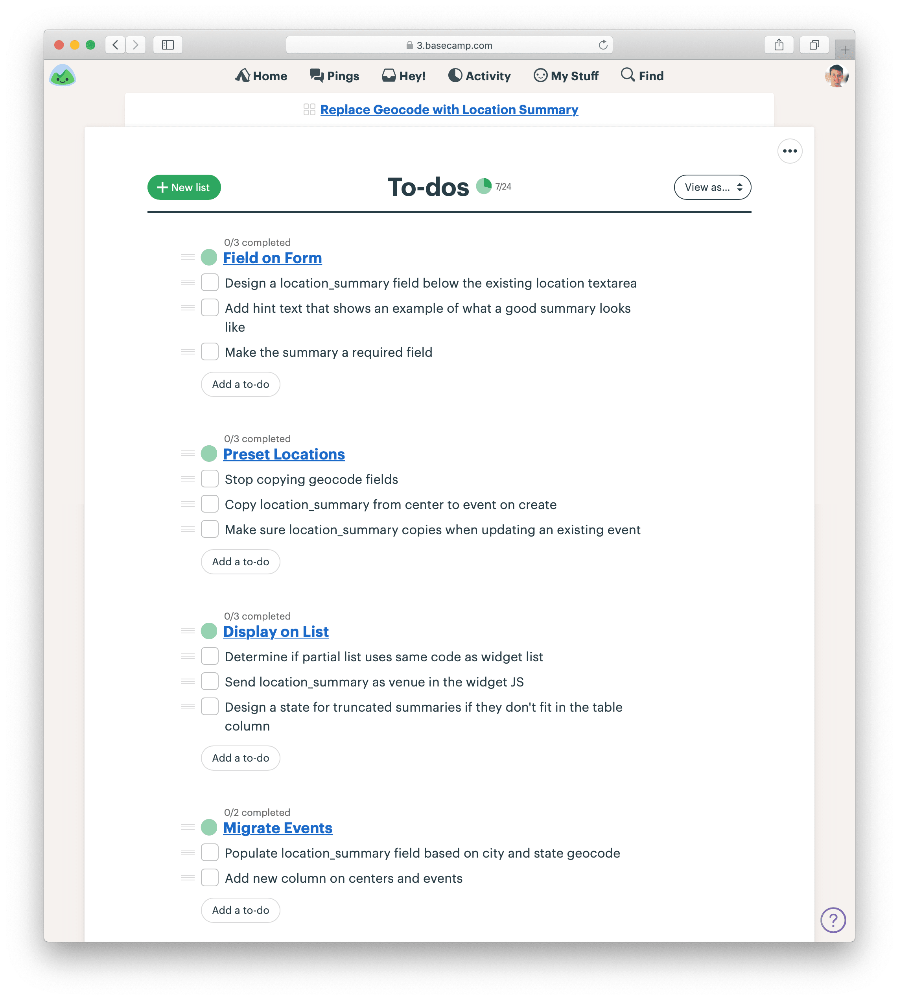
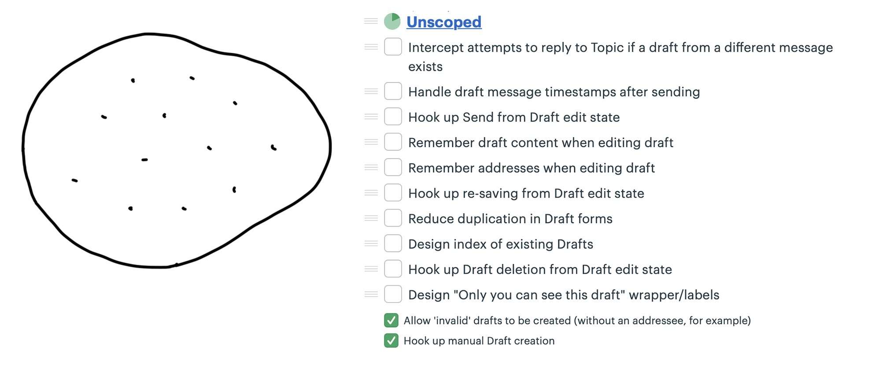

# 第十二章 Map the Scopes 繪製範圍

In the previous chapter, we started the project by finishing one integrated slice early on. That practice belongs to a more general technique that the team can use throughout the project.

在上一章中，我們通過早期完成一個集成的切片來開始專案。這個做法屬於一個更通用的技術，團隊可以在整個專案中使用這個方法。

## Organize by structure, not by person 根據結構組織，而不是根據人員

When asked to organize tasks for a project, people often separate work by person or role: they’ll create a list for Designers and a list for Programmers. This leads to the problem we talked about in the previous chapter—people will complete tasks, but the tasks won’t add up to a finished part of the project early enough.

當被要求為專案組織任務時，人們經常根據人員或角色來劃分工作：他們會為設計師和程式員分別創建列表。這會導致我們在前一章中提到的問題——人們會完成任務，但這些任務不會及早組成專案的完成部分。

To take an example outside of software, consider someone organizing a fundraising event. They could create a list of tasks for each of their three volunteers and track the work that way. But then there’d be no way to see the big picture of how the event is coming together—what’s done and what’s not done at the macro level. Instead, they should create lists based on the _structure_ of the project—the things that can be worked on and finished independently of each other. To do that, they would create lists for Food Menu, Venue Setup, and Light/Sound. Then the organizer can easily see which areas are done and which areas have outstanding work.

舉個軟體以外的例子，想像有人在組織一個募款活動。他們可能會為三個志工創建一個任務列表，並以此追蹤工作進度。但這樣一來，就無法從宏觀層面看到活動進展的全貌——哪些已經完成，哪些還沒有完成。相反，他們應該根據專案的**結構**來創建任務清單——那些可以獨立進行並完成的部分。為此，他們可以創建食物菜單、場地佈置和燈光/音響的列表。這樣一來，組織者就能輕鬆地看到哪些領域已經完成，哪些還有待完成的工作。

In product development, the categories aren’t pre-cut for us. We usually build things we’ve never built before. Each project is a wild territory that we have to walk through before we can draw a map. By digging into the work, we figure out where the interdependencies are, how things are connected, and what we can slice apart.

在產品開發中，這些類別並不是預先劃定的。我們通常是在建立一些我們從未做過的東西。每一個專案都是一片未知的領土，我們必須走過它，才能繪製出地圖。透過深入工作，我們能夠找出相互依賴的部分、事物之間的連結，以及我們可以切割開的部分。

As we saw in the previous chapter, the slices of work integrate front-end and back-end tasks. This allows us to finish one slice of the actual project and definitively move on. That’s better than having lots of pieces that—fingers crossed—are supposed to come together by the end of the cycle.

正如前一章所見，工作切片整合了前端和後端的任務。這讓我們能夠完成專案中的某一片段，並確定地向下一階段邁進。這比起有很多碎片，然後——希望能夠在周期結束前合併起來，要來得更有效。

We call these integrated slices of the project `scopes`. We break the overall scope (singular) of the project into separate scopes (plural) that can be finished independently of each other. In this chapter, we’ll see how the team maps the project into scopes and tackles them one by one.

我們稱這些整合過的專案片段為「範圍」（scopes）。我們將專案的整體範圍（singular）分解成可以互相獨立完成的個別範圍（plural）。在本章中，我們將展示團隊如何將專案劃分成範圍，並逐一處理這些範圍。

## The scope map 範圍地圖

Imagine an overhead view of the project. At the beginning, there’s just an outline from the shaping work that preceded the project. There aren’t any tasks or scopes yet.

想像一下專案的鳥瞰圖。一開始，只有來自專案前期形狀工作（shaping work）的輪廓，還沒有任何任務或範圍。

When the team members take over the project, they start discovering tasks. Tasks are a natural starting point because they’re concrete and granular. It’s too early to organize them into higher level categories. It would be artificial to try and group them arbitrarily. It’s enough at the start just to capture a variety of things that need to happen.

當團隊成員接手專案時，他們開始發現任務。任務是自然的起點，因為它們具體且詳細。此時，還太早將它們組織成較高層次的分類，試圖隨意地將它們歸類是人工的。開始時，僅僅捕捉到需要發生的各種事情就已經足夠了。

But we don’t want to stay with this picture for long. It’s too low-level. There’s nothing visible from high altitude.

但我們不希望長時間停留在這個畫面中。它太過於低階，從高空看不到任何全貌。

As the team starts doing real work on the project they learn how the tasks are related and what the structure of the project is really like. Then they become able to factor the project into scopes. This is like dividing the map of the project into separate territories.

隨著團隊開始進行實際的專案工作，他們會學到這些任務之間的關聯，以及專案的結構實際上是怎麼樣的。然後，他們就能夠將專案劃分成不同的範疇（scopes）。這就像是將專案的地圖分割成不同的領域一樣。

The scopes reflect the meaningful parts of the problem that can be completed independently and in a short period of time—a few days or less. They are bigger than tasks but much smaller than the overall project.

這些範疇反映了問題中可以在短時間內（幾天內）獨立完成的有意義部分。它們比任務大，但比整個專案小。

The map is a mental image. In practice, we define and track the scopes as to-do lists. Each scope corresponds to a list name. Then any tasks for that scope go in that list.

這張地圖是一個心理圖像。在實際操作中，我們會將範疇定義並追蹤為待辦事項清單。每個範疇對應到一個清單名稱，然後所有與該範疇相關的任務都會放進這個清單裡。

## The language of the project 專案的語言

Scopes are more than just slices. They become the language of the project at the macro level. When we were building the _Clients in Projects_ feature, the team used the language of the scopes like this: “After _Bucket Access_ is done we can implement _Invite Clients_. Then we’ll _Update Recording Visibility_ when people on the firm flip the _Visibility Toggle_.”

範疇不僅僅是切分部分，它們還成為了專案在宏觀層面的語言。在我們開發 _Clients in Projects_ 功能時，團隊用範疇的語言來表達，例如：「當 _Bucket Access_ 完成後，我們就可以實作 _Invite Clients_。接著，當公司的人切換 _Visibility Toggle_ 時，我們將進行 _Update Recording Visibility_。」

When it’s time to report status, the team uses the language of scopes to explain what’s done and what’s not done. It’s more satisfying to have the conversation at a high level and point to finished pieces of software, instead of going down into the weeds and defending the purposes and status of individual outstanding tasks. (We’ll see more in the next chapter about how to report on scopes using the Hill Chart.)

當需要報告進度時，團隊會使用範疇的語言來解釋已完成和尚未完成的部分。這樣的對話方式比深入細節，解釋每個待辦任務的目的和狀態來得更有滿足感。 （在下一章中，我們會進一步了解如何使用 Hill Chart 來報告範疇進度。）

## Case study: Message drafts 案例研究：訊息草稿

A designer and programmer were building a feature to create and save drafts of messages in a new app. After kick-off, they identified a bunch of tasks they would need to do at some point.

一位設計師和程式設計師正在為一款新應用程式開發一個功能，讓用戶可以創建並保存訊息草稿。啟動會議後，他們識別出了需要在某個階段完成的一些任務。

As the end of the first week approached, they had completed some of the tasks, but there wasn’t anything to show for their work. In the spirit of “get one piece done” they focused on one key interaction they could integrate: creating a new draft.

隨著第一週結束的臨近，他們完成了一些任務，但還沒有任何具體成果可展示。秉持著「完成一個部分」的精神，他們專注於一個關鍵的互動來整合：創建一個新的草稿。

They called the new scope “Start New,” created a to-do list for it, and moved to-dos into it. There was only one design task left for them to consider this scope finished.

他們將這個新範圍命名為「開始新草稿」，並為其創建了一個待辦清單，將待辦事項移動到其中。只剩下最後一個設計任務，完成後這個範圍就可以算作完成。

After finishing the one design task, the scope was complete.

在完成那個設計任務後，這個範圍就完成了。

The unscoped tasks that are left don’t represent all the work that remains. More tasks are going to be discovered as they start working on each of those. Still, there is enough variety in the work to tease out more scopes. The team was motivated to break out the scopes already at this point because they knew they wanted their efforts to add up to another visible piece being finished before long.

剩下的未定義範圍的任務並不代表所有剩餘的工作。隨著他們開始處理這些任務，還會發現更多的任務。儘管如此，這些工作中已經有足夠的多樣性，可以進一步分出更多的範圍。團隊在這個時候已經有動力將工作分成範圍，因為他們知道自己希望能夠在不久後完成另一個可見的成果。

Taking a look at the tasks that were left, they decided to pull out tasks related to finding the drafts into a new scope called Locate and the task for deleting into a scope called Trash. The work that was left all seemed related to saving and editing the draft, so they called that Save/Edit.

查看剩下的任務後，他們決定將與查找草稿相關的任務分出來，命名為新的範圍「Locate」，而將刪除的任務放入名為「Trash」的範圍。剩下的工作似乎都與保存和編輯草稿有關，因此他們將這部分工作命名為「Save/Edit」。

Take a look at the Locate scope. There’s only one task there right now. But surely there will be more work to do than just designing the index. When there are implementation tasks to do, that’s where they’ll go.

看看「Locate」範圍。目前只有一個任務，但肯定會有比設計索引更多的工作要做。當有實作任務時，它們就會放進這裡。

The designer started some work on Locate while the programmer focused on Save/Edit. As she dug into it, she noticed she could carve off a couple pieces to make more visible progress. There were really three scopes in it.

設計師開始進行「Locate」的部分工作，而程式開發者則專注於「Save/Edit」。當她深入了解時，她注意到可以將一些工作拆分出來，以便更快地展示進展。實際上，這裡有三個範圍。

First she factored out the work related to sending the drafted message. She called that Send.

首先，她將與發送草稿消息相關的工作提取出來，並將其命名為「Send」。

Finally, some of the remaining Save/Edit tasks were about storing information and one other was actually unrelated—it was a special case for handling drafts when replying to another message. She broke these out into two new scopes: Store and Reply.

最後，一些剩餘的「Save/Edit」任務是關於儲存資料的，另外還有一項任務其實不相關——它是處理回覆其他訊息時草稿的特殊案例。她將這些拆分成兩個新的範圍：「Store」和「Reply」。

At this point the team suddenly felt like they could see the whole of the project at a high level. All the major parts were visible at the macro level as scopes. None of them were so big that important or challenging tasks could hide inside of them unnoticed.

這時，團隊突然覺得能夠在高層次上看到整個專案。所有主要部分都作為範圍可見。這些範圍都不會太大，以至於其中的重要或具有挑戰性的任務會被隱藏而不被注意到。

Meanwhile, the designer had made progress on Locate. After a little wiring, they were able to mark that done. Tasks were getting done on Send and Store as well.

同時，設計師在「Locate」上取得了進展。經過一些連接後，他們能夠標記它為完成。關於「Send」和「Store」的任務也在進行中並取得了進展。

Once Send and Store were finished, just a couple tasks remained for Trash and Reply.

一旦「Send」和「Store」完成後，只有幾個任務剩下，分別是「Trash」和「Reply」。

And then the project was done.

然後，專案就完成了。

## Discovering scopes 發現範圍

Scope mapping isn’t planning. You need to walk the territory before you can draw the map. Scopes properly drawn are not arbitrary groupings or categories for the sake of tidiness. They reflect the real ground truth of what can be done independently—the underlying interdependencies and relationships in the problem.

範圍映射並不是規劃。你需要走過這片領土，才能畫出地圖。正確的範圍劃分不是為了整齊而隨意地將任務分組或分類，而是反映了實際情況，顯示了哪些任務可以獨立完成—即問題中的底層相互依賴和關聯。

Scopes arise from interdependencies. The way parts depend on each other determines when you can say a given piece of the work is “done.” You don’t know what the work and interdependencies actually are in advance. We talked earlier about imagined versus discovered tasks. The same principle applies to scopes. The scopes need to be discovered by doing the real work and seeing how things connect and don’t connect.

範圍來自相互依賴。各部分之間的依賴關係決定了你何時可以說某個工作已經「完成」。你無法提前知道具體的工作內容和相互依賴的關係。我們之前談過想像中的任務與發現的任務，同樣的原則也適用於範圍。這些範圍需要透過實際的工作來發現，並觀察事物如何連接或無法連接。

That’s why at the start of a project, we don’t expect to see accurate scopes. We’re more likely to see them at the end of week one or start of week two, after the team has had a chance to do some real work and find the natural dividing lines in the anatomy of the problem.

這就是為什麼在專案開始時，我們不期望能夠準確地劃分範圍。我們更有可能在第一週結束或第二週開始時看到範圍，因為這時團隊已經有機會進行一些實際工作，並找出問題結構中的自然劃分點。

It’s also normal to see some shuffling and instability in the scopes at first. The lines get redrawn or scopes renamed as the team feels out where the boundaries really are, like in the example above. The team was focused on specific problems of saving and editing drafts, so it was easiest to identify that scope early. It wasn’t until they got into the weeds that they noticed there were tasks specifically about sending the draft and made that a separate scope.

一開始，範圍也常常會出現一些調整和不穩定。隨著團隊摸索問題的邊界，範圍的劃分線可能會被重新繪製或範圍名稱被更改，就像上述例子所示。團隊專注於儲存和編輯草稿的具體問題，因此最早能夠識別出這個範圍。直到他們深入細節後，才注意到有些任務專門與發送草稿有關，並將其單獨劃分為一個範圍。

## How to know if the scopes are right 如何知道範圍是否正確

Well-made scopes show the anatomy of the project. When you feel a pain in your body, you don’t have to question whether it’s in your arms or your legs or your head. You know the parts and their names so you can explain where the pain is. In the same way, every project has a natural anatomy that arises from the design you want, the system you’re working within, and the interdependencies of the problems you have to solve.

精心設計的範圍展示了專案的結構。當你感到身體某部位疼痛時，你不需要質疑疼痛是在手臂、腿部還是頭部，你知道各個部位及其名稱，並能夠清楚地描述疼痛的部位。同樣，每個專案都有其自然的結構，這來自於你想要的設計、你正在使用的系統，以及你必須解決的問題之間的相互依賴關係。

Three signs indicate when the scopes are right:

三個標誌可以顯示範圍是否正確：

- You feel like you can see the whole project and nothing important that worries you is hidden down in the details.
- Conversations about the project become more flowing because the scopes give you the right language.
- When new tasks come up, you know where to put them. The scopes act like buckets that you can easily lob new tasks into.
- 你覺得可以看清整個專案，並且沒有任何重要的問題被隱藏在細節中。
- 關於專案的對話變得更加順暢，因為範圍提供了正確的語言。
- 當新任務出現時，你知道該把它放在哪裡。範圍就像是可以輕鬆丟進去的新任務的容器。

On the other hand, these three signs indicate the scopes should be redrawn:

另一方面，以下三個標誌表示範圍應該重新劃分：

- It’s hard to say how “done” a scope is. This often happens when the tasks inside the scope are unrelated. If the problems inside the scope are unrelated, finishing one doesn’t get you closer to finishing the other. It’s good in this case to look for something you can factor out, like in the Drafts example.
- 很難說一個範圍「完成」了多少。這通常發生在範圍內的任務彼此不相關。如果範圍內的問題不相關，完成一個不會讓你更接近完成其他的任務。在這種情況下，最好找出可以劃分出去的部分，就像在草稿範例中的情況。
- The name isn’t unique to the project, like “front-end” or “bugs.” We call these “grab bags” and “junk drawers.” This suggests you aren’t integrating enough, so you’ll never get to mark a scope “done” independent of the rest. For example, with bugs, it’s better to file them under a specific scope so you can know whether, for example, “Send” is done or if you need to fix a couple bugs first before putting it out of mind.
- 範圍的名稱對專案來說不夠具體，比如「前端」或「錯誤」。我們稱這些為「收集袋」或「垃圾抽屜」。這表明你沒有進行足夠的整合，因此你永遠無法在不依賴其他部分的情況下標記範圍為「完成」。例如，處理錯誤時，最好將它們歸類在具體範圍內，這樣你就可以知道例如「發送」功能是否已完成，還是需要先解決一些錯誤再繼續。
- It’s too big to finish soon. If a scope gets too big, with too many tasks, it becomes like its own project with all the faults of a long master to-do list. Better to break it up into pieces that can be solved in less time, so there are victories along the way and boundaries between the problems to solve.
- 範圍太大，無法很快完成。如果範圍變得太大，任務過多，它就變成了一個類似大規模專案的待辦清單，並且會出現很多問題。最好將其劃分成可以在較短時間內解決的小塊，這樣可以在過程中獲得勝利，並在解決問題時劃清界限。

Let’s close this chapter with a few tips for dealing with different kinds of tasks and scopes that will come up.

讓我們在這一章結束前，提供一些應對不同類型任務和範圍的技巧，這些將會在專案中出現。

## Layer cakes 層疊式蛋糕

Most software projects require some UI design and a thin layer of code below. Think of a database app where all you need to do is enter information, save it, and display it back. Work like this looks like a `layer cake`: You can judge the work by UI surface area because the back-end work is thin and evenly distributed. In these cases, you can integrate all design and programmer tasks together in the same scope. This is a good default for most “information system” type apps.

大多數軟體專案都需要一些 UI 設計，並且下面會有一層簡單的程式碼。想像一個資料庫應用程式，你只需要輸入資訊、儲存並顯示回來。這樣的工作就像是「層疊式蛋糕」：你可以通過 UI 的表面面積來評估工作，因為後端工作很簡單並且均勻分佈。在這些情況下，你可以將所有設計和程式開發的任務整合到同一範圍中。這是大多數「資訊系統」類應用程式的好預設方式。

## Icebergs 冰山

But sometimes there is significantly more back-end work than UI work or vice versa. For example, a new feature that only requires submitting a form could require very complex business logic to return the right answer. This kind of work is like an iceberg.

但有時候，後端工作會比 UI 工作多得多，反之亦然。例如，一個只需要提交表單的新功能，可能需要非常複雜的業務邏輯來返回正確的答案。這種工作就像是冰山。

For icebergs, it can help to factor out the UI as a separate scope of work (assuming the UI isn’t interdependent with the back-end complexity). If the back-end is complex enough, you can split it into separate concerns and then turn those into scopes as well. The goal in cases like this is to define some different things you can finish and integrate in stages, rather than waiting until the 11th hour with fingers crossed that it will all come together.

對於冰山型的工作，將 UI 當作一個獨立的範圍來處理會很有幫助（假設 UI 與後端的複雜性並不相互依賴）。如果後端足夠複雜，你可以將其拆分成不同的關注點，再將這些拆分成範圍。像這樣的情況下，目標是定義一些可以分階段完成和整合的不同部分，而不是等到最後一刻，抱著希望它會一切順利的心態。

You also sometimes see upside-down icebergs, where there is a ton of UI complexity with less back-end complexity. For example, the data model for a calendar isn’t complicated, but the interaction for rendering a multiple-day event and wrapping across grid cells could take a lot of time and problem-solving.

有時候我們也會遇到倒置冰山的情況，這是指 UI 複雜度遠高於後端複雜度。例如，日曆的資料模型並不複雜，但渲染多天事件並跨越格子顯示的互動過程可能會花費大量時間和解決問題的努力。

For both back-end and front-end icebergs, we always question them before accepting them as a fact. Is the complexity really necessary and irreducible? Do we need that fancy UI? Is there a different way to build that back-end process so it has fewer interdependencies with the rest of the system?

無論是後端還是前端的冰山，我們在接受它們之前，總是會先質疑其必要性。這些複雜性真的不可避免且必要嗎？我們真的需要那麼華麗的 UI 嗎？是否有其他方法可以構建這個後端過程，使其與系統的其他部分的相依性更少？

## Chowder 巧達濃湯

There are almost always a couple things that don’t fit into a scope. We allow ourselves a “Chowder” list for loose tasks that don’t fit anywhere. But we always keep a skeptical eye on it. If it gets longer than three to five items, something is fishy and there’s probably a scope to be drawn somewhere.

幾乎總是會有一些任務無法歸入任何範疇。我們允許自己有一個「巧達濃湯」清單，用來處理那些無法歸類的零散任務。但我們始終保持懷疑的態度。如果這個清單上的項目超過三到五個，那就有些不對勁，通常意味著應該從中分出一個範疇來處理這些任務。

## Mark nice-to-haves with ~ 標註為「可選擇完成」的項目

New tasks constantly come up as you get deeper into a problem. You’ll find code that could be cleaned up, edge cases to address, and improvements to existing functionality. A good way to deal with all those improvements is to record them as tasks on the scope but mark them with a ~ in front. This allows everyone on the team to constantly sort out the `must-haves` from the `nice-to-haves`.

在深入解決問題的過程中，新的任務會不斷出現。你會發現可以清理的程式碼、需要處理的邊界情況，還有現有功能的改進方法。處理這些改進的一個好方法是將它們記錄為範疇中的任務，但在前面加上 ~ 標註。這樣可以幫助團隊不斷區分「必須完成」的任務和「可選擇完成」的任務。

In a world with no deadlines, we could improve everything forever. But in a fixed time box, we need a machete in our hands to cut down the constantly growing scope. The ~ at the start of an item, or even a whole scope, is our best tool for that. We’ll come back to this technique when we talk about making cuts to scope in Chapter 14, Decide When to Stop.

在沒有截止日期的世界裡，我們可以永遠不斷改進一切。但在固定時間內，我們需要手上拿著一把砍刀，將不斷擴大的範疇砍掉。任務前加上 ~，甚至整個範疇加上 ~，是我們最好的工具。我們會在第14章「決定何時停止」時，回來深入探討這個技術。

