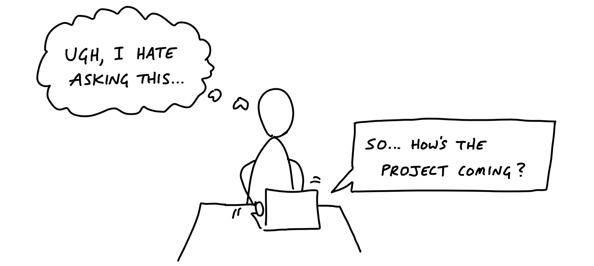
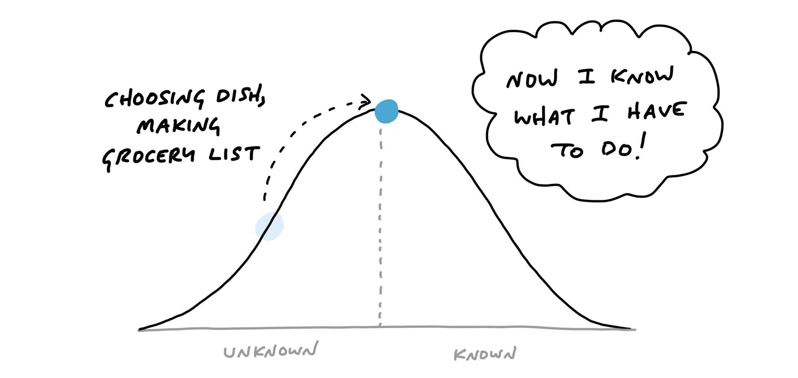
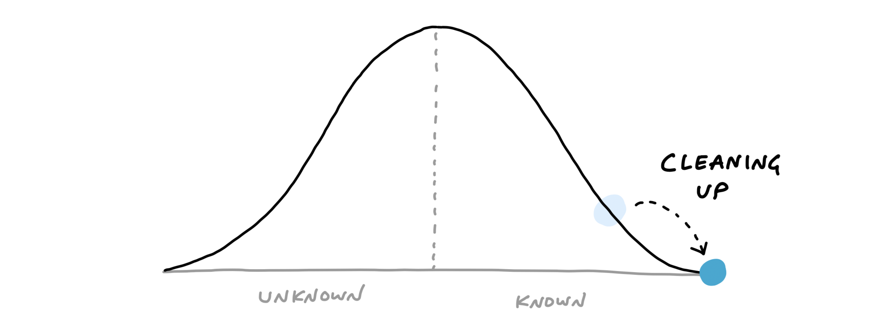
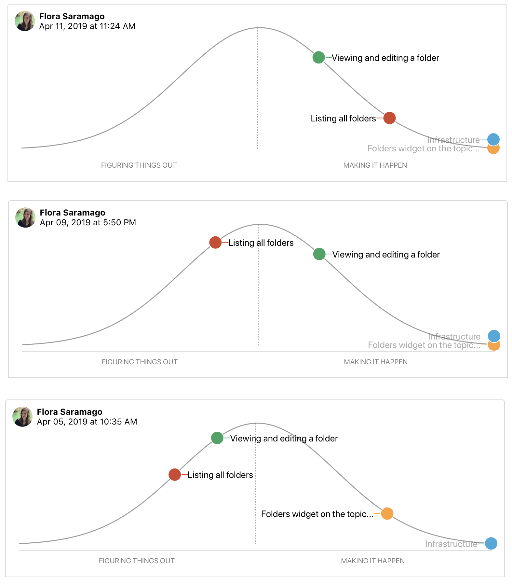
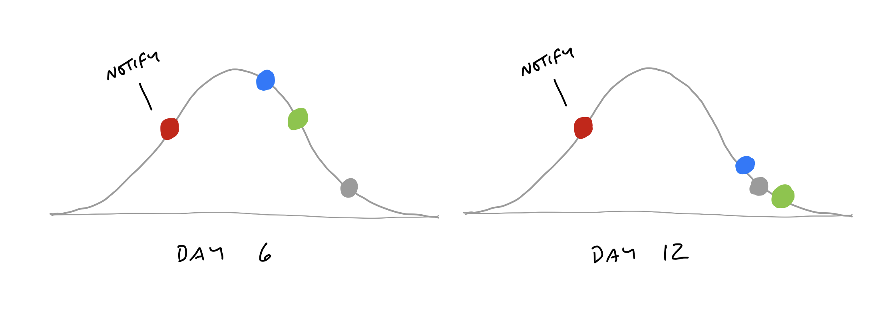

# 第十三章 Show Progress 顯示進度

Good-hearted managers don’t like asking for status. It’s awkward, feels like nagging, and gets even worse when they have to ask follow-up questions to get sufficiently clear about what’s going on.

善良的管理者不喜歡詢問進度。這樣做很尷尬，感覺像是在嘮叨，而且當他們需要進一步追問以確保掌握清楚狀況時，情況會變得更加糟糕。

Managers would rather be able to see the status themselves whenever they need to. We saw in the last chapter how organizing to-dos into scopes helps the team to stay on top of the work. But this doesn’t help the manager directly. There are a couple problems with to-dos that make them insufficient for judging status.

管理者更希望能夠在需要時隨時查看進度。上一章我們看到，將待辦事項組織成不同範疇有助於團隊掌握工作狀況。但這對管理者本身並沒有直接的幫助。待辦事項存在一些問題，使其無法充分反映工作進度。

## The tasks that aren’t there 那些未列出的任務

Consider a list with a few completed items and no incomplete items left. This could mean that all the work is done. But it could also mean that the team knows there’s more work but hasn’t defined tasks yet.

想像一份清單，上面只有幾項已完成的工作，且沒有未完成的項目。這可能表示所有工作都已完成，但也可能表示團隊知道還有更多工作要做，卻尚未明確定義這些任務。

Sometimes a team will define a `scope` early in the project without populating it with tasks. It marks that some work needs to be done but that actual tasks haven’t been discovered yet.

有時，團隊在專案初期會先定義一個範疇，但尚未填入具體的任務。這表示有工作需要完成，但實際的任務尚未被發現。

Or think about doing some QA at the end of a scope. All the tasks are done. There’s nothing else to do. Then the act of testing populates the scope with new tasks for the issues found.

或者，想像在範疇結束前進行 QA 時，所有任務看似已完成，沒有其他工作要做。然而，在測試過程中發現問題，又會產生新的任務，填補進這個範疇。

This goes back to the notion of `imagined` versus `discovered` tasks. In our naive notion of a list that’s planned up-front, somebody populates it with items that are gradually checked off. In real life, issues are discovered by getting involved in the problem. That means _to-do lists actually grow as the team makes progress_.

這回到「預想的任務」與「發現的任務」之間的概念。在一個理想化的計畫清單中，某人會事先列出所有項目，然後逐步勾選完成。但在現實中，問題是在處理過程中被發現的。因此，「待辦清單會隨著團隊的進展而成長」。

![Two diagrams with the same axes. The top is labeled: In Theory. The Y axis is tasks and the X axis is time. A to-do list is shown at five time steps t1 through t5. The list is the same length in every time step. At t1 none of the items are completed. They are gradually completed in each step until at t5 all the items are checked. Below, the second digram is labeled: In Practice. At t1 the list is five items long. At t2, it is still five items long and three of the items are completed. At t3, the list gets taller with new uncompleted items. At t4, two items get completed, but it still gets taller due to an extra item added. At t5 all items are completed. t3 and t4 are labeld: More tasks discovered. The height of the list has grown from t1 to t5, in contrast with the constant height in the first diagram.](./images/tasks_growing.jpg)

If we tried to judge at _t2_ how far along the project is, we’d be misled. From an outsider’s perspective, there’s no way to know whether the number of outstanding tasks will go down or up. To know that, you’d need more context on the work inside the scope to understand what it means that those particular tasks are done and whether others might still be coming.

如果我們試圖在 _t2_ 時點判斷專案的進展程度，可能會被誤導。從外部觀察來看，無法確定未完成任務的數量是會減少還是增加。要真正了解進度，還需要更多關於範疇內工作的背景資訊，才能判斷已完成的任務代表什麼，以及是否還有其他任務尚未浮現。

## Estimates don’t show uncertainty 估算無法反映不確定性

Some teams try to attach estimates to their tasks or scopes to report status. The problem with estimates is they have a very different meaning depending on the nature of the work being estimated.

有些團隊會為任務或範疇設定估算時間，以此來回報進度。然而，估算的問題在於，它的意義會根據工作的性質而有所不同，並不能準確反映實際情況。

Say you have two tasks, both estimated to take four hours. If one task is something the team has done ten times in the past, you can be confident in the estimate. Suppose the other task is something the team has never done before, or it has unclear interdependencies. It could take the four hours if all goes perfectly, but due to the unknowns in it, it could stretch out to two to three days. It’s not meaningful to write “4 hours, or maybe 3 days” as the estimate.

假設有兩個任務，它們的預估時間都是四小時。如果其中一個是團隊過去已經做過十次的工作，那這個估算是相對可靠的。但如果另一個任務是團隊從未做過的，或者它涉及不明確的相依關係，那麼雖然理論上可能只需要四小時，但由於未知因素，實際上可能會延長到兩三天。然而，寫下「4 小時，或可能 3 天」這樣的估算並沒有實際意義。

Recognizing this, we came up with a way to see the status of the project without counting tasks and without numerical estimates. We do that by shifting the focus from what’s done or not done to what’s unknown and what’s solved. To enable this shift, we use the metaphor of the hill.

意識到這個問題後，我們找到了一種方法，可以在不依賴任務數量或數字估算的情況下查看專案進度。我們的方法是將重點從「已完成或未完成」轉向「未知的與已解決的」。為了實現這種轉變，我們使用了一個比喻——「登山模型」。

## Work is like a hill 工作就像爬坡

Every piece of work has two phases. First there’s the uphill phase of figuring out what our approach is and what we’re going to do. Then, once we can see all the work involved, there’s the downhill phase of execution.

每項工作都有兩個階段。首先是**上坡階段**，這時我們需要弄清楚應該採取什麼方法，以及具體要做什麼。接著，當我們已經看清楚所有需要完成的工作後，就進入了**下坡階段**，專注於執行與落實。

![A Hill Chart diagram. It looks like a wide bell curve, with a vertical dotted line down the middle. The far left edge is labeled: Start, and the far right edge labeled: Finish. The left slope going up is labeled: Figuring out what to do. The right slope going down is labeld: Getting it done. A dot is drawn about two-thirds of the way up the left side of the hill. Light-colored arrows suggest the dot originated at the left side, moved up to its current position, and later moves over the hill and down the right to the finish.](./images/hill_concept.png)

Let’s use an everyday example to get the feeling of the hill.

用日常例子來理解登山模型

Suppose you’re planning to host a dinner party. You’ve set the date, but it’s still a couple weeks ahead and you haven’t thought about what to cook yet. You have no idea what type of cuisine the meal will be or what dish to make. That would place you at the start of the hill on the bottom-left.

假設你正在計劃舉辦一場晚宴。日期已經確定，但還有幾週時間，而你還沒開始考慮要準備哪些料理。你對於菜色的類型或要做哪些菜完全沒有頭緒。這樣的狀況就像是站在**山腳下的左側**——剛開始攀登，還在摸索方向。

Next you think about who’s attending and note that a couple people are vegetarian. That eliminates some options (like grilling out) but still leaves a lot of options open. You consider both Italian and Indian. You think Indian might be more fun to cook, with more interesting vegetarian options. So you decide to look for Indian recipes.

接下來，你開始考慮參加者，發現有幾位是素食者。這樣就排除了某些選項（例如烤肉），但仍然有許多選擇。你開始考慮義大利料理和印度料理，認為印度料理可能更有趣，且有更多適合素食者的選擇。於是你決定搜尋印度菜的食譜。

At this point, the question “What percent complete is the project?” doesn’t even make sense. And if someone asked you to estimate how long the shopping and prep will take, you couldn’t answer that either because you haven’t chosen a dish yet. The answer would be: “I’ve done some work to figure out what kind of cuisine, but I haven’t narrowed it down to a specific dish yet.” We can represent that by putting you halfway up the “figuring it out” side of the hill.

在這個階段，問題「專案進度百分比是多少？」根本沒有意義。如果有人問你估算採購食材和準備時間，你也無法回答，因為你還沒選擇具體的菜色。這時的回答會是：「我已經做了一些工作來決定料理的風格，但還沒縮小範圍到具體的菜色。」我們可以將這個狀況視為你處於「搞清楚方向」階段的中途，也就是爬坡的過程中。

Next you do some searching online and look through your recipe books. You want to find a recipe that will be interesting but doesn’t require ingredients that will be too hard to find. You settle on a recipe and prepare a shopping list.

接下來，你開始上網搜尋並翻閱食譜書，尋找既有趣又不需要難以取得食材的食譜。最終，你決定了一個食譜並準備好了購物清單。

Now you are in a very different position than before. The feeling changes from “I’m still not sure what I’m doing” to “Now I know what to do.” You’re at the top of the hill.

此時，你的處境與之前大不相同。感覺從「我還不確定該做什麼」轉變為「現在我知道該做什麼了。」你已經到達了**山頂**。

From this vantage point, you can see all of the steps that are left. It’s even fair to estimate how long all the work will take (“Let’s see…an hour to grocery shop, 30 minutes of prep, cook for 45 minutes…”).

從這個視角，你可以看到剩下的所有步驟。此時，你甚至可以合理地估算所有工作的時間（「讓我看看…買菜一小時、準備30分鐘、烹飪45分鐘…」）。

The day before the dinner party, you go to the grocery store and buy the ingredients. This moves you downhill. You’re closer to finishing the task.

在晚宴前一天，你去超市購買所需食材。這讓你開始往**下坡**前進，距離完成任務更近了。

Next comes the work of prepping and cooking the meal.

接下來是準備和烹飪餐點的工作。

After the meal is over, there’s just a little work left: the clean-up.

晚餐結束後，只剩下一點工作：清理。

Note how the hill shows how the work _feels_ at different stages. The uphill phase is full of uncertainty, unknowns, and problem solving. The downhill phase is marked by certainty, confidence, seeing everything, and knowing what to do.

注意，這個山丘模型顯示了工作在不同階段的**感覺**。上坡階段充滿了不確定性、未知和問題解決的過程，而下坡階段則標誌著確定性、自信、清楚地看見所有細節，並且知道接下來該做什麼。

## Scopes on the hill 山丘上的範疇

We can combine the hill with the concept of scopes from the last chapter. The scopes give us the language for the project (“Locate,” “Reply”) and the hill describes the status of each scope (“uphill,” “downhill”).

我們可以將山丘模型與上一章提到的範疇概念結合。範疇為專案提供了語言（例如：「定位」、「回覆」），而山丘則描述了每個範疇的進度狀態（「上坡」或「下坡」）。

To see the status of the scopes, we can plot each one as a different color on the hill.

要查看範疇的進度，我們可以將每個範疇以不同的顏色標示在山丘上。

![A map in the style of last chapter is drawn next to a hill chart. The map is divided into regions labeled: Permas per occurence, Future-apply labels, and Global Recurring. Each scope on the map is marked with a colored dot. To the right, a hill chart appears. It has three dots on it that correspond to the same scopes. The dots are the same colors as on the map. Future-apply edits is a blue dot one-third up the left side of the hill. Permas per occurrence is a green dot one third down the right side of the hill. Global recurring events is an orange dot two thirds down the right side of the hill.](./images/scopes_on_the_hill.png)

This is a snapshot from a project to implement recurring events in Basecamp. Here “Future-applying edits” is a scope that is still being worked out, with significant unknowns to solve. The other two scopes have no meaningful unknowns left, and “Global recurring events” is closer to finished.

這是來自一個在 Basecamp 中實現重複事件的專案快照。在這裡，「未來應用編輯」是仍在進行中的範疇，存在著大量未解決的未知問題。其他兩個範疇則沒有剩下有意義的未知問題，而「全域重複事件」則更接近完成。

## Status without asking 無需詢問的進度狀態

We built a feature exclusive to Basecamp for creating hill charts and updating them with a few clicks. The team members, who have the full context of where the work stands, intuitively drag the scopes into position, and save a new update that’s logged on the project (see How to Implement Shape Up in Basecamp).

我們為 Basecamp 開發了一個專屬功能，可以創建山丘圖並輕鬆更新。團隊成員擁有完整的工作進度背景，他們可以直觀地將範疇拖動到適當的位置，然後保存新的更新，這些更新會被記錄在專案中（詳見《如何在 Basecamp 中實現 Shape Up》）。

For managers, the ability to compare past states is the killer feature. It shows not only where the work stands but how the work is _moving_.

對於管理者來說，能夠比較過去的狀態是這項功能的關鍵。它不僅顯示了工作當前的進度，還能顯示工作的**移動**過程。

With this second-order view, managers can judge what’s in motion and what’s stuck. They can see which problems the team chose to solve and how much time they spent at each stage from unknown to known to done.

透過這種第二層次的視角，管理者可以判斷哪些工作在進行中，哪些則卡住了。他們能夠看到團隊選擇解決了哪些問題，以及每個範疇從未知、已知到完成的各階段花費了多少時間。

This report becomes the manager’s first destination when they feel anxious about a project. Since it’s self-serve, there’s no need to interrupt the team with the awkward status question. And in cases where something doesn’t look right, the manager can jump directly into a conversation about the relevant piece of work. “Looks like ‘Autosave’ has been uphill for a while. What’s the unknown that’s holding it back?” The manager can workshop this specific piece of the project without having to first untangle it from all the other things that are moving along as expected.

這份報告成為管理者在對專案感到焦慮時的首要查詢來源。由於它是自助式的，管理者不需要再打擾團隊，問那些尷尬的進度問題。而在某些情況下，當發現有些地方看起來不對勁時，管理者可以直接進入與相關工作項目的對話。「看起來‘自動儲存’已經在上坡階段待了一段時間，究竟是什麼未知因素讓它卡住了？」管理者可以針對專案的這個特定部分進行討論，而不必先將它與其他按預期進行的部分分開理清。

## Nobody says “I don’t know” 沒有人會說「我不知道」

Nobody wants to raise their hand to management and say “I don’t know how to solve this problem.” This causes teams to hide uncertainty and accumulate risk. The moments when somebody is stuck or going in circles are where the biggest risks and opportunities lie. If we catch those moments early, we can address them with help from someone senior or by reworking the concept. If we don’t catch them, the unsolved problems could linger so far into the cycle that they endanger the project.

沒有人願意在管理層面前舉手說「我不知道怎麼解決這個問題」。這會讓團隊隱瞞不確定性，並積累風險。其實，當某個人卡住或進入死胡同時，往往隱藏著最大的風險和機會。如果我們能及早發現這些時刻，就可以透過向資深人士請求幫助或重新調整概念來處理這些問題。如果沒能及時發現，未解決的問題可能會延續到專案的後期，最終危及整個專案。

The hill chart allows everybody to see that somebody might be stuck without them actually saying it. A dot that doesn’t move is effectively a raised hand: “Something might be wrong here.”

山丘圖讓每個人都能看到可能有人成為瓶頸，而無需他們親自說出來。一個停滯不前的點就像是舉起的手：「這裡可能出現了問題。」

Once it’s been spotted, the language of uphill/downhill facilitates the conversation. It’s less about the person (Looks like you’re stuck!) and more about the work. The question is: What can we solve to get that over the hill?

一旦問題被發現，上坡/下坡的語言就能促進對話。焦點不再是針對人（看起來你卡住了！），而是專注於工作本身。問題是：我們能解決什麼來幫助這個範疇順利過山丘？

## Prompts to refactor the scopes 促使重新調整範疇的問題

Sometimes probing into a stuck scope reveals that it isn’t stuck at all. The problem is in how the lines of the scope were drawn.

有時，深入探討一個卡住的範疇會發現，實際上它根本沒有卡住。問題可能出在範疇的劃定方式。

Here’s a case where the “Notify” scope was stuck on the hill for too long.

這裡是一個例子，顯示「通知」範疇在山丘上停留太久。

When we checked in with the team, it turned out the work was moving along just fine. The problem was that “Notify” wasn’t a single thing. It had three different parts: designing an email, delivering the email in the back-end, and displaying the notification in an in-app menu. The team mostly finished the code for delivering the email. The design of the email was nearly figured out. But they hadn’t started on the in-app display. It wasn’t possible to say whether “Notify” as a whole was over the hill or not because parts of it were and parts of it weren’t.

當我們與團隊確認時，發現工作進展得很好。問題在於「通知」並不是單一的任務，它有三個不同的部分：設計電子郵件、在後端發送電子郵件，以及在應用程式內顯示通知。團隊大部分完成了發送電子郵件的程式碼，電子郵件的設計也接近完成，但他們還沒開始處理應用內顯示的部分。無法確定「通知」整體是否已經過山丘，因為有些部分已經完成，有些部分則還在進行中。

The solution in a case like this is to break the scope apart into smaller scopes that can move independently.

在這種情況下，解決方案是將範疇拆分成更小的範疇，使它們能夠獨立移動。

Now the team can move each dot to accurately show where the work stands.

現在，團隊可以將每個點移動到正確的位置，準確地顯示工作的進度。

The benefit comes at the second order. With the scopes separated out, they can move independently over time. Now the team can show more progress more frequently than before.

這樣的好處體現在第二層次。將範疇分開後，它們可以隨著時間獨立移動。現在，團隊能比以前更頻繁地展示進展。

## Build your way uphill 在上坡過程中建立進展

Some teams struggle with backsliding when they first try the hill chart. They consider a scope solved, move it the top of the hill, and later have to slide it back when they uncover an unexpected unknown.

有些團隊在初次使用山丘圖時會遇到倒退的情況。他們將一個範疇認為已經解決，並將其移到山丘頂部，然而當他們發現意外的未知問題時，又不得不將它滑回去。

When this happens, it’s often because somebody did the uphill work with their head instead of their hands. Coming up with an approach in your head is just the first step uphill. We often have a theory of how we’ll solve something—“I’ll just use that API”—and then the reality turns out to be more complicated. It’s good to think of the first third uphill as “I’ve thought about this,” the second third as “I’ve validated my approach,” and the final third to the top as “I’m far enough with what I’ve built that I don’t believe there are other unknowns.”

這種情況通常是因為某人只用腦袋思考上坡工作，而不是實際動手操作。僅僅在腦中構思出解決方法只是上坡的第一步。我們經常會有解決問題的理論—「我只需要使用那個 API」—但現實通常會更複雜。將上坡的前三分之一視為「我已經思考過這個問題」，第二個三分之一視為「我已經驗證過我的方法」，最後的三分之一視為「我已經完成了足夠的工作，並且相信不會有其他未知問題」是很有幫助的。

## Solve in the right sequence

In addition to seeing where the work stands, we can use the hill chart to sequence the work—which problems to solve in which order.

除了查看工作進度，我們還可以利用山丘圖來安排工作的順序——也就是該按什麼順序解決哪些問題。

Some scopes are riskier than others. Imagine two scopes: One involves geocoding data—something the team has never done before. The other is designing and implementing an email notification. Both have unknowns. Both start at the bottom of the hill. This is where the team asks themselves: If we were out of time at the end of the cycle, which of these could we easily whip together—despite the unknowns—and which might prove to be harder than we think?

有些範疇比其他範疇風險更高。假設有兩個範疇：一個涉及地理編碼資料——這是團隊以前從未做過的工作；另一個是設計並實現電子郵件通知。這兩者都有未知數，並且都從山丘的底部開始。這時，團隊會問自己：如果在專案週期結束時時間不夠，我們能輕鬆完成哪一個——儘管有未知數——而哪一個可能比我們想的還要困難？

That motivates the team to push the scariest work uphill first. Once they get uphill, they’ll leave it there and look for anything critically important before finishing the downhill work to completion. It’s better to get a few critical scopes over the top early in the project and leave the screw-tightening for later.

這會激勵團隊優先將最具挑戰性的工作推向上坡。一旦進入上坡階段，他們會將其固定在那裡，並在完成下坡工作之前，尋找任何關鍵性的重要事項。最好在專案初期就將一些關鍵範疇推過山頂，然後將細節調整的工作留到後期。

Work expands to fill the time available. If the team starts with the email template first, they could easily spend weeks iterating on copy or creating the ultimate best-ever email design. But they don’t _need_ to do that. There’s some version of an email template that could be worked out in a day during the final week and it would be sufficient. The geocoder, on the other hand, might present novel problems that the team could struggle with for weeks. They don’t want that surprise to come at the end of the cycle.

工作會擴展以填滿可用的時間。如果團隊先從電子郵件模板著手，他們可能會花費數週時間反覆修改文案或創建最完美的電子郵件設計。但他們**不需要**這麼做。實際上，有一個基本版本的電子郵件模板可以在專案的最後一週內完成，並且已經足夠了。另一方面，地理編碼器可能會帶來新穎的問題，團隊可能需要花幾週時間解決。團隊不希望這個驚訝出現在專案週期的最後。

Journalists have a concept called the “inverted pyramid.” The idea is their articles start with the most essential information at the top, then they add details and background information in decreasing order of importance. This allows print newspaper designers to get the crucial part of the story on the front page and cut the end as needed without losing anything essential.

記者有一個概念叫做「倒金字塔」。這個概念的意思是，他們的文章從最關鍵的信息開始，然後按照重要性的順序逐漸添加細節和背景信息。這樣，報紙的設計師就能將故事的關鍵部分放在頭版，並根據需要刪減文章的結尾，而不會損失任何重要內容。

Effective teams sequence their problem solving in the same way. They choose the most important problems first with the most unknowns, get them to the top of the hill, and leave the things that are the most routine or least worrisome for last.

高效的團隊以相同的方式排列解決問題的順序。他們首先選擇最重要且未知數最多的問題，將它們推到山頂，然後將最常規或最不令人擔心的問題留到最後。

As the end of the cycle approaches, teams should have finished the important things and left a variety of “nice to haves” and “maybes” lingering around. That brings us to the next chapter, on deciding when to stop.

隨著專案週期的結束臨近，團隊應該已經完成了重要的工作，並留下各種「可有可無」和「可能會做」的事項。這也引出了下一章的內容——決定何時停止。

