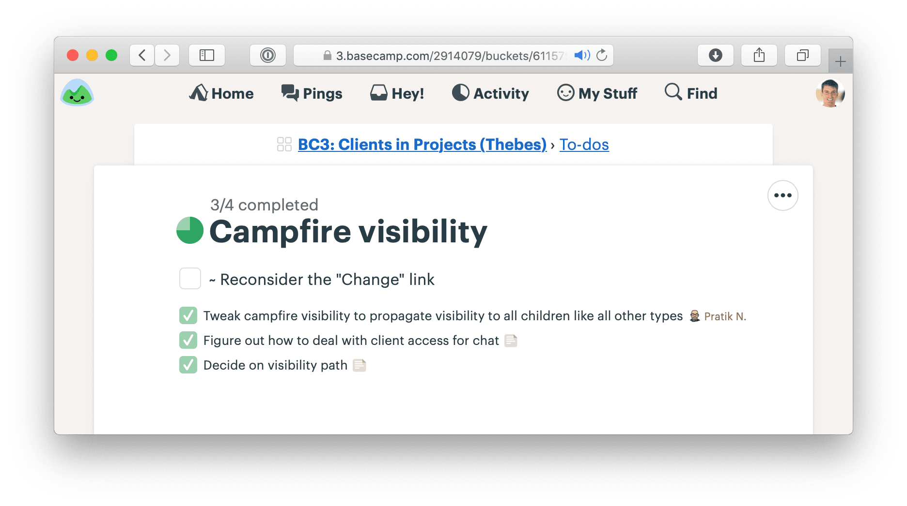

# 第十四章 Decide When to Stop 決定何時停止

When the end of the cycle approaches, the techniques we covered so far will put the team in a good position to finish and ship. The shaped work gave them guard rails to prevent them from wandering. They integrated one scope at a time so there isn’t half-finished work lying around. And all the most important problems have been solved because they prioritized those unknowns first when they sequenced the work.

當專案週期接近結束時，我們到目前為止介紹的技術將使團隊處於良好的位置來完成並發布。精心設計的工作為團隊提供了防護邊界，避免他們迷失方向。他們一次整合一個範疇，避免了留下未完成的工作。而且，最重要的問題已經解決，因為他們在排列工作順序時，優先處理了這些未知數。

Still, there’s always more work than time. Shipping on time means shipping something imperfect. There’s always some queasiness in the stomach as you look at your work and ask yourself: Is it good enough? Is this ready to release?

然而，工作總是多於時間。按時發布意味著要發布一個不完美的版本。當你看著自己的工作，心中難免會有些不安，問自己：這已經足夠好嗎？這準備好發布了嗎？

## Compare to baseline 與基準比較

Designers and programmers always want to do their best work. It doesn’t matter if the button is on the center of the landing page or two pages down a settings screen, the designer will give it their best attention. And the best programmers want the code base to feel like a cohesive whole, completely logically consistent with every edge case covered.

設計師和程式設計師總是希望能做到最好的工作。不管是按鈕位於登陸頁面的中央，還是位於設定頁面的兩頁之後，設計師都會給予最好的關注。而最優秀的程式設計師也希望程式碼庫能夠呈現出一個完整的整體，並且每個邊緣案例都能被充分覆蓋，邏輯上一致。

Pride in the work is important for quality and morale, but we need to direct it at the right target. If we aim for an ideal perfect design, we’ll never get there. At the same time, we don’t want to lower our standards. How do we make the call to say what we have is good enough and move on?

對工作的自豪感對於質量和士氣非常重要，但我們需要將這份自豪感指向正確的目標。如果我們追求一個理想的完美設計，則永遠無法達成。同時，我們也不希望降低標準。我們如何做出決定，說我們現有的工作已經足夠好，並且可以繼續前進？

It helps to shift the point of comparison. Instead of comparing up against the ideal, compare down to `baseline`—the current reality for customers. How do customers solve this problem today, without this feature? What’s the frustrating workaround that this feature eliminates? How much longer should customers put up with something that doesn’t work or wait for a solution because we aren’t sure if design A might be better than design B?

將比較的焦點轉移是有幫助的。與其與理想的情況進行比較，不如與**基準**進行比較——即當前對客戶來說的現實。客戶今天是如何解決這個問題的，沒有這個功能的情況下？這個功能解決了哪個令人沮喪的權宜之計？客戶應該再忍受多長時間的問題未解決，或者因為我們不確定設計 A 是否比設計 B 更好，導致他們還在等待解決方案？

Seeing that our work so far is better than the current alternatives makes us feel better about the progress we’ve made. This motivates us to make calls on the things that are slowing us down. It’s less about us and more about value for the customer. It’s the difference between “never good enough” and “better than what they have now.” We can say “Okay, this isn’t perfect, but it definitely works and customers will feel like this is a big improvement for them.”

看到我們到目前為止的工作比現有的替代方案更好，會讓我們對自己的進展感到更有信心。這激勵我們做出決策，解決那些拖慢進度的問題。重點不在於我們自己，而是對客戶帶來的價值。這是「永遠不夠好」和「比他們現在擁有的更好」之間的區別。我們可以說：「好吧，這不是完美的，但它肯定能運作，客戶會覺得這對他們來說是一個很大的改進。」

[![A chart with performance on the Y axis and development time on the X axis. A line curves upward from zero performance at the beginning of development time to about halfway up the y axis when it reaches the middle of the chart and terminates in a dot. The x axis below the dot is labeld: Now. Horizontal lines divide the Y axis into three regions. In the bottom third, below the dot of the current position, a dotted line is labeled: Baseline. At the top of the chart, above the dot, a line is labeled: Ideal. The Y value of the dot is labeled: Work in progress. An arrow points down from the dot to the baseline with the label: Compare down. Another arrow points up from the dot to the ideal line and says: Not up.](./images/compare_to_baseline.jpeg)](./images/compare_to_baseline.jpeg)

Make scope cuts by comparing down to baseline instead of up to some perfect ideal

通過將比較基準從理想的完美狀態轉移到當前基準，來進行範疇的切割。

## Limits motivate trade-offs 限制激勵取捨

Recall that the six-week bet has a `circuit breaker`—if the work doesn’t get done, the project doesn’t happen.

回想一下，六週的賭注有一個「斷路器」——如果工作沒有完成，專案就不會發生。

This forces the team to make trade-offs. When somebody says “wouldn’t it be better if…” or finds another edge case, they should first ask themselves: Is there time for this? Without a deadline, they could easily delay the project for changes that don’t actually deserve the extra time.

這迫使團隊進行取捨。當有人說「如果這樣會不會更好」或發現另一個邊緣情況時，他們應該首先問自己：這有時間去做嗎？如果沒有最後期限，他們很容易為那些其實不值得額外時間的變更推遲專案進度。

We expect our teams to actively make trade-offs and question the scope instead of cramming and pushing to finish tasks. We create our own work for ourselves. We should question any new work that comes up before we accept it as necessary.

我們期望團隊積極進行取捨，質疑範疇，而不是拼命趕進度完成任務。我們創造了自己的工作，應該在接受任何新工作的必要性之前，先對其進行質疑。

## Scope grows like grass 範疇像草一樣成長

Scope grows naturally. Scope creep isn’t the fault of bad clients, bad managers, or bad programmers. Projects are opaque at the macro scale. You can’t see all the little micro-details of a project until you get down into the work. Then you discover not only complexities you didn’t anticipate, but all kinds of things that could be fixed or made better than they are.

範疇是自然而然地增長的。範疇蔓延並不是因為客戶不好、管理者不好或程式設計師不好。專案在宏觀層面上是模糊的。在你深入工作之前，你無法看到專案中的所有微小細節。然後，你不僅會發現一些你未曾預料的複雜性，還會發現各種可以修正或改善的地方。

Every project is full of scope we don’t need. Every part of a product doesn’t need to be equally prominent, equally fast, and equally polished. Every use case isn’t equally common, equally critical, or equally aligned with the market we’re trying to sell to.

每個專案都充滿了我們不需要的範疇。產品的每個部分不需要一樣顯眼、一樣快速、一樣精緻。每個使用情境也不會是同樣常見、同樣關鍵，或與我們想要銷售的市場完全一致。

This is how it is. Rather than trying to stop scope from growing, give teams the tools, authority, and responsibility to constantly cut it down.

這就是現狀。與其試圖阻止範疇增長，不如給予團隊工具、權限和責任，讓他們能夠不斷縮減範疇。

## Cutting scope isn’t lowering quality 削減範疇並不是降低品質

Picking and choosing which things to execute and how far to execute on them doesn’t leave holes in the product. Making choices makes the product better. It makes the product better _at some things_ instead of others. Being picky about scope _differentiates_ the product. Differentiating what is core from what is peripheral moves us in competitive space, making us more alike or more different than other products that made different choices.

挑選和選擇要執行的事項以及執行的深度，並不會讓產品出現漏洞。做出選擇會讓產品變得更好。它會讓產品在某些方面變得更好，而在其他方面則保持簡化。對範疇的挑剔「區別」了產品。區分核心與周邊的要素，能讓我們在競爭領域中脫穎而出，使我們與做出不同選擇的其他產品相比，變得更加相似或更加不同。

Variable scope is not about sacrificing quality. We are extremely picky about the quality of our code, our visual design, the copy in our interfaces, and the performance of our interactions. The trick is asking ourselves which things actually matter, which things move the needle, and which things make a difference for the core use cases we’re trying to solve.

可變範疇並不是在犧牲質量。我們對程式碼的質量、視覺設計、界面中的文案以及互動的效能極為挑剔。關鍵在於問自己，哪些事情真正重要，哪些事情能推動進展，哪些事情對我們試圖解決的核心使用情境產生實質影響。

## Scope hammering 範疇敲打

People often talk about “cutting” scope. We use an even stronger word—`hammering`—to reflect the power and force it takes to repeatedly bang the scope so it fits in the time box.

人們經常談論「削減」範疇。我們使用一個更強烈的詞——`敲打`——來反映需要多大的力量和反覆敲打範疇，才能讓它適應時間框架。

As we come up with things to fix, add, improve, or redesign during a project, we ask ourselves:

在專案進行過程中，當我們想到要修正、增加、改善或重新設計的事情時，我們會問自己：

- Is this a “must-have” for the new feature?
- Could we ship without this?
- What happens if we don’t do this?
- Is this a new problem or a pre-existing one that customers already live with?
- How likely is this case or condition to occur?
- When this case occurs, which customers see it? Is it core—used by everyone—or more of an edge case?
- What’s the actual impact of this case or condition in the event it does happen?
- When something doesn’t work well for a particular use case, how aligned is that use case with our intended audience?
- 這是新功能的「必需品」嗎？
- 我們能在沒有這個的情況下發佈嗎？
- 如果我們不做這個會發生什麼？
- 這是新的問題還是客戶已經在忍受的舊問題？
- 這個情況發生的可能性有多大？
- 當這種情況發生時，哪些客戶會遇到？是核心用戶（所有人都會使用）還是邊緣情況？
- 如果這種情況真的發生，它的實際影響是什麼？
- 當某個使用情境對某個特定用例不太適用時，這個用例與我們的目標受眾有多大契合度？

The fixed deadline motivates us to ask these questions. Variable scope enables us to act on them. By chiseling and hammering the scope down, we stay focused on just the things we need to do to ship something effective that we can be proud of at the end of the time box.

固定的截止日期激勵我們提出這些問題。可變範疇使我們能夠付諸行動。通過雕刻和敲打範疇，我們能夠保持專注，只做那些我們需要做的事情，確保在時間框架內交付一個有效且值得驕傲的產品。

Throughout the cycle, you’ll hear our teams talking about `must-haves` and `nice-to-haves` as they discover work. The must-haves are captured as tasks on the scope. The scope isn’t considered “done” until those tasks are finished. Nice-to-haves can linger on a scope after it’s considered done. They’re marked with a tilde (~) in front. Those tasks are things to do if the team has extra time at the end and things to cut if they don’t. Usually they never get built. The act of marking them as a nice-to-have is the scope hammering.

在整個專案周期中，你會聽到我們的團隊討論「必須做」和「可有可無」的工作。必須做的事情會作為任務列在範疇中，並且範疇在這些任務完成之前不會被視為「完成」。可有可無的任務則可以在範疇完成後仍然存在，它們會在任務前面加上波浪號 (~)。這些任務是團隊在時間允許的情況下才會做的，若時間不足則會被砍掉。通常這些任務最終是沒被實現的。標註為「可有可無」的過程就是範疇敲打的一部分。

A finished scope with one `nice-to-have` (marked with a “~”) that was never completed

一個已完成的範疇，裡面有一個「可選做」（以波浪號「~」標註）但從未完成的任務。

## QA is for the edges QA 是為了邊緣情況。

At Basecamp’s current size (millions of users and about a dozen people on the product team), we have one QA person. They come in toward the end of the cycle and hunt for edge cases outside the core functionality.

在Basecamp目前的規模下（擁有數百萬用戶，並且產品團隊大約有十來個人），我們有一位QA人員。他們會在專案周期的末期進來，並尋找超出核心功能的邊緣情況。

QA can limit their attention to edge cases because the designers and programmers take responsibility for the basic quality of their work. Programmers write their own tests, and the team works together to ensure the project does what it should according to what was shaped. This follows from giving the team responsibility for the whole project instead of assigning them individual tasks (see Chapter 9, Hand Over Responsibility).

QA 可以將注意力集中在邊緣情況上，因為設計師和程式開發人員會對他們工作的基本品質負責。程式開發人員會撰寫自己的測試，而團隊會一起合作，確保專案根據預定的規劃來完成應該做的事情。這是因為我們將整個專案的責任交給團隊，而不是指派他們單獨的任務（參見第九章，交付責任）。

For years we didn’t have a QA role. Then after our user base grew to a certain size, we saw that small edge cases began to impact hundreds or thousands of users in absolute numbers. Adding the extra QA step helped us improve the experience for those users and reduce the disproportional burden they would create for support.

多年來，我們並沒有設立QA角色。直到我們的用戶數量達到一定規模後，我們發現一些小的邊緣情況開始影響到數百或數千名用戶。加入這一步驟的QA過程幫助我們改善了這些用戶的體驗，並減少了這些邊緣情況對支援團隊帶來的不成比例的負擔。

Therefore we think of QA as a level-up, not a gate or a check-point that all work must go through. We’re much better off with QA than without it. But we don’t depend on QA to ship quality features that work as they should.

因此，我們將QA視為一種升級，而不是所有工作必須經過的門檻或檢查點。我們有QA的情況下，效果比沒有它要好得多。但我們不依賴QA來交付品質過硬、能如預期運作的功能。

QA generates `discovered tasks` that are all `nice-to-haves` by default. The designer-programmer team triages them and, depending on severity and available time, elevates some of them to `must-haves`. The most rigorous way to do this is to collect incoming QA issues on a separate to-do list. Then, if the team decides an issue is a must-have, they drag it to the list for the relevant `scope` it affects. This helps the team see that the scope isn’t done until the issue is addressed.

QA 會產生「已發現的任務」，這些任務預設都是「可有可無」。設計師與程式開發人員的團隊會對這些任務進行優先處理，根據問題的嚴重性和可用時間，將其中一些提升為「必須完成」的任務。最嚴謹的方式是將進來的QA問題收集到一個單獨的待辦清單中。然後，如果團隊決定某個問題是必須解決的，他們會將它拖動到相關範疇的清單中。這樣可以幫助團隊看到，直到問題解決之前，範疇還不能視為完成。

We treat code review the same way. The team can ship without waiting for a code review. There’s no formal check-point. But code review makes things better, so if there’s time and it makes sense, someone senior may look at the code and give feedback. It’s more about taking advantage of a teaching opportunity than creating a step in our process that must happen every time.

我們對待程式碼審查的方式也是如此。團隊可以在不等待程式碼審查的情況下發佈程式碼，這不是一個正式的檢查點。但程式碼審查可以使程式碼變得更好，因此如果有時間且有意義，資深成員可能會查看程式碼並提供反饋。這更多是利用教學的機會，而不是將其視為每次必須執行的步驟。

## When to extend a project 何時延長專案

In very rare cases, we’ll extend a project that runs past its deadline by a couple weeks. How do we decide when to extend a project and when to let the `circuit breaker` do its thing?

在非常罕見的情況下，當專案超過預定期限時，我們會決定延長專案幾個星期。那麼，我們如何決定何時延長專案，何時讓斷路器發揮作用呢？

First, the outstanding tasks must be true `must-haves` that withstood every attempt to `scope hammer` them.

首先，未完成的任務必須是經過所有 `scope hammer` 嘗試後，仍然是必須完成的 `must-haves`。

Second, the outstanding work must be all `downhill`. No unsolved problems; no open questions. Any `uphill` work at the end of the cycle points to an oversight in the shaping or a hole in the concept. Unknowns are too risky to bet on. If the work is uphill, it’s better to do something else in the next cycle and put the troubled project back in the shaping phase. If you find a viable way to patch the hole, then you can consider betting more time on it again in the future.

第二，剩餘的工作必須全部處於「下坡」階段。沒有未解決的問題；沒有開放的疑問。任何在週期結束時仍處於「上坡」階段的工作，都代表在設計或概念上有疏漏。未知的問題風險太高，無法賭注。如果工作仍在上坡階段，最好在下一個週期做其他事情，並將有問題的專案重新放回設計階段。如果找到可行的解決方案來補上這個漏洞，那麼未來可以考慮再投入更多時間。

Even if the conditions are met to consider extending the project, we still prefer to be disciplined and enforce the `appetite` for most projects. The two-week `cool-down` usually provides enough slack for a team with a few too many `must-haves` to ship before the next cycle starts. But this shouldn’t become a habit. Running into cool-down either points back to a problem in the shaping process or a performance problem with the team.

即使條件符合考慮延長專案的情況，我們仍然偏好保持紀律，並對大多數專案執行「預算」的限制。兩週的「冷卻期」通常提供足夠的緩衝，讓一個有些過多「必須完成項目」的團隊能在下一個週期開始前完成交付。但這不應該成為習慣。如果經常遇到冷卻期，通常表示設計過程中有問題，或者是團隊的表現出了問題。

