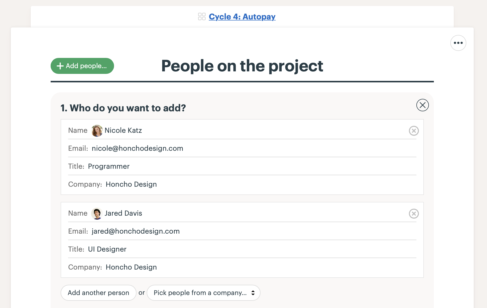
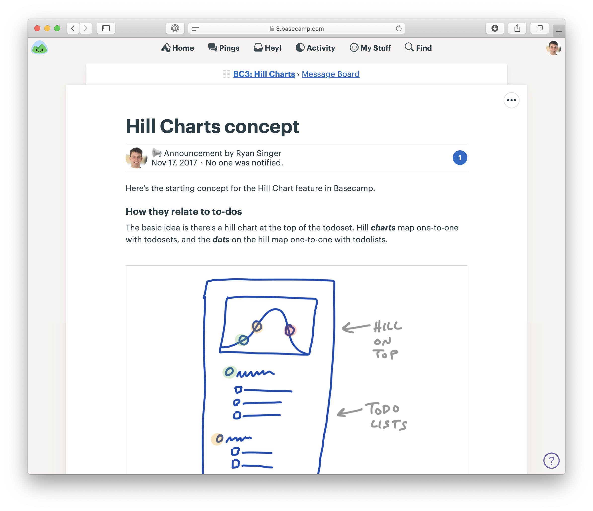

# How to Implement Shape Up in Basecamp 如何在 Basecamp 中實現 Shape Up

We built [Basecamp](https://basecamp.com) to implement the Shape Up method. Instead of scattering our work across multiple tools, Basecamp centralizes all project communication, task management, and documentation in one place. Here’s how we use it.

我們建造了 [Basecamp](https://basecamp.com) 來實現 Shape Up 方法。與其將工作分散在多個工具中，我們將所有專案溝通、任務管理和文檔集中在一個地方。以下是我們如何使用 Basecamp 的方式。

## A Basecamp Team for shaping 為 Shape Up 創建一個 Basecamp 團隊

- Create a Basecamp Team for shaping. We call ours “Product Strategy.”
- 創建一個用於 shaping 的 Basecamp 團隊，我們稱之為「產品策略」。
- Add the people doing the shaping, any trusted people who give feedback on pitches, and the people who bet at the betting table. Keep this group small and announce the bets more widely elsewhere (we use Basecamp’s HQ for that), when it’s time to kick off a cycle.
- 添加參與 shaping 的人員、任何提供提案反饋的信任人員，以及在投注桌上進行賭注的人員。保持這個小組精簡，並在適當的時候將賭注廣泛宣布（我們使用 Basecamp 的 HQ 來做這件事），這樣就可以開始一個新週期。
- Post pitches as Messages on the Message Board. We created a Message Category called “Pitch” with the light bulb emoji for the icon.
- 將提案作為消息發布在消息板上。我們創建了一個名為「Pitch」的消息類別，並使用燈泡表情符號作為圖示。
- Use the Campfire chat room to bounce ideas and coordinate the betting table between cycles. We conduct the actual betting table meeting over video chat.
- 使用 Campfire 聊天室來討論點子和協調週期之間的投注桌。我們會通過視訊通話進行實際的投注桌會議。

Pitches on the Message Board of the Product Strategy team in Basecamp

在 Basecamp 的「產品策略」團隊消息板上發佈 Pitch

A sketch drawn on an iPad in the middle of a pitch

在提案過程中，用iPad畫的草圖。

Jason announces the bets for the next cycle in the HQ—a Team in Basecamp that includes the whole company

傑森在總部（Basecamp上的團隊，包含全體員工）宣布下一個週期的賭注。

## Basecamp Projects for the cycle projects 為週期專案建立Basecamp專案

- Create a Basecamp Project for each project in the six-week cycle. We usually prepend a name or number for the cycle like this: “Cycle 4: Autopay.”
- Add the designer and programmers who are working on this project to the Basecamp Project.
- Post a kick-off message to the Message Board with the pitch or a restatement of the shaped work for the team’s reference.
- 為六週週期中的每個專案建立一個Basecamp專案。我們通常會在專案名稱前加上週期名稱或編號，例如：「週期4：自動付款」。
- 將參與該專案的設計師和程式設計師新增至Basecamp專案。
- 在留言板上發布啟動訊息，包含提案或對已定型工作的重述，供團隊參考。

Creating the project

建立專案

Adding the designer and programmer

加入設計師和程式設計師

The first thing on the project is a kick-off message with the shaped concept

專案的第一件事是發布包含塑形概念的啟動訊息。

The team uses the chat room in the Basecamp project to communicate as they get started

團隊在Basecamp專案中使用聊天室進行溝通，以開始工作。

## To-Do Lists for scopes 範圍的待辦事項清單

- After the team gets oriented they start spiking, discover tasks, and map them into scopes (see Chapter 12).
- 團隊熟悉情況後，開始進行初步探索，發現任務，並將它們映射到範圍中 (參見第十二章)。
- In the Basecamp Project, the team creates a To-Do List for each scope, like “Start Autopay” or “ACH Option.” Sometimes we use the description field on the To-Do List to summarize the scope.
- 在Basecamp專案中，團隊為每個範圍建立一個待辦事項清單，例如「啟動自動付款」或「ACH選項」。有時我們會在待辦事項清單的描述欄位中總結範圍。
- Add design _and_ programming tasks to each scope as To-Do Items. For example, “Start Autopay” has one task for design the UI and another task for wiring it to the existing recurring billing API. They can use the discussion thread on each To-Do Item to post updates or ask each other questions.
- 將設計「和」程式設計任務作為待辦事項新增到每個範圍中。例如，「啟動自動付款」有一個設計UI的任務，另一個將其連接到現有定期計費API的任務。他們可以使用每個待辦事項的討論串發布更新或互相提問。
- Repeat as the team discovers new scopes and tasks.
- 隨著團隊發現新的範圍和任務，重複此步驟。

To-Do Lists for each scope with designer and programmer tasks under each. Note: these are just the tasks discovered so far.

每個範圍的待辦事項清單，每個範圍下都有設計師和程式設計師的任務。注意：這些僅是目前發現的任務。

## Track scopes on the Hill Chart 在山丘圖上追蹤範圍

- Navigate to the To-Do List page for each scope and click the options menu (•••) in the upper right. Click “Track this on the Hill Chart.” That will display a Hill Chart at the top of the overall To-Dos section of the Project, with a dot corresponding to that scope (To-Do List).
- 導覽至每個範圍的待辦事項清單頁面，然後點擊右上角的選項選單 (•••)。點擊「在山丘圖上追蹤此項」。這將在專案的整體待辦事項部分頂部顯示一個山丘圖，其中有一個點對應於該範圍（待辦事項清單）。
- Repeat for each scope (To-Do List).
- 為每個範圍重複此步驟（待辦事項清單）。
- Click “Update” on the Hill Chart and drag the dots to show progress from “unknown” to “known” to “done.” Use the annotation feature to add commentary when necessary.
- 點擊山丘圖上的「更新」，然後拖曳點以顯示從「未知」到「已知」再到「完成」的進度。必要時使用註解功能新增評論。
- To see the history of updates to the Hill Chart, click the timestamp above the Hill Chart where it says “last update.”
- 若要查看山丘圖更新的歷史記錄，請點擊山丘圖上方的時間戳記，顯示「上次更新」的位置。

Tracking a scope (To-Do List) on the Hill Chart via the options menu on the To-Do List’s page

透過待辦事項清單頁面上的選項選單，在山丘圖上追蹤範圍（待辦事項清單）。

After enabling the Hill Chart on each To-Do List, a dot appears for each scope

在每個待辦事項清單上啟用山丘圖後，每個範圍都會出現一個點。

Drag the dots to update the Hill Chart

拖曳點以更新山丘圖。

The updated Hill Chart appears at the top of the To-Dos page

更新後的山丘圖會顯示在待辦事項頁面的頂部。

Clicking the timestamp at the top of the Hill Chart shows a history of updates. The most recent update is at the top.

點擊山丘圖頂部的時間戳記會顯示更新歷史記錄。最近的更新位於頂部。

---

Other tools make it hard to see everything about the project in one place. Basecamp combines chat, messages, to-dos, and documents in one interface that’s powerful enough for technical people and friendly enough for everyone else to use. Programmers, designers, QA and managers feel equally at home and can work together seamlessly on projects. **[Try Basecamp free for 30 days.](https://basecamp.com)**

其他工具很難在一個地方看到專案的所有資訊。Basecamp將聊天、訊息、待辦事項和文件整合在一個介面中，對於技術人員來說足夠強大，對於其他人來說也足夠友善。程式設計師、設計師、品管和經理都能輕鬆上手，並能在專案上無縫協作。**[免費試用 Basecamp 30天。](https://basecamp.com)**

