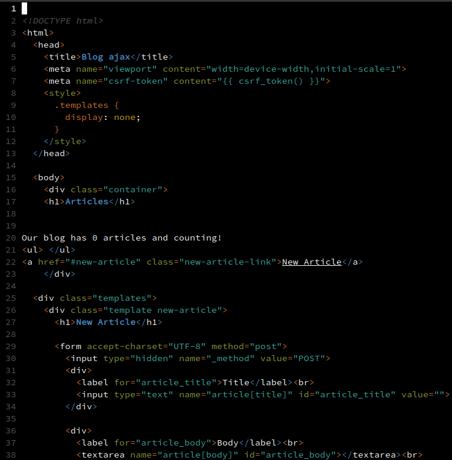
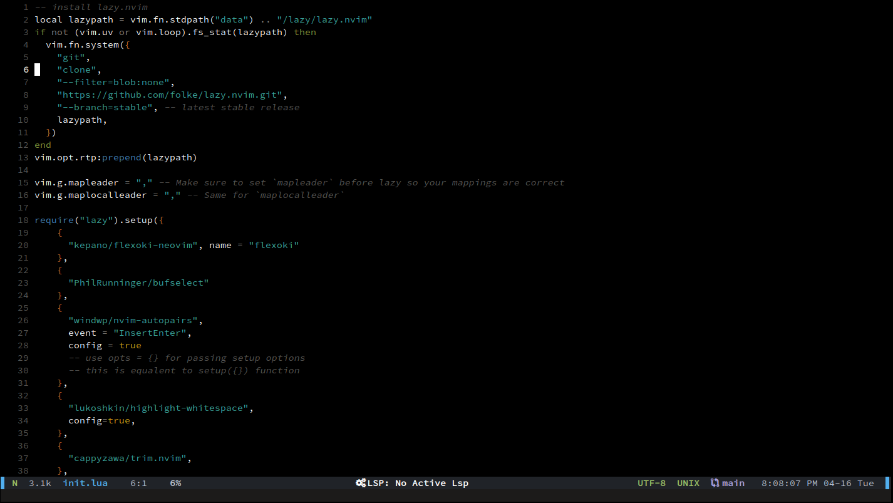

# 從 Vim 到 Neovim

原文在 2024-04-15 完成

Neovim 是從 Vim 分出去的版本，把 Vim 的程式碼複製後整理一番，並加上想要的新功能，類似兄弟鬧不合，到外面開分店，有各自的特色那樣。說來慚愧，我用 Vim 寫程式十幾年來都不知道怎麼它的正確發音，正巧 [Neovim 官網首頁](https://neovim.io/)有內嵌一個 [YouTube 影片介紹](https://www.youtube.com/watch?v=c4OyfL5o7DU)，有 Vi, Vim 和 Neovim 的正確發音。

為什麼從 Vim 換成 Neovim？因為 [flexoki 配色](https://github.com/kepano/flexoki) 很好看，而且沒有 Vim 版本。之前想要在 Vim 有語法自動補齊，以及安裝一些外掛時提到有 Neovim 這個程式。雖然 Neovim 有許多新功能，不過我都用不上。最近發現 Neovim 有 0.9.5 版本，已經有3、4 個月沒更新，看起來是穩定下來了，然後發現  flexoki 配色，安裝後一開始還不習慣，和原來 Vim 配色相比覺得不夠好，直到顯示 html



對比原來 Vim 的配色更好看。


也有可能是原來的配色幾年下來已經看膩了？

Neovim 最好從 GitHub 上抓取最新版本安裝。如果用 `apt-get` 或 `rpm` 等套件管理安裝，還停留在 0.5 版，許多外掛要求至少 0.8 版。在 Ubuntu/Debian 安裝的指令如下

``` bash
cd /tmp
# 瀏覽器連到 https://github.com/neovim/neovim/releases/latest 顯示最新版本
# 抓取最新版本
wget https://github.com/neovim/neovim/releases/download/v0.10.4/nvim-linux-x86_64.tar.gz
# 解壓縮
tar xzvf nvim-linux-x86_64.tar.gz
# 複製所有檔案到 /opt
sudo cp -r ./nvim-linux-x86_64/ /opt
# 編輯 ~/.bash_profile，加上  export PATH="$PATH:/opt/nvim-linux-x86_64/bin"
echo 'export PATH="$PATH:/opt/nvim-linux-x86_64/bin"' >> ~/.bash_profile
# 輸入 nvi ，neovim 不套用外掛和設定
echo 'alias nvi="nvim -u NONE -N"' >> ~/.bash_profile
# 重新讀取 ~/.bash_profile 以啟用設定
source ~/.bash_profile
# root 也做一樣的設定，讓它可以用 neovim
su root
# 加上  export PATH="$PATH:/opt/nvim-linux-x86_64/bin"
echo 'export PATH="$PATH:/opt/nvim-linux-x86_64/bin"' >>  /root/.bash_profile
source /root/.bash_profile
```

[Guide to using Lua in Nvim](https://neovim.io/doc/user/lua-guide.html)說明如何轉移原來的 Vim 設定到 Neovim。例如 `vim.o.number = true` 顯示行數，設定放在 `~/.config/nvim/init.lua`，改用 Lua 語言設定 Neovim，也可以沿用 Vimscript 語法，只要把 `init.lua` 改成 `init.vim` 即可，兩個只能選一個。

安裝需要的 Nerd Fonts

1. 在 host 端，連到 [Nerd Fonts](https://www.nerdfonts.com/font-downloads) ，搜尋 Symbols Only，點選 Symbols Nerd Font
2. 解壓縮後，滑鼠點兩下打開 SymbolsNerdFont-Regular.ttf 檔案，按右上方按鈕 install
3. [設定終端機使用這個字型](https://github.com/tomleesm/blog/issues/22)

下方狀態列設定 [lualine.nvim](https://github.com/nvim-lualine/lualine.nvim) 時突然覺得如果最右邊顯示時間到秒數，看著時間一分一秒的跳動，對於（工作時）把握時間寫程式應該會很有幫助，在 [lualine.nvim](https://github.com/nvim-lualine/lualine.nvim)  搜尋 datetime，找到以下的 Lua 程式碼

```lua
sections = {
  lualine_a = {
    {
      'datetime',
      -- options: default, us, uk, iso, or your own format string ("%H:%M", etc..)
      style = 'default'
    }
  }
}
```

然後在狀態列設定 [evil_lualine.lua](https://github.com/nvim-lualine/lualine.nvim/blob/master/examples/evil_lualine.lua) 把上述的程式碼貼上去，最後調整時間格式。時間格式來自於  
[vim-jp/vital.vim](https://github.com/vim-jp/vital.vim/blob/master/doc/vital/DateTime.txt#L325) 第 325 到 362 行。後來找到下來兩個連結，也可以用

- [https://renenyffenegger.ch/notes/development/misc/strftime](https://renenyffenegger.ch/notes/development/misc/strftime)
- [https://renenyffenegger.ch/notes/development/vim/script/vimscript/functions/strftime](https://renenyffenegger.ch/notes/development/vim/script/vimscript/functions/strftime)

Vim 有個外掛 [NerdTree](https://github.com/preservim/nerdtree)，用來顯示類似 VS Code 左邊的檔案管理，Neovim 也有外掛[Neo-tree](https://github.com/nvim-neo-tree/neo-tree.nvim)、[netrw.nvim](https://github.com/prichrd/netrw.nvim) 和 [nvim-tree.lua](https://github.com/nvim-tree/nvim-tree.lua)  ，但是後來發現 Vim 內建的 Netrw 已經夠用了，而且不會和外掛 BufSelect 衝突（Neo-tree 會和 BufSelect 衝到，無法使用）。

[BufSelect](https://github.com/PhilRunninger/bufselect) buffer 管理工具。之前 Vim 有和 VS Code 一樣的檔案分頁，分頁一多，螢幕很快就不夠寬了，而且會一直按 `]b` 切換 buffer，明明能用 `:b 數字` 會更快。後來覺得用 `:ls` 會更好，尤其用空白鍵(SPACE) 呼叫 `:ls` ，應該比分頁一直擺在那裡佔著螢幕空間更好。之前用 Vim 就已經找到[一個外掛](https://github.com/jlanzarotta/bufexplorer)，但是這個更好，至少好看多了。

[nvim-autopairs](https://github.com/windwp/nvim-autopairs) 自動加上右括號，確保括號成對。之前 Vim 試了幾個才找到合適的，Neovim 倒是第一個就很好用

Vim 有安裝外掛，自動顯示多餘的空格，並且能一個指令快速清除。到了 Neovim  時代，[Highlight Whitespace](https://github.com/lukoshkin/highlight-whitespace) 只有顯示多餘的空格和空行，無法用指令一次清掉。不過它有把 markdown 用不同顏色顯示，因為 markdown 段落和結尾加上兩個空格代表強制換行，有其作用，應該用溫和的顏色標示。[trim.nvim](https://github.com/cappyzawa/trim.nvim) 比起 Vim 時代的外掛只能清除多餘的空格，這個外掛還加上刪除多餘的空行，並且把 markdown 設成例外

Vim 有安裝外掛 [vim-visual-star-search](https://github.com/nelstrom/vim-visual-star-search) ，Visual 模式選取後以此搜尋 ，Neovim 似乎不需要外掛就能辦到？即使選取的文字包含 `@` 也行

外掛 [unimpaired.vim](https://github.com/tpope/vim-unimpaired) 功能是各種成對操作，例如 `[b` 和 `]b` 是上一個開啟的檔案(buffer)和下一個檔案，`[空格` 和 `]空格` 是游標上面新增一行和下面新增一行。多年來其實只用到切換 buffer 和新增一行，就不裝外掛了，直接用 remap 設定就好，不然其實有[找到外掛](https://github.com/tummetott/unimpaired.nvim)

左邊的 navigate marks highlight 顯示有用外掛 [vim-signature](https://github.com/kshenoy/vim-signature) ，Neovim 也有外掛[marks.nvim](https://github.com/chentoast/marks.nvim)

### 總結

搬到 Neovim 後，省略許多之前的 vim 設定，同時丟掉許多實際上沒用到的外掛，當初只是為了漂亮的配色，但是成果比我想像的更好。Neovim 設定放在 [tomleesm/nvim](https://github.com/tomleesm/nvim)，最後附上一張截圖


