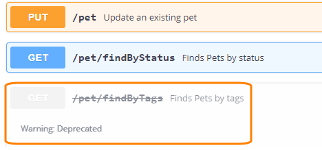
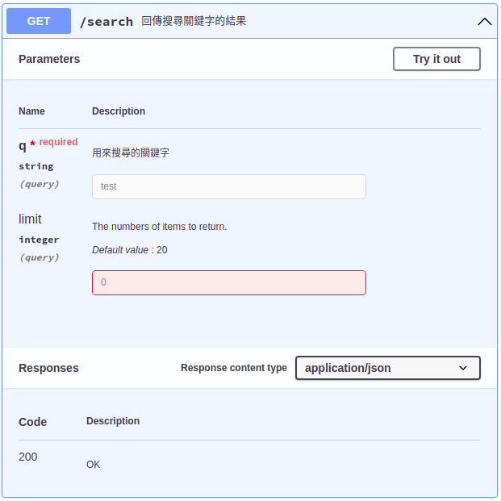

# 使用 Swagger 寫文件

[Swagger](https://swagger.io) 使用 YAML 或 JSON 的語法來寫 RESTful API 文件，主要使用 YAML，官方文件也都用 YAML

## 工具

使用 Swagger Editor 來編輯並預覽，在 Debian 11 中安裝方法如下：

首先要安裝 Node.js

``` bash
sudo apt install curl build-essential
# 安裝 node.js v16，請參考 https://nodejs.org/en/ 選擇目前推薦的版本
curl -sL https://deb.nodesource.com/setup_16.x | sudo bash -
sudo apt install nodejs

# 檢查 node.js 和 npm 的版本
node -v
npm -v
```

下载 Swagger-Editor ，並解壓縮。[查看目前最新版本](https://github.com/swagger-api/swagger-editor/releases)

``` bash
wget https://github.com/swagger-api/swagger-editor/archive/refs/tags/v4.0.4.tar.gz -O swagger-editor.tar.gz
tar zxvf swagger-editor.tar.gz
mv swagger-editor-4.0.4 swagger-editor
```

安裝 http-server，因爲 swagger-editor 沒有內建伺服器軟體

``` bash
sudo npm install -g http-server
```
用 http-server 服務 swagger-editor

``` bash
# 切換到 swagger-editor 目錄的上一層
http-server -a 0.0.0.0 -p 8115 swagger-editor
```

用瀏覽器打開 http://192.168.56.10:8115/

改用 nginx

``` bash
sudo vim /etc/nginx/sites-available/swagger-editor.conf

# 把以下的設定複製貼上到 vim 存檔
# vm 使用 host-only，IP 爲 192.168.56.10
# root 設定是 swagger-editor 目錄所在，必須使用絕對路徑
server {
  listen 8115;
  server_name 192.168.56.10;
  index index.html  index.htm;
  client_max_body_size 50M;
  root  /home/tom/apps/swagger-editor;
}
```

Nginx 啓用設定，並重新啓動 Nginx 讓設定生效
``` bash
sudo ln -s /etc/nginx/sites-available/swagger-editor.conf /etc/nginx/sites-enabled/swagger-editor.conf
sudo service nginx restart
```
使用瀏覽器打開 http://192.168.56.10:8115/

## 語法

以下筆記參考自[Swagger v2 官方文件](https://swagger.io/docs/specification/2-0/basic-structure/)

### 開始

``` yaml
swagger: "2.0"
info:
  title: Sample API
  description: API description in Markdown.
  version: 1.0.0
```
第 1 行的 `swagger: "2.0"` 指定 Swagger 的版本是 2.0，每一個 Swagger API 文件都必須要有這一行，放在第幾行倒是無所謂。有趣的是，2.0 需要用引號包起來，否則無法產生文件。YAML 會自動依照值決定型別，所以 `swagger: 2.0` 會自動把鍵 swagger 的值設爲浮點數 2.0，用引號包起來表示強制轉型成字串2.0

接著 info 表示這個文件的相關資訊，包含 3 個鍵 title、description 和 version，代表文件的標題、描述和版本。description 是這個文件的相關描述，可以用 Markdown 格式，可以沒有這個鍵。version 是指這個文件的版本，不是 Swagger 的版本，所以它的值只是字串，可以用任何你喜歡的格式，例如數字 1.0-beta，日期 2016.11.15。

### API Host and Base URL

host, basePath 和 schemes 指定 API 文件所在的網址

``` yaml
host: petstore.swagger.io
basePath: /v2
schemes:
  - https
  - http
```

在此借用官方文件上的圖片


host 是網站的網址或 IP 位址，不能包含通訊協定，例如 `http://`，因爲改在 schemes 設定。有 port 的話要指明。

basePath 的值一定要以斜線開頭，例如 `/v2`。如果沒有 basePath，預設是 `/`。

schemes 可以使用的通訊協定有 http 和 https，以及 WebSocket 的 ws 和 wss，使用 YAML 的清單語法，也就是開頭爲橫線的方式 `- https`，或是陣列實字語法 `schemes: [http, https]`。

如果沒有設定 host 或 schemes，預設值是文件所在的網站網址和通訊協定。如果文件放在 http://192.168.56.10:8115 ，則 host 預設值爲 192.168.56.10:8115，schemes 預設值爲 `- http`

### Paths and Operations

如果有一個 RESTful 路由，請求 `GET /message`，回應是字串 Hello World，用 Swagger 寫成文件會是這樣：

``` yaml
swagger: "2.0"
info:
  title: Message API
  version: 1.0.0
paths:
  /message:
    get:
      summary: 回傳字串 Hello World
      description: 可以用 markdown 語法的附加描述
      produces:
        - text/plain
      responses:
        200:
          description: 回傳字串 Hello World
          examples:
            text/plain: >
              Hello World
```
所有的 RESTful 資源和 HTTP methods 都要定義在 paths 內，上述的例子中，資源 `/message` 寫成 `/message:`，HTTP method `GET` 則在下一層的 `get:`，請注意 get 必須是小寫，不能是大寫的 GET。summary 和 description 是這個路由的簡要描述和附加描述，都是可以省略的。

Swagger 使用 consumes 代表請求的 Content-Type，用 produces 代表回應的 Content-Type，所以下面的例子描述請求和回應的 Content-Type 都是 application/json 或 application/xml。如果像上面例子中只有一個 produces，表示請求的 Accept 和回應的 Content-Type 是一樣的

``` yaml
consumes:
  - application/json
  - application/xml
produces:
  - application/json
  - application/xml
```

回應定義在 `responses`，必須先寫 HTTP 狀態碼，例如200，然後是 description，最後是 body 內容。responses 一定要有 description，不知道爲什麼。最後 examples 是舉例說這個回應會有怎樣的值，因爲 Content-Type 可以有很多種，所以必須要先指定 `text/plain`，然後是作爲範例的文字
 Hello World

有兩種方法可以在 YAML 中書寫多行文字，一種為保留換行（使用 `|` 字元），另一種為摺疊換行（使用 `>` 字元），請參考 [YAML 區塊的字元](https://zh.wikipedia.org/wiki/YAML#%E5%8D%80%E5%A1%8A%E7%9A%84%E5%AD%97%E7%AC%A6)，上面的例子是使用了摺疊換行。

``` yaml
paths:
  /pet/findByTags:
    get:
      deprecated: true
```
`deprecated: true` 標示這個路由已經放棄使用，Swagger Editor 會把這個路由顏色變成灰色，並加上刪除線，如下所示：




### Request

``` yaml
paths:
  /message:
    get:
      summary: 接收訊息
      description: 裡面定義了動作 GET，所以等同於路由 GET /message
      produces:
        - text/plain
      responses:
        200:
          description: 回傳字串 Hello World
          examples:
            text/plain: >
              Hello World
    put:
      summary: 更新訊息
      description: 這裡是另一個動作 PUT，等同於路由 PUT /message，用來修改資料。
      consumes:
        - text/plain
      parameters:
        - in: body
          name: newMessage
          required: true
          schema:
            type: string
            example: All your base are belong to us.
      responses:
        204:
          description: No Content
```
RESTful 資源 `/message` 包含兩個 HTTP methods，`GET` 和 `PUT`，所以上述例子有 `get:` 和 `put:`，這 2 個縮排的空格數必須相同，才會被認爲是相同的階層，才不會有錯誤。在 `put:` 中，consumes 表示請求的 Content-Type，需要用清單格式，所以是橫線開頭的 `- text/plain`。

請求的內容 body 必須使用 parameters 來定義，之後會看到，它可以用來定義很多東西，例如 `/users/{id}` 的參數 id，`/search?q=keyword` 查詢參數 q，所以必須使用 `in: body` 表明這個參數是用在請求 body 的。必須使用清單格式。

parameters 必須要有一個 name，即使在請求 body 內沒必要也必須有一個。

required 表示這個參數是否爲必填，必填爲 true，否則爲 false。

schema 表示在此開始定義 body 的內容，型別 type 是字串 string，然後給一個例子 example

回應 `responses:` 除了 HTTP 狀態碼 204 以及描述 description 外，沒有其他東西，所以代表回應沒有 body

### tags

``` yaml
paths:
  /message:
    get:
      tags:
        - pets
      summary: 接收訊息
```

每一個 HTTP methods 可以加上標籤 `tags`，把路由進行分組，方便管理大量的 API。沒有設定標籤的路由，會自動歸類在群組 default

``` yaml
tags:
  - name: pets
    description: Everything about your Pets
    externalDocs:
      url: http://docs.my-api.com/pet-operations.htm
  - name: store
    description: Access to Petstore orders
    externalDocs:
      url: http://docs.my-api.com/store-orders.htm
```

可以把標籤加上額外的描述，分組的結果如下圖：


### 自訂 headers

``` yaml
paths:
  /message:
    get:
      summary: 接收訊息
      produces:
        - text/plain
      parameters:
        - in: header
          name: X-RateLimit-Limit
          type: integer
          required: true
          description: Request limit per hour.
        - in: header
          name: X-RateLimit-Remaining
          type: integer
          required: true
          description: The number of requests left for the time window.
        - in: header
          name: X-RateLimit-Reset
          type: string
          required: true
          description: The UTC date/time at which the current rate limit window resets.
      responses:
        200:
          description: 回傳字串 Hello World
          headers:
            X-RateLimit-Limit:
              type: integer
              description: Request limit per hour.
            X-RateLimit-Remaining:
              type: integer
              description: The number of requests left for the time window.
            X-RateLimit-Reset:
              type: string
              format: date-time
              description: The UTC date/time at which the current rate limit window resets.
          examples:
            text/plain: >
              Hello World
```

請求和回應都有自訂 headers X-RateLimit-Limit、X-RateLimit-Remaining 和 X-RateLimit-Reset，但是請求使用 parameters 定義，回應則是用 `headers:`。

請求的 parameters 可以定義很多東西，headers 是其中一種，和之前提到的一樣，首先它是清單，所以開頭是橫線，後面接著 in, name, type, 和 required 是清單的一個項目。用 `in: header` 指明要定義 headers，name 寫上要自訂的 headers 名稱。自訂 headers 例如 `X-RateLimit-Limit: 20`，所以 `type: integer`，使用 `required: true` 表示它必填。最後 description 寫明 headers 欄位的用途

回應的 headers 直接用 `headers:` 就好。

### 參數 Parameters

資源通常有 id 或關鍵字包含其中，例如 /users/123 或 /search?q=關鍵字，這時使用參數 Parameters 來定義。

#### path parameters

``` yaml linenums="1" hl_lines="6 7 8 9 10"
paths:
  /users/{userId}:
    get:
      summary: 依照 id 抓取使用者
      parameters:
        - in: path
          name: userId
          type: integer
          required: true
          description: 使用者 id
      responses:
        200:
          description: OK
```
請注意第 6 行，in 的前面有橫線，表示此爲陣列，所以第 6 到 10 行是一體的，是陣列的一個元素

第 6 行的 `in: path` 表示這個參數 parameters 是用來定義路徑，也就是路由大括號的內容，因此第 7 行 `name: ` 的值必須和大括號內的變數名稱 userId 相同。

第 8 行 type 表示參數的型別，因爲路由是 `/users/123` 這樣，所以是整數 integer。type 的值是基本型別，有 integer, number, string 可用

第 9 行 required 表示這個參數是否爲必填，必填爲 true，否則爲 false。path parameters 一定是 `required: true`，其他種類的 parameters 則是可以設定爲 false

第 10 行 description 用來描述參數的用途，注意事項等，可以沒有 description

#### query parameters

``` yaml linenums="1" hl_lines="5 6 7 8 9"
  /search:
    get:
      summary: 回傳搜尋關鍵字的結果
      parameters:
        - in: query
          name: q
          type: string
          required: true
          description: 用來搜尋的關鍵字
      responses:
        200:
          description: OK
```

上面的例子產生 `/search?q=` 的路由，關鍵字是字串，所以 `type: string`

如果路由是 `GET /notes?offset=100&limit=50`，因爲 parameters 的值是陣列，所以需要 2 個元素 offset 和 limit，如下所示：

``` yaml
parameters:
  - in: query
    name: offset
    type: integer
    description: The number of items to skip before starting to collect the result set.
  - in: query
    name: limit
    type: integer
    description: The numbers of items to return.
```

#### Header Parameters

參數也可用來定義自訂的 headers 欄位，如果以下的 HTTP headers 內容：
``` http
GET /ping HTTP/1.1
Host: example.com
X-Request-ID: 77e1c83b-7bb0-437b-bc50-a7a58e5660ac
```

用 Swagger 文件是這樣的：

``` yaml linenums="1" hl_lines="6 7"
paths:
  /ping:
    get:
      summary: Checks if the server is alive.
      parameters:
        - in: header
          name: X-Request-ID
          type: string
          required: true
```

#### Form Parameters

傳統的表單如下：
``` html
<form action="http://example.com/survey" method="post">
  <input type="text"   name="name" />
  <input type="number" name="fav_number" />
  <input type="submit"/>
 </form>
```
會產生 HTTP headers 如下：
``` http
POST /survey HTTP/1.1
Host: example.com
Content-Type: application/x-www-form-urlencoded
Content-Length: 29

name=Amy+Smith&fav_number=321
```

寫成 Swagger 文件如下：
``` yaml
paths:
  /survey:
    post:
      summary: A sample survey.
      consumes:
        - application/x-www-form-urlencoded
      parameters:
        - in: formData
          name: name
          type: string
          description: A person's name.
        - in: formData
          name: fav_number
          type: number
          description: A person's favorite number.
      responses:
        200:
          description: OK
```

consumes 是請求的 Content-Type，所以指定其值爲 `application/x-www-form-urlencoded`

請求的 body `name=Amy+Smith&fav_number=321`，有兩個欄位 name 和 fav_number，所以使用兩個 formData parameters。

`in: formData` 是專門用來指定表單 body 的(以及檔案上傳)，不能和之後介紹的 `in: body` 放在同一個 parameters。

#### 預設參數值

path parameters 一定 `required: true` ，其他種類的 parameters 可以是 `required: false`，這時候通常會需要預設值，如下所示：

``` yaml linenums="1" hl_lines="15 16 17"
paths:
  /search:
    get:
      summary: 回傳搜尋關鍵字的結果
      parameters:
        - in: query
          name: q
          type: string
          required: true
          description: 用來搜尋的關鍵字
        - in: query
          name: limit
          type: integer
          required: false
          default: 20
          minimum: 1
          maximum: 100
          description: The numbers of items to return.
      responses:
        200:
          description: OK
```

第 15 行的 default 設定 parameters 預設爲 20，同時 minimum 和 maximum 用來設定最小和最大值。Swagger Editor 會依照最小和最大值範圍提出警告。



點選路由 `/search` 後，點選按鈕 Try it out，在第二個輸入框輸入 0，點選按鈕 Execute，輸入框變成紅色，同時不會執行

預設參數值只會在 `required: false` 時使用，所以 `required: true` 時設定 `default: 10` 是沒有意義的。
