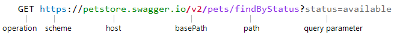
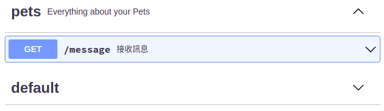

# 使用 Swagger 寫文件

臺灣業界好像比較常用 [Swagger](https://swagger.io/) 寫 API 文件，雖然我不喜歡這樣多層巢狀的 YAML ，還是沒辦法要研究它，所以在這裡筆記重點，以免之後又要再看一次官方文件。

## 工具

使用 Swagger Editor 來編輯並預覽，在 Debian 11 中安裝方法如下：

首先要安裝 Node.js

``` bash
sudo apt install curl build-essential
# 安裝 node.js v16，請參考 https://nodejs.org/en/ 選擇目前推薦的版本
curl -sL https://deb.nodesource.com/setup_16.x | sudo bash -
sudo apt install nodejs

# 檢查 node.js 和 npm 的版本
node -v
npm -v
```

下載 Swagger-Editor ，並解壓縮。[查看目前最新版本](https://github.com/swagger-api/swagger-editor/releases)

``` bash
wget https://github.com/swagger-api/swagger-editor/archive/refs/tags/v4.0.4.tar.gz -O swagger-editor.tar.gz
tar zxvf swagger-editor.tar.gz
mv swagger-editor-4.0.4 swagger-editor
```

安裝 http-server，因為 swagger-editor 沒有內建伺服器軟體

``` bash
sudo npm install -g http-server
```
用 http-server 服務 swagger-editor

``` bash
# 切換到 swagger-editor 目錄的上一層
http-server -a 0.0.0.0 -p 8115 swagger-editor
```

用瀏覽器打開 http://192.168.56.10:8115/

改用 nginx

``` bash
sudo vim /etc/nginx/sites-available/swagger-editor.conf

# 把以下的設定複製貼上到 vim 存檔
# vm 使用 host-only，IP 為 192.168.56.10
# root 設定是 swagger-editor 目錄所在，必須使用絕對路徑
server {
  listen 8115;
  server_name 192.168.56.10;
  index index.html  index.htm;
  client_max_body_size 50M;
  root  /home/tom/apps/swagger-editor;
}
```

Nginx 啓用設定，並重新啓動 Nginx 讓設定生效
``` bash
sudo ln -s /etc/nginx/sites-available/swagger-editor.conf /etc/nginx/sites-enabled/swagger-editor.conf
sudo service nginx restart
```
使用瀏覽器打開 http://192.168.56.10:8115/

## 語法

以下筆記參考自 [Swagger v2 官方文件](https://swagger.io/docs/specification/2-0/basic-structure/)。建議新手可以先去 [YAML 的維基百科](https://zh.wikipedia.org/wiki/YAML) 看一下基本語法。

### 開始

``` yaml
# 指定 Swagger 的版本是 2.0，每一個 Swagger API 文件都必須要有這一行，放在第幾行倒是無所謂。
# 有趣的是，2.0 需要用引號包起來，否則無法產生文件
# YAML 會自動依照值決定型別，所以 swagger: 2.0 會自動把鍵 swagger 的值設為浮點數 2.0，用引號包起來表示強制轉型成字串2.0
swagger: "2.0"
# info 表示這個文件的相關資訊
info:
  # 描述：可以使用 markdown 語法，可以省略
  description: "This is a sample server Petstore server.  You can find out more about     Swagger at [http://swagger.io](http://swagger.io) or on [irc.freenode.net, #swagger](http://swagger.io/irc/).      For this sample, you can use the api key `special-key` to test the authorization     filters."
  # version 是指這個文件的版本，不是 Swagger 的版本，
  # 所以它的值只是字串，可以用任何你喜歡的格式，例如數字 1.0-beta，日期 2016.11.15
  version: "1.0.0"
  title: "Swagger Petstore"
  termsOfService: "http://swagger.io/terms/"
  contact:
    email: "apiteam@swagger.io"
  license:
    name: "Apache 2.0"
    url: "http://www.apache.org/licenses/LICENSE-2.0.html"
```

### API Host and Base URL

``` yaml
host: petstore.swagger.io
basePath: /v2
schemes:
  - https
  - http
```

在此借用官方文件上的圖片


host 是網站的網址或 IP 位址，不能包含通訊協定，例如 `http://`，因為改在 schemes 設定。有 port 的話要指明。

basePath 的值一定要以斜線開頭，例如 `/v2`。如果沒有 basePath，預設是 `/`。

schemes 可以使用的通訊協定有 http 和 https，以及 WebSocket 的 ws 和 wss，使用 YAML 的清單語法，也就是開頭為橫線的方式 `- https`，或是陣列實字語法 `schemes: [http, https]`。

如果沒有設定 host 或 schemes，預設值是文件所在的網站網址和通訊協定。如果文件放在 http://192.168.56.10:8115 ，則 host 預設值為 192.168.56.10:8115，schemes 預設值為 `- http`

### 標籤

``` yaml
# 標籤把路由設定分組
tags:
# 標籤有 pet 和 store (name 的值)
- name: "pet"
  # 參考下方的圖片
  description: "Everything about your Pets"
  externalDocs:
    description: "Find out more"
    url: "http://swagger.io"
- name: "store"
  description: "Access to Petstore orders"
```
產生效果如圖



### 請求與回應

``` yaml
# 所有 RESTful 路由都定義在 paths
path:
  # RESTful 資源(URI)
  /pet/findByStatus:
    # HTTP methods GET, POST, PUT 等緊接著放在 URI 之下，注意必須用小寫的 get，不能用大寫 GET
    get:
      # 可以加上標籤，路由會自動歸類在這個群組，沒有標籤的話，預設是 default 群組
      tags:
      - "pet"
      # 可選的簡介會顯示在 /pet/findByStatus 的右邊
      summary: "Finds Pets by status"
      # 可選的描述則顯示在展開的內容
      description: "Multiple status values can be provided with comma separated strings"
      operationId: "findPetsByStatus"
      produces:
      - "application/xml"
      - "application/json"
      parameters:
      - name: "status"
        in: "query"
        description: "Status values that need to be considered for filter"
        required: true
        type: "array"
        items:
          type: "string"
          enum:
          - "available"
          - "pending"
          - "sold"
          default: "available"
        collectionFormat: "multi"
      responses:
        "200":
          description: "successful operation"
          schema:
            type: "array"
            items:
              $ref: "#/definitions/Pet"
        "400":
          description: "Invalid status value"
```
