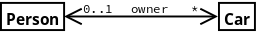
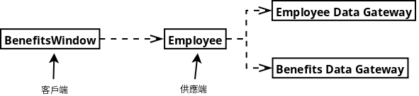

# UML

## 類別圖：基本概念

property 有兩種表現方式：attribute 和 association。上圖的 Order 類別，分別用 attribute 和 association 表示。通常 attribute 用在基本型態上，表示類別有哪些屬性，association 則用在表示物件之間的多重性關係

attribute 語法只有名稱是必要的：

可見性 名稱 : 形態 多重性 = 預設值 {property-string}

例如： `+ name: String[1] = "Untitled" {readOnly}`

operation 只有名稱是必要的：

可見性 名稱(參數串列) : 回傳形態 {property-string}

例如： `+ balanceOn(date: Date): Money`

參數串列語法：

方向性 名稱 : 形態 = 預設值

方向性有 in 輸入(預設值)、out 輸出和 inout 輸出入

只列出 CRC 卡中此類別的主要操作，不要列出所有 method。例如只操作 property 的 operation，getter/setter，不需列出，因爲只要列出 attribute，即暗示有 getter/setter。

property-string：

- ordered 有順序的, unordered 沒有順序的(預設值)
- unique 唯一(預設值), nonunique 非唯一
- readOnly 唯讀, unrestricted 不受限制(預設值)
- query 查詢(只是從類別中取值，不改變系統狀態), modifier (會改變系統狀態)
- constructor 建構式, destructor 解構式

上圖表示 Person 和 Car 類別是雙向關聯，一個人可以有多台車，或沒有車，一台車只屬於一個人，或不屬於任何人，所以 Person 類別內包含一個欄位是 Collection，儲存 Car，Car 包含一個欄位記錄車主是誰。Person 的角色(role)是 owner。

上圖表示 BenefitsWindow 依賴 Employee
